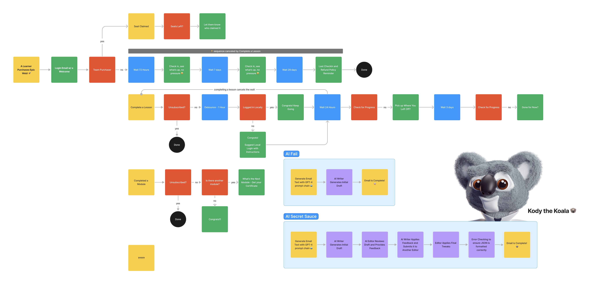

# Skill Recordings Course Builder POC

This is an application that is primarily meant to be ran locally (for now) as a
way to explore and experiment with gpt-4 prompt chaining as a "tool for
thought"""

Current State: https://www.loom.com/share/651287e8136a46429f46e6541e3dd0c2

Note that this is a monorepo and teh main app is in `apps/course-builder-web`!

It's got a lot of moving parts 😅:

- A database to store our data
- An ORM to interact with our database
- Authentication
- Serverless Queueing
- Email sending
- Websockets
- CMS

## Getting Started

We are building an application that allows us to build courses. It's largely
based on the
[Skill Recordings Products](https://github.com/skillrecordings/products)
repository.

Async event-driven workflows are a key part of the application. We are using
[Inngest](https://inngest.com) to process chained conversations with GPT-4 to
produce summaries, titles, emails and other supplemental details.

Here's an example from a production application that's using this approach:

Various events in the application trigger async workflows that occur in queued
serverless background jobs.

- an event is received
- steps/actions are performed
- we can sleep or wait for other events within the workflow
- we can send events that trigger other workflows

## Event-Driven Workflows

The application is built around the concept of event-driven workflows. There are
several kinds of events. The primary events are external to the workflow and are
emitted from users interacting with the application. The user has requested work
and provided input. When these are received, the workflow kicks into gear and
begins processing the request.

There are also external events that are generally received via webhooks when
some service provider has completed some work. For example,
[when a video is uploaded to Mux, they send a series of webhooks](https://docs.mux.com/guides/system/listen-for-webhooks)
at various staging in the video processing to let us know when the asset is
available.

The receiving URL is configured within the Mux dashboard (not, for local
development we use [ngrok](https://ngrok.com/) to expose our local server.

Another example is ordering transcripts from Deepgram. When the video is
uploaded we send the URL to Deepgram for transcription and include a callback
url for Deepgram to contact when the transcript is ready.

The last kind of event is internal to the workflow. These are events that are
triggered by the workflow itself.

- `VIDEO_UPLOADED_EVENT`: triggered when a new video has been uploaded and is
  available via a URL.

_[more to come]_
