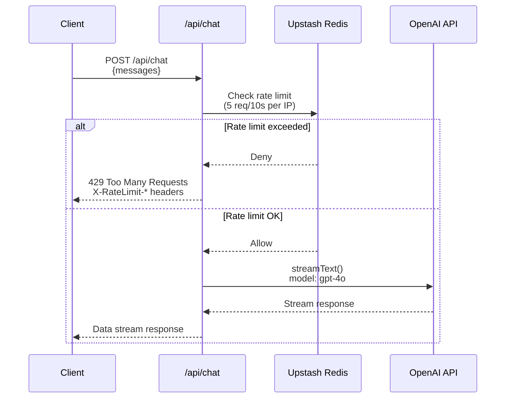
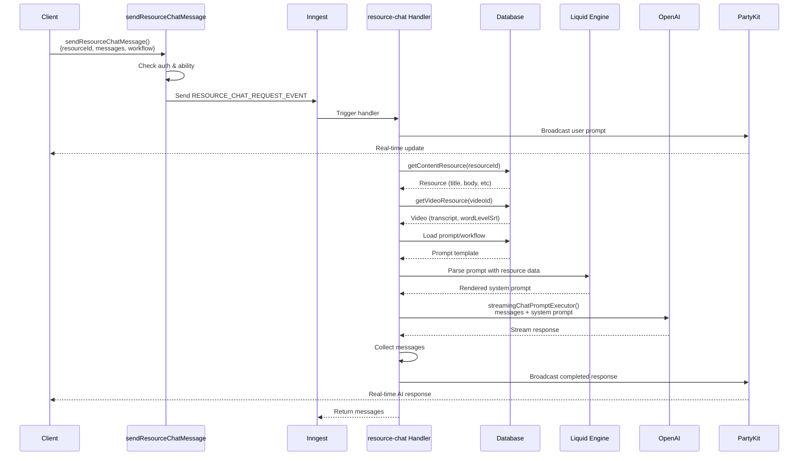
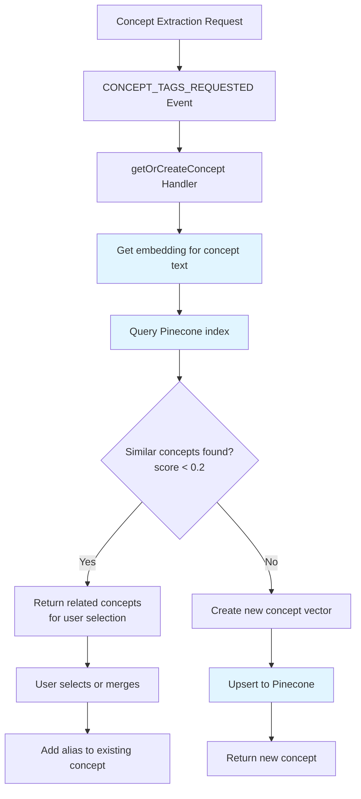
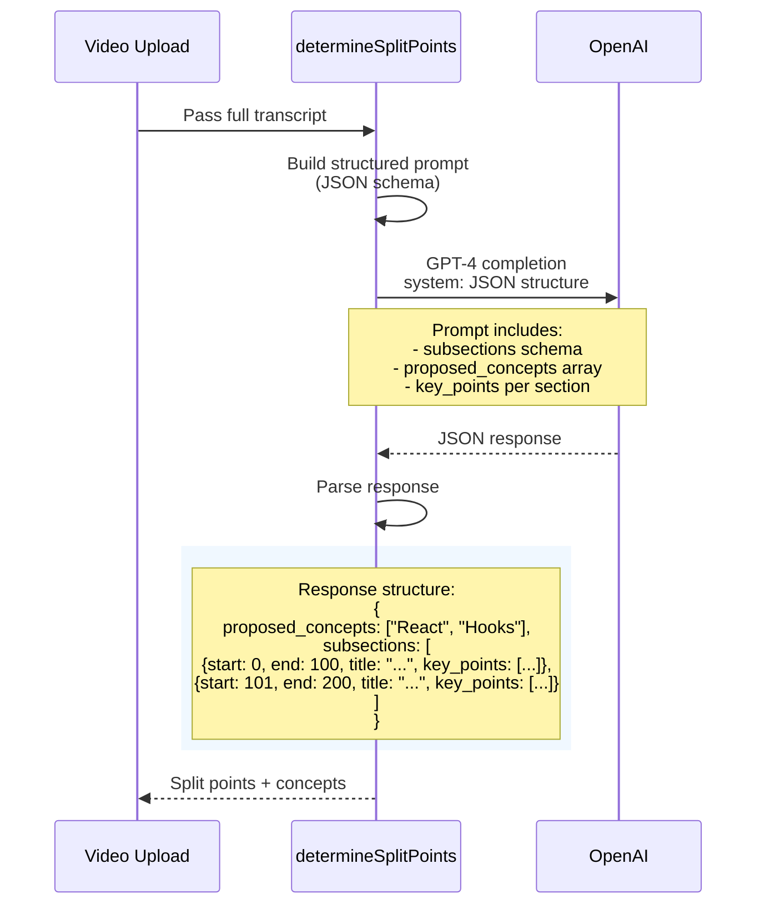
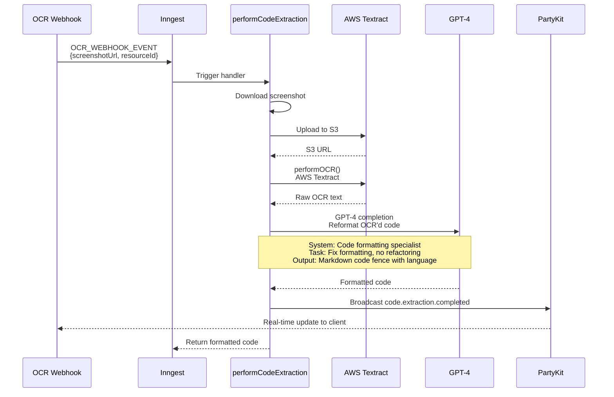
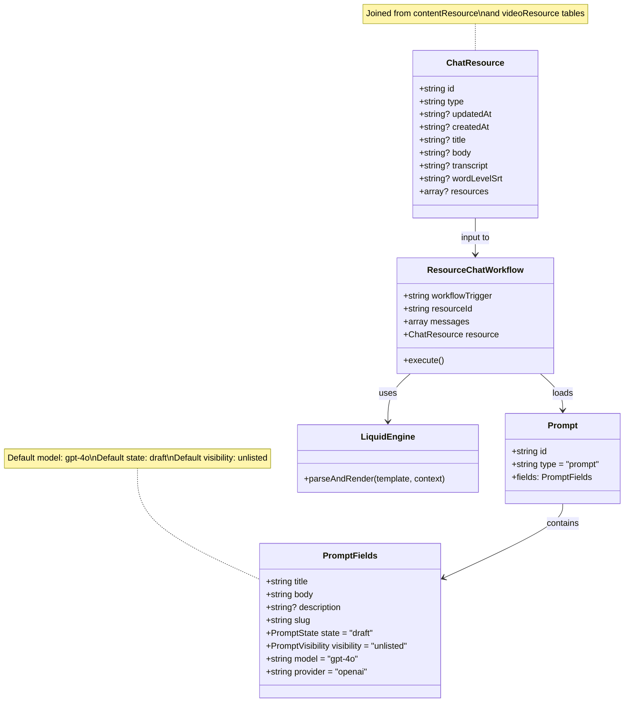

# AI-Assisted Content Creation Flow

## Overview

ai-hero integrates OpenAI GPT models for AI-assisted content creation, providing capabilities for:
- Real-time chat with context from resources (video transcripts, course content)
- Transcript processing and analysis (split points, code extraction)
- Concept/tag extraction using semantic similarity
- AI-powered content generation with custom prompts
- Rate limiting via Upstash Redis

## Architecture Components

### Core AI Components
- **OpenAI Provider**: Configured via `@coursebuilder/core/providers/openai`
- **AI SDK**: Vercel AI SDK for streaming responses (`ai` package)
- **Chat API**: `/api/chat` endpoint for general-purpose chat
- **Resource Chat**: Inngest-powered workflow for resource-based conversations
- **Concept Extraction**: Pinecone vector DB for semantic concept matching
- **Rate Limiting**: Upstash Redis sliding window (5 requests/10s)

### Key Technologies
- OpenAI GPT-4/GPT-4 Turbo models
- Pinecone vector database for embeddings
- Inngest for event-driven workflows
- PartyKit for real-time updates
- Liquid templating for dynamic prompts

---

## 1. General Chat API Flow

Basic chat endpoint for simple AI interactions without resource context.



**Key Files:**
- `/src/app/api/chat/route.ts` - Chat endpoint with rate limiting
- `/src/server/redis-client.ts` - Redis client configuration

---

## 2. Resource-Based AI Chat Flow

Advanced chat workflow with resource context (transcripts, content) using Inngest for orchestration.



**Key Features:**
- **Authentication**: Requires `create` ability on `Content`
- **Rate Limiting**: Inngest rate limit (5/min per user)
- **Dynamic Prompts**: Liquid templates inject resource data
- **Real-time Updates**: PartyKit broadcasts progress
- **Context Awareness**: Includes transcript, title, body in prompt

**Key Files:**
- `/src/lib/ai-chat-query.ts` - Server action & DB query
- `/packages/core/src/inngest/co-gardener/resource-chat.ts` - Inngest handler
- `/src/coursebuilder/openai-provider.ts` - OpenAI config

---

## 3. Concept Extraction Flow

Semantic concept detection using Pinecone vector embeddings for tagging content.



**Process:**
1. **Embedding Generation**: OpenAI text-embedding model converts text → vector
2. **Similarity Search**: Pinecone cosine similarity (threshold: 0.2)
3. **Deduplication**: Find existing concepts before creating new ones
4. **Alias Management**: Related terms linked to canonical concept

**Key Files:**
- `/src/inngest/functions/concepts/get-or-create-tag.ts` - Inngest function
- `/src/utils/vector-utils/concepts.ts` - Pinecone operations
- `/src/utils/openai.ts` - Embedding generation (re-export)

---

## 4. Transcript AI Processing Flow

AI-powered transcript analysis to identify split points and concepts for video segmentation.



**Key Features:**
- **Structured Output**: Enforces JSON schema for subsections
- **Timestamp Precision**: Start/end times in seconds
- **Concept Identification**: Extracts normalized concept names
- **Key Points**: Captures nuanced details per section

**Prompt Engineering:**
- Instructs AI to identify "schelling points" (canonical terms)
- Sequential sections with minimal overlap
- Focus on nuance and detail in key points

**Key Files:**
- `/src/transcript-processing/determine-split-points.ts`

---

## 5. OCR + Code Extraction Flow

AI-assisted code extraction from video screenshots using OCR and GPT-4 for reformatting.



**System Prompt Strategy:**
- Role: "Code formatting specialist"
- Constraint: No refactoring, only format fixes
- Output: Markdown code fence with detected language
- Filter: Exclude non-code text from frame

**Key Files:**
- `/src/inngest/functions/ocr/ocr-code-extractor.ts` - Inngest handler
- `/src/transcript-processing/extract-code-from-screenshot.ts` - OpenAI integration
- `/src/utils/aws.ts` - S3 + Textract operations

---

## 6. Prompt & Chat Resource Class Diagram



**Schema Design:**
- **Prompt**: Reusable AI instruction templates
- **ChatResource**: Aggregated view of content + video data
- **Workflow**: Orchestrates prompt rendering + execution
- **Liquid**: Dynamic variable substitution (transcript, title, etc.)

---

## Configuration

### OpenAI Provider Setup
```typescript
// src/coursebuilder/openai-provider.ts
import OpenAIProvider from '@coursebuilder/core/providers/openai'

export const openaiProvider = OpenAIProvider({
  apiKey: env.OPENAI_API_KEY,
  partyUrlBase: env.NEXT_PUBLIC_PARTY_KIT_URL,
})
```

### Rate Limiting
```typescript
// Upstash Redis sliding window
const ratelimit = new Ratelimit({
  redis,
  limiter: Ratelimit.slidingWindow(5, '10s'),
})
```

### Pinecone Index
```typescript
// Concepts index configuration
{
  name: 'concepts',
  dimension: 1536,  // OpenAI text-embedding-ada-002
  metric: 'cosine',
  spec: {
    serverless: { cloud: 'aws', region: 'us-west-2' }
  }
}
```

---

## Environment Variables

```bash
# OpenAI
OPENAI_API_KEY=sk-...

# Upstash Redis (rate limiting)
UPSTASH_REDIS_REST_URL=https://...
UPSTASH_REDIS_REST_TOKEN=...

# PartyKit (real-time)
NEXT_PUBLIC_PARTY_KIT_URL=https://...

# Pinecone (concept vectors)
PINECONE_API_KEY=...
PINECONE_ENVIRONMENT=...

# AWS (OCR/S3)
AWS_ACCESS_KEY_ID=...
AWS_SECRET_ACCESS_KEY=...
AWS_BUCKET_NAME=coursebuilderimages
```

---

## Future Enhancements (TODOs in code)

1. **Concept Similarity Tuning**: Current threshold (0.2) needs calibration
2. **Cancellation Conditions**: Resource chat lacks cancellation logic
3. **Concept Selection UI**: Implement user flow for merging similar concepts
4. **Error Recovery**: Better handling of OpenAI API failures
5. **Model Configuration**: Per-workflow model selection (currently hardcoded)
