# Authentication Flow Documentation

## Overview

AI Hero uses NextAuth.js v5 for authentication with multiple providers:
- **OAuth**: GitHub, Discord, Twitter
- **Magic Link**: Email-based passwordless authentication via Postmark
- **Authorization**: CASL-based ability rules for fine-grained permissions
- **User Management**: Inngest events for async user creation workflow
- **Organizations**: Multi-tenant support with organization memberships and roles

Key components:
- **NextAuth config**: `/src/server/auth.ts`
- **CASL abilities**: `/src/ability/index.ts`
- **Email provider**: `/src/coursebuilder/email-provider.ts`
- **User creation**: `/src/inngest/functions/user-created.ts`
- **Database**: Drizzle ORM with MySQL (users, accounts, sessions, organizationMemberships)

---

## 1. OAuth Login Flow

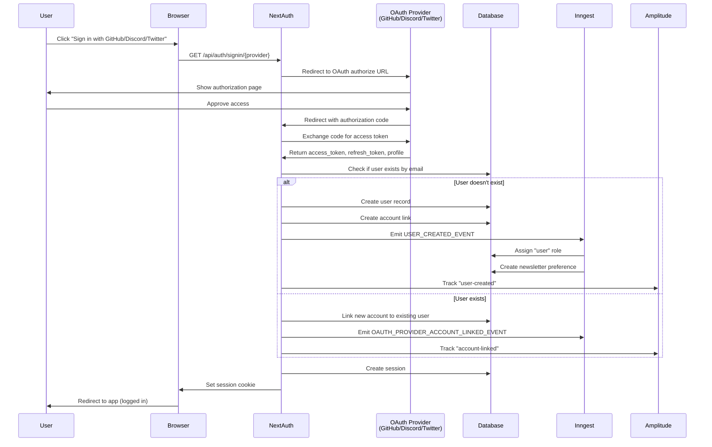

### OAuth Provider Configuration

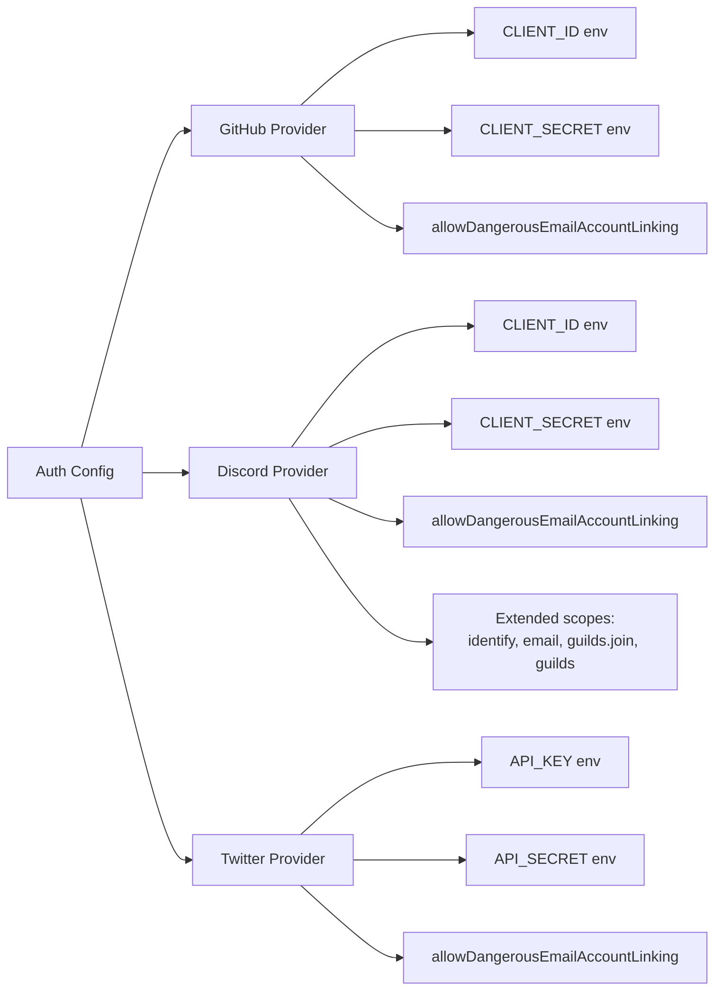

### Discord Token Refresh Flow

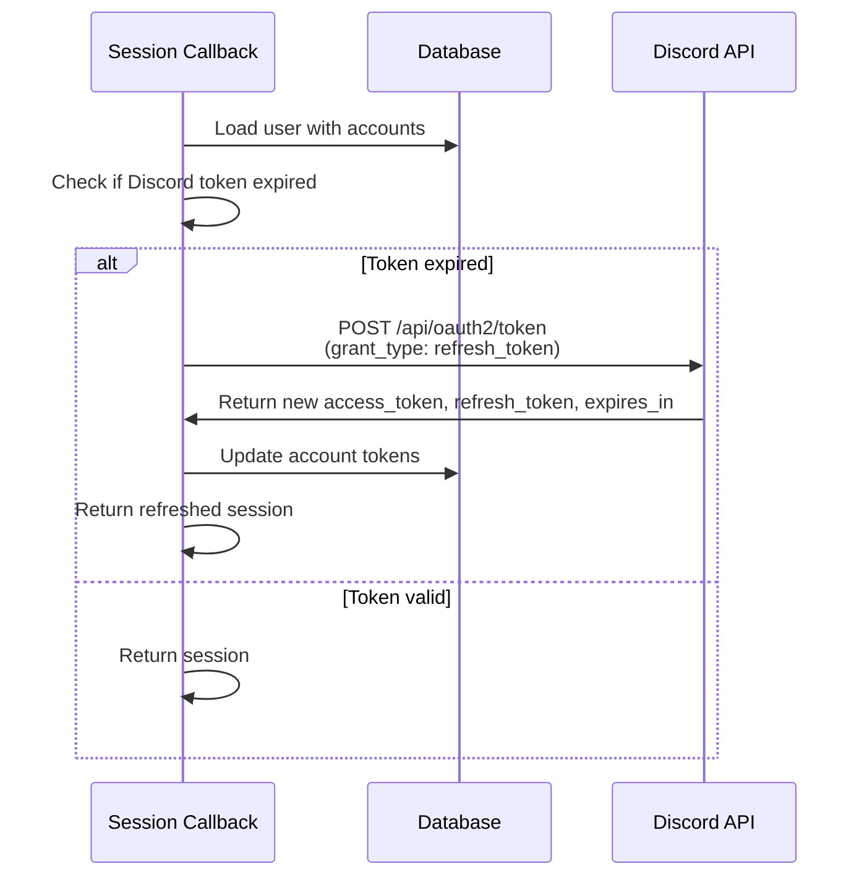

---

## 2. Email Magic Link Flow

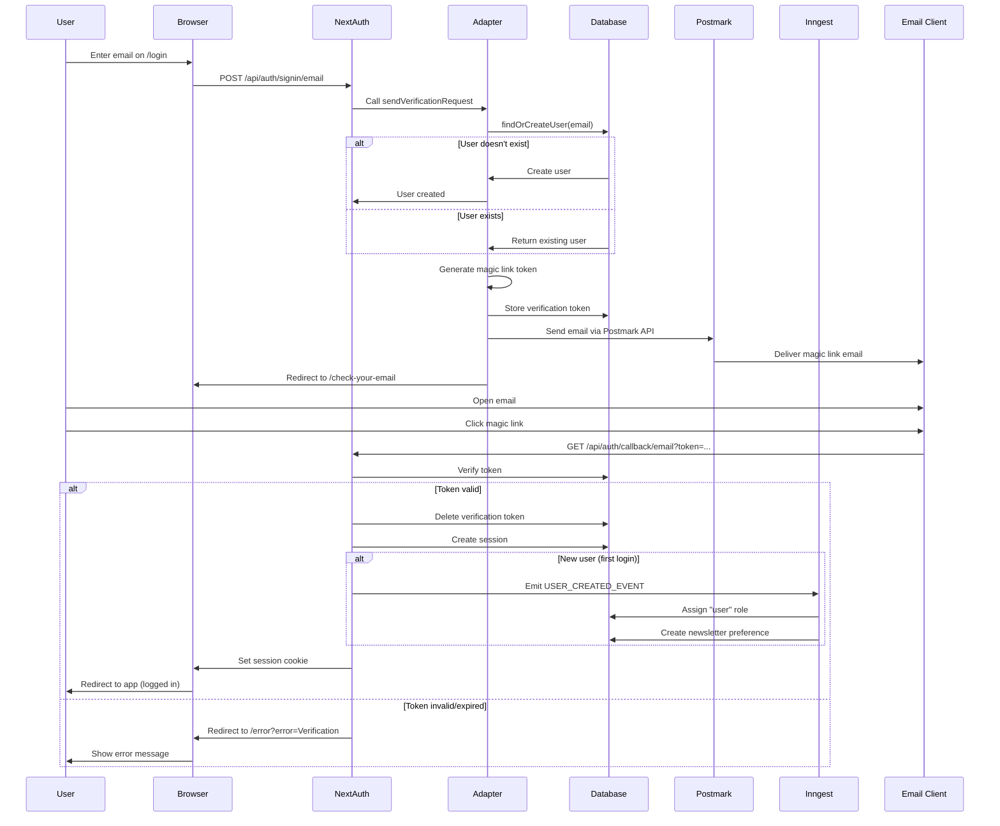

### Email Types

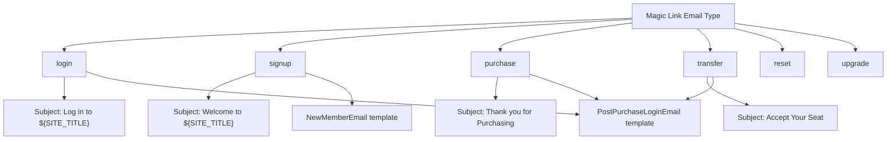

---

## 3. Database Schema (Auth Tables)

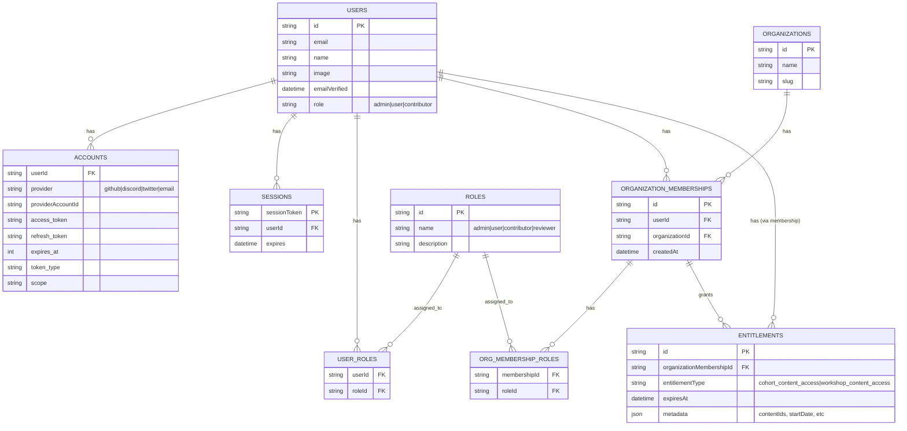

---

## 4. CASL Authorization Rules

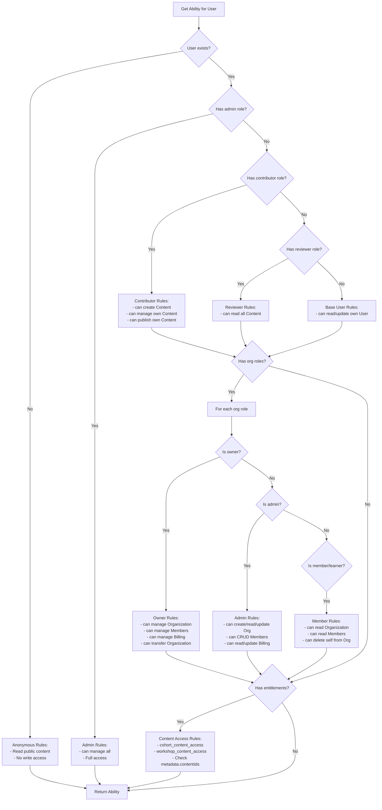

### Purchase-Based Access Rules

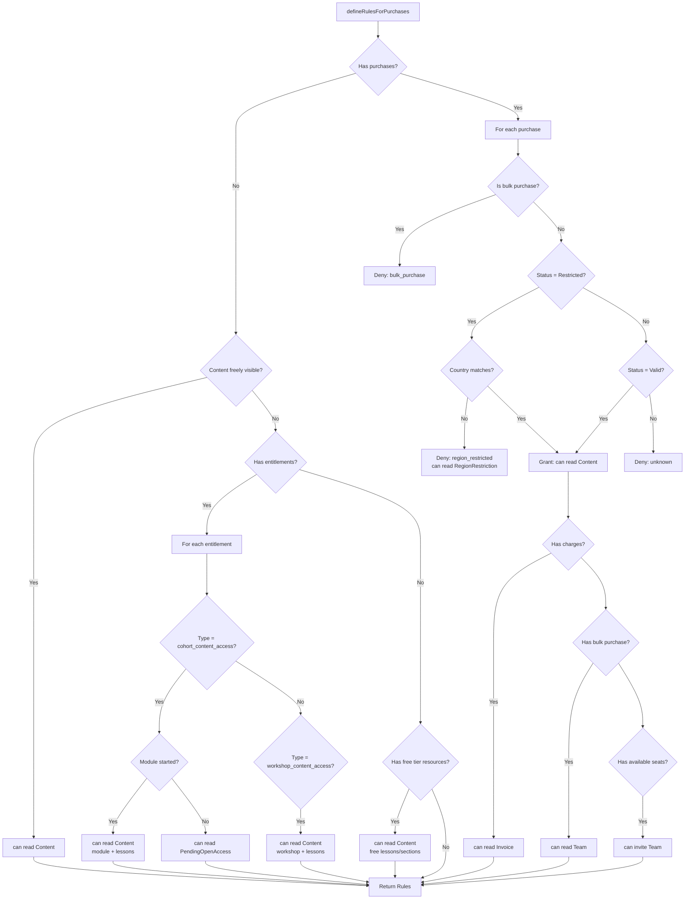

---

## 5. Session Lifecycle

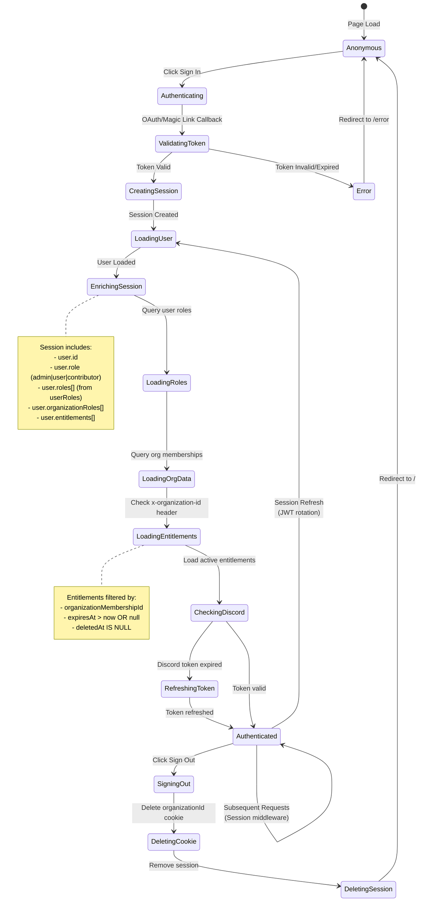

---

## 6. User Creation Workflow (Inngest)

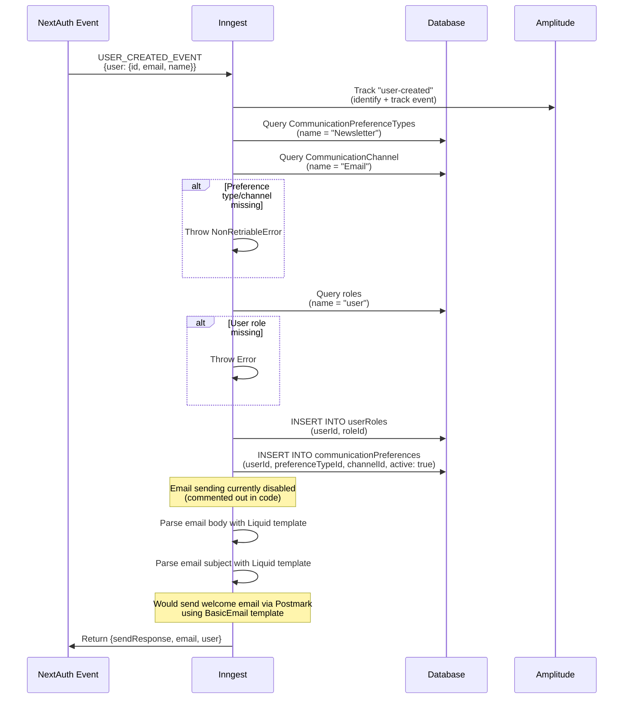

---

## 7. Organization Membership & Roles

```mermaid
graph TD
    User[User] --> Membership1[Organization Membership 1]
    User --> Membership2[Organization Membership 2]

    Membership1 --> Org1[Organization A]
    Membership2 --> Org2[Organization B]

    Membership1 --> Role1A[Owner Role]
    Membership1 --> Role1B[Admin Role]
    Membership2 --> Role2A[Member Role]

    Membership1 --> Ent1[Entitlement 1:<br/>cohort_content_access]
    Membership1 --> Ent2[Entitlement 2:<br/>workshop_content_access]

    Ent1 --> Content1[Workshop 101]
    Ent1 --> Content2[Workshop 102]
    Ent2 --> Content3[Self-Paced Course]

    Membership2 --> Ent3[Entitlement 3:<br/>cohort_content_access]
    Ent3 --> Content4[Cohort Winter 2024]

    style Ent1 fill:#e1f5ff
    style Ent2 fill:#e1f5ff
    style Ent3 fill:#e1f5ff

    Note1[Organization-scoped permissions:<br/>- x-organization-id header<br/>- Session includes organizationRoles[]]
    Note2[Entitlement metadata:<br/>- contentIds: string[]<br/>- startsAt: datetime<br/>- expiresAt: datetime]
```

### Organization Permission Matrix

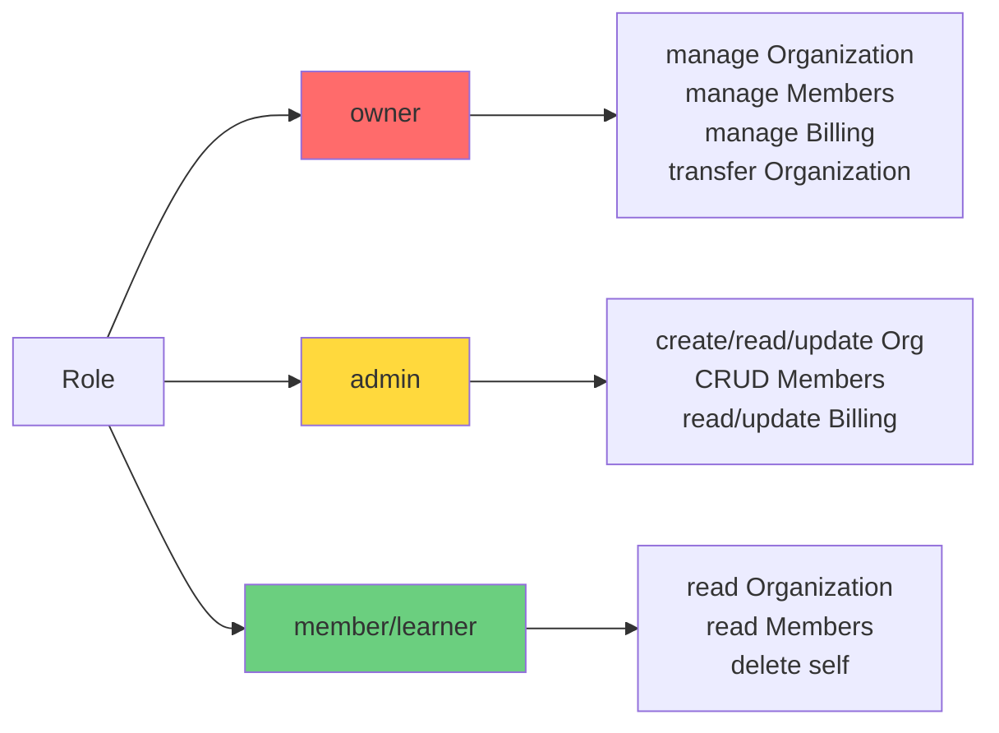

---

## 8. Authorization Check Flow

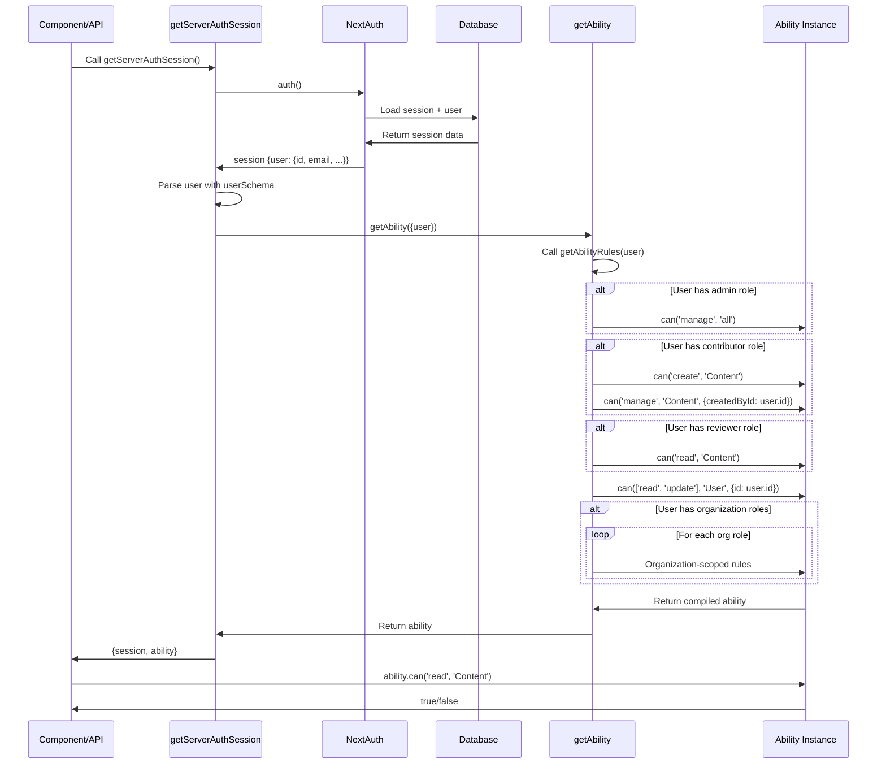

---

## Key Features & Patterns

### 1. **Dangerous Email Account Linking**
All OAuth providers have `allowDangerousEmailAccountLinking: true`, meaning if a user signs in with GitHub and then Discord using the same email, both accounts link to the same user record.

### 2. **Token Refresh**
Discord OAuth tokens are automatically refreshed when expired (checked in session callback). Access token, refresh token, and expiry are updated in the database.

### 3. **Magic Link Types**
Email provider supports multiple magic link types: login, signup, purchase, transfer, reset, upgrade. Each type has a different subject line and can use different email templates.

### 4. **Organization Context**
Authorization checks use the `x-organization-id` header to scope permissions. The session callback loads organization memberships and roles based on this header.

### 5. **Entitlements**
Content access is granted via entitlements linked to organization memberships. Two types:
- `cohort_content_access`: Time-based access with start dates
- `workshop_content_access`: Immediate access to workshop + lessons

### 6. **Role Hierarchy**
- **admin**: Full access to everything
- **contributor**: Can create and manage own content
- **reviewer**: Can read all content
- **user**: Base permissions (read/update self)
- **Organization roles**: owner > admin > member/learner

### 7. **CASL Conditions**
CASL rules use MongoDB query syntax for conditions:
- `{id: {$eq: userId}}` - Exact match
- `{id: {$in: [id1, id2]}}` - Array membership
- `{createdById: {$eq: userId}}` - Ownership check

### 8. **Free Tier Access**
Resources can be marked as `tier: 'free'` in metadata. These are accessible to all users without purchase or entitlement, including:
- Free sections (all lessons in section)
- Individual free lessons/exercises/posts

---

## Environment Variables

```bash
# OAuth Providers
GITHUB_CLIENT_ID=
GITHUB_CLIENT_SECRET=
DISCORD_CLIENT_ID=
DISCORD_CLIENT_SECRET=
TWITTER_API_KEY=
TWITTER_API_SECRET=

# Email (Magic Link)
POSTMARK_API_KEY=
NEXT_PUBLIC_SUPPORT_EMAIL=

# NextAuth
NEXTAUTH_URL=
NEXTAUTH_SECRET=

# Analytics
NEXT_PUBLIC_AMPLITUDE_API_KEY=

# Feature Flags
CREATE_USER_ON_LOGIN=true
LOG_VERIFICATION_URL=false
SKIP_EMAIL=false
```

---

## Error Handling

1. **Invalid Magic Link**: Redirect to `/error?error=Verification`
2. **Missing OAuth Credentials**: Provider not added to config (conditional)
3. **Token Refresh Failure**: Return `{error: 'Failed to refresh session'}`
4. **Missing Postmark Key**: Throw error, email sending fails
5. **User Creation Failure**: Inngest NonRetriableError for missing preferences

---

## Testing Considerations

- **Test OAuth flow**: Mock provider responses, verify account linking
- **Test magic link**: Mock Postmark, verify token generation/validation
- **Test CASL rules**: Unit test ability rules for each role
- **Test session enrichment**: Verify org roles and entitlements are loaded
- **Test token refresh**: Mock Discord API, verify token update in DB
- **Test entitlements**: Verify content access based on contentIds and start dates
