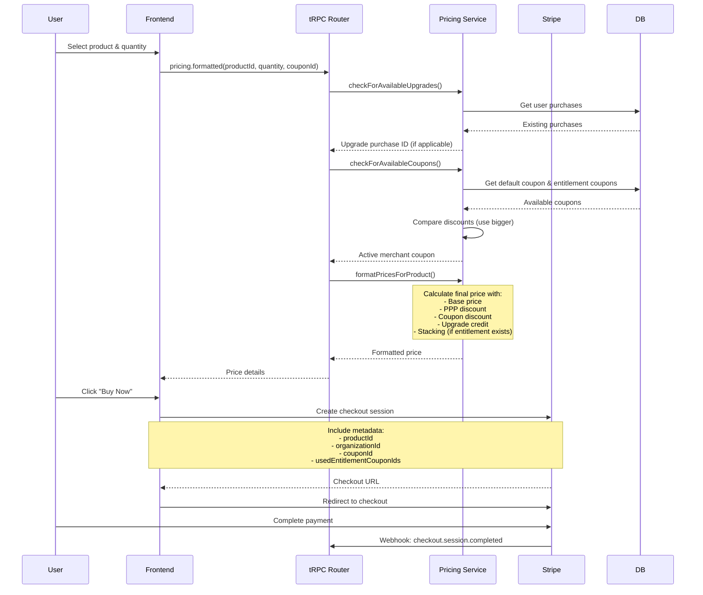
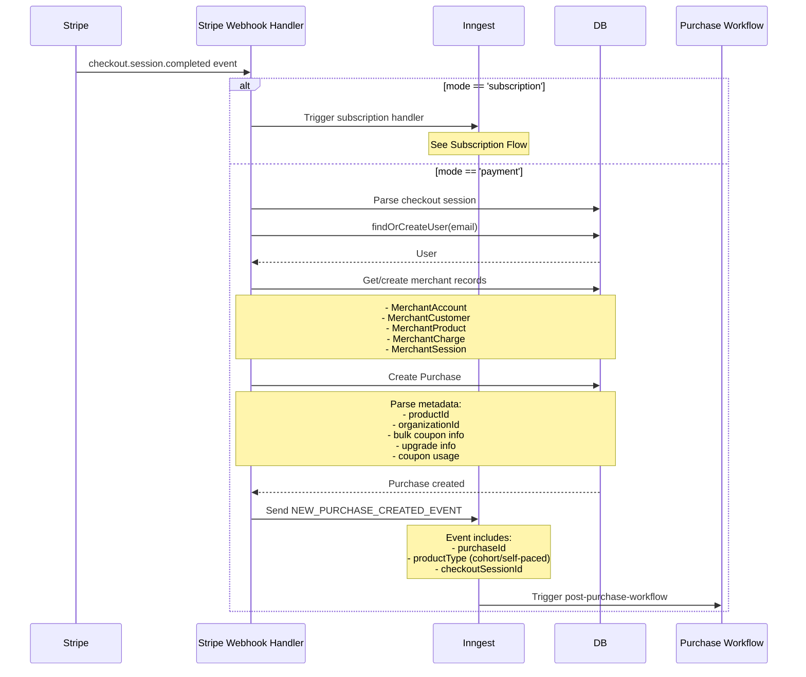
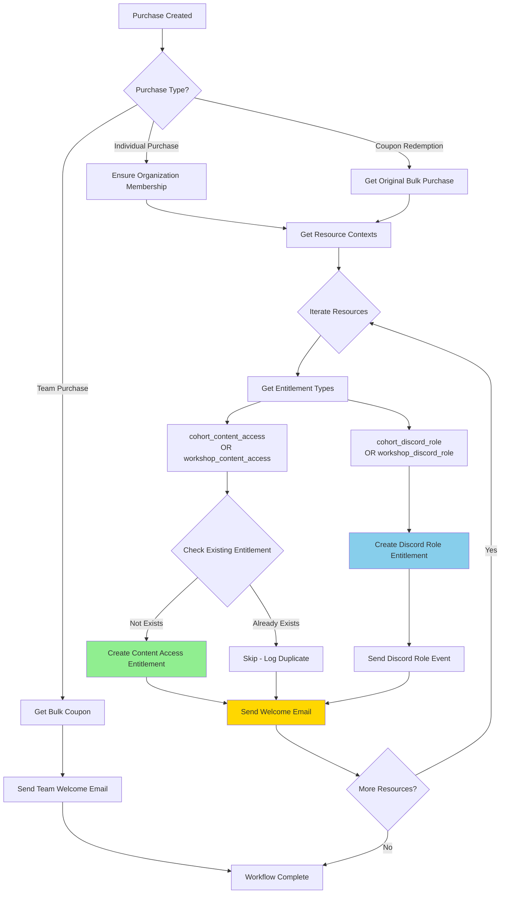
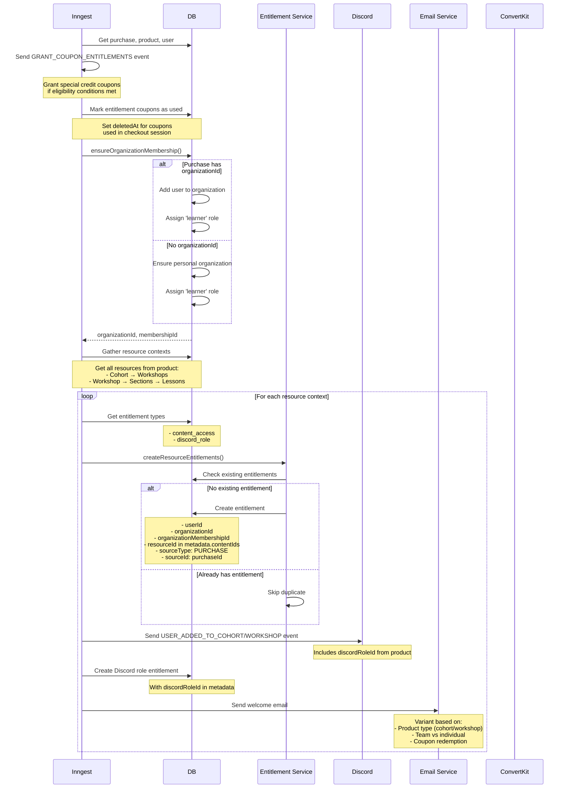
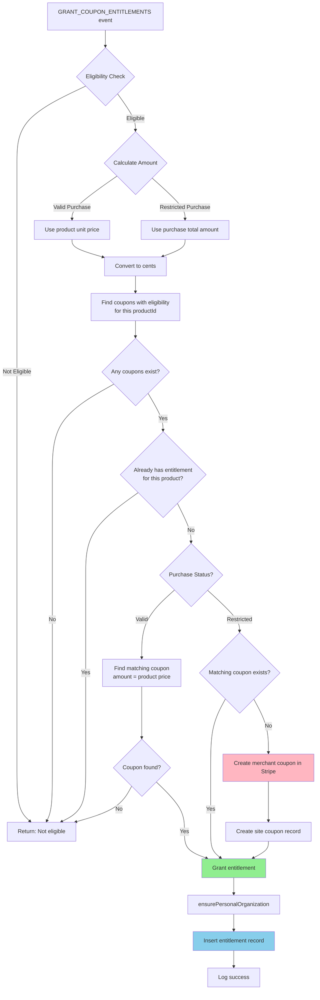
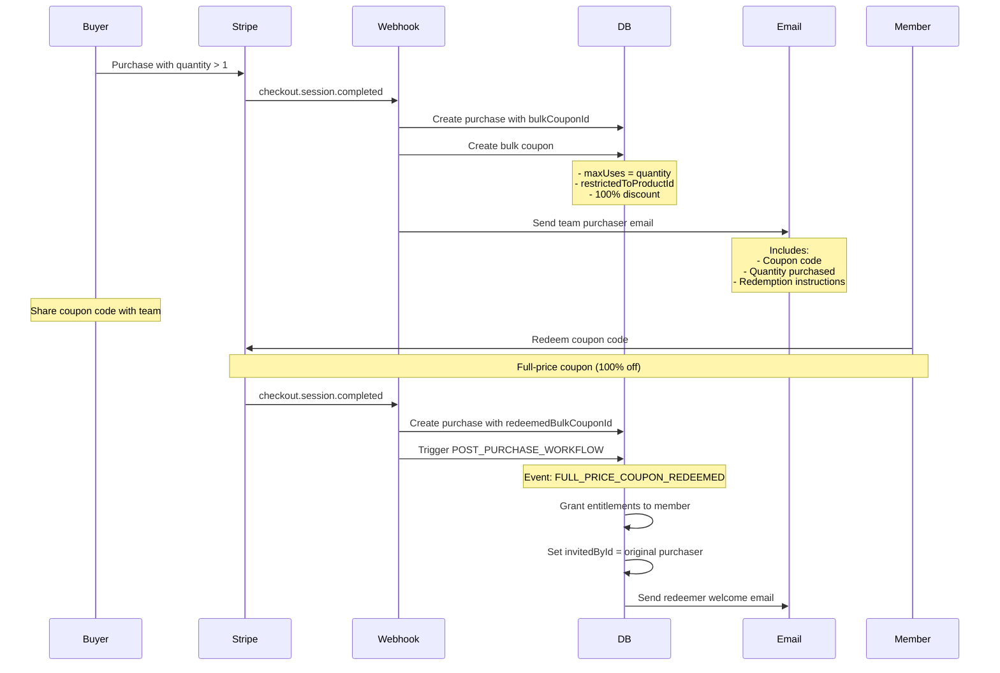
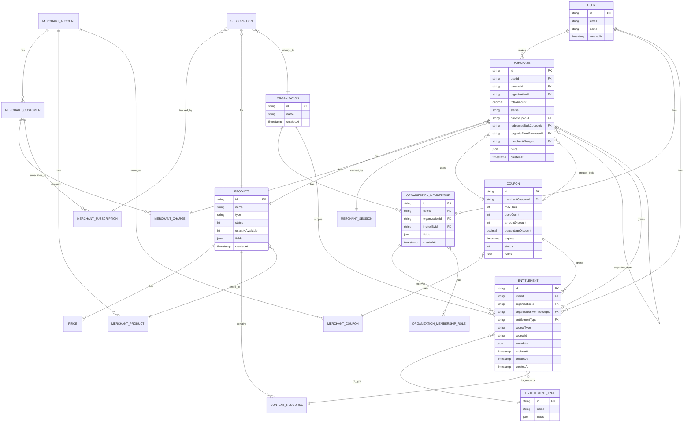
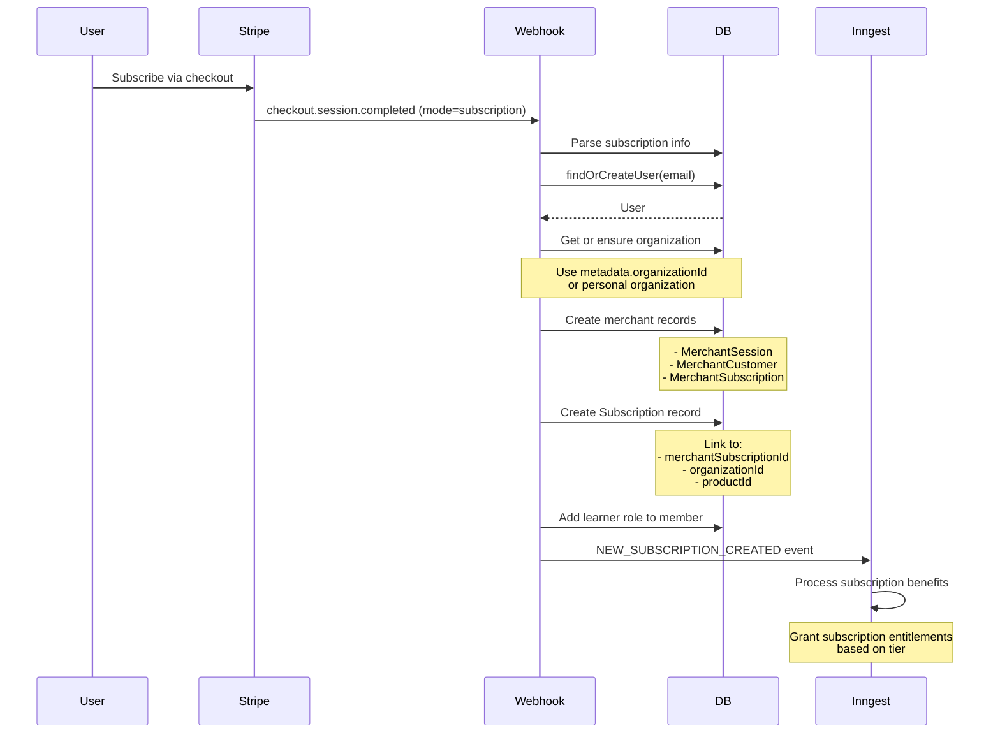

# Commerce Flow Documentation

## Overview

The ai-hero commerce system handles product purchases through Stripe integration, manages entitlements for content access, supports team/bulk purchases, and integrates with external services (Discord, ConvertKit). The system supports both one-time purchases and subscriptions.

### Key Components

- **Stripe Integration**: Payment processing via Stripe Checkout
- **Entitlements System**: Granular access control for content and features
- **Purchase Types**: Individual, team/bulk, full-price coupon redemption
- **Product Types**: Cohorts (time-based workshops) and self-paced workshops
- **Coupon System**: Stackable coupons with eligibility conditions
- **Post-Purchase Workflows**: Email, Discord roles, ConvertKit integration

---

## 1. Stripe Checkout Flow



---

## 2. Stripe Webhook Handling (Purchase Creation)



---

## 3. Entitlement Granting Flow



---

## 4. Post-Purchase Workflow (Individual)



---

## 5. Coupon Entitlement Granting



### Coupon Eligibility Logic

- **Valid Purchase**: Product has a defined price → grant coupon matching that price
- **Restricted Purchase**: Purchase has PPP/discount → create/find coupon for actual paid amount
- **Eligibility Condition**: Coupons have `fields.eligibilityCondition.productId` pointing to the purchased product
- **Entitlement Type**: `apply_special_credit` stored as `COUPON` source type

---

## 6. Team/Bulk Purchase Flow



---

## 7. Entity Relationship Diagram



---

## 8. Key Entitlement Types

| Entitlement Type | Purpose | Granted By | Metadata |
|-----------------|---------|------------|----------|
| `cohort_content_access` | Access to cohort workshops and lessons | Purchase, Transfer | `contentIds: [resourceId]` |
| `workshop_content_access` | Access to self-paced workshop content | Purchase, Transfer | `contentIds: [resourceId]` |
| `cohort_discord_role` | Discord role for cohort participants | Purchase | `discordRoleId` |
| `workshop_discord_role` | Discord role for workshop participants | Purchase | `discordRoleId` |
| `apply_special_credit` | Stackable coupon credit for future purchases | Coupon eligibility | `eligibilityProductId` |
| `subscription_tier` | Subscription-based access | Subscription | Tier details |

---

## 9. Subscription Flow



---

## 10. Refund & Entitlement Revocation

When a refund occurs:

1. **Stripe webhook** receives `charge.refunded` event
2. **Soft delete purchase entitlements**: Set `deletedAt` on all entitlements with `sourceType=PURCHASE` and `sourceId=purchaseId`
3. **Revoke credit entitlements**: Find and soft delete any `apply_special_credit` entitlements where `metadata.eligibilityProductId` matches the refunded product
4. **Discord role removal**: Trigger event to remove Discord roles
5. **Update purchase status**: Mark purchase as `Refunded`

---

## 11. Integration Points

### Discord Integration
- **Event**: `USER_ADDED_TO_COHORT_EVENT` or `USER_ADDED_TO_WORKSHOP_EVENT`
- **Handler**: `add-discord-role-workflow.ts`
- **Flow**: Looks up Discord user by email → assigns role via Discord API

### ConvertKit Integration
- **Triggered by**: Welcome emails and specific events
- **Purpose**: Add subscribers to email sequences
- **Tags**: Based on product type and purchase status

### Shortlink Attribution
- **Purpose**: Track referral sources for purchases
- **Flow**: Cookie-based attribution → linked to purchase on completion
- **Handler**: `shortlink-attribution` inngest function

---

## 12. Price Calculation Logic

```typescript
// Simplified pricing logic
finalPrice = basePrice
  - pppDiscount        // Country-based purchasing power parity
  - couponDiscount     // Applied coupon (default or user-provided)
  - upgradeCredit      // Credit from previous purchase
  - stackedCredit      // Additional credit from entitlement coupon (if preferStacking=true)

// Stacking only enabled when:
// - User has active 'apply_special_credit' entitlement
// - preferStacking flag is true
// - Credit is applied ON TOP of other discounts
```

### Discount Priority
1. Check for **upgrade** opportunities
2. Compare **user coupon** vs **default site coupon** → pick bigger discount
3. Apply **PPP discount** if enabled
4. Apply **entitlement credit** if stacking enabled

---

## Summary

The commerce system is designed around:
- **Flexibility**: Supports multiple product types, purchase modes, and discount strategies
- **Entitlements**: Granular, time-bounded access control with soft deletes
- **Observability**: Extensive logging at each step for debugging
- **Integration**: Seamless connections to Stripe, Discord, email services
- **Team Support**: Native bulk purchase and redemption flows
- **Upgrade Paths**: Built-in support for product upgrades with credit
