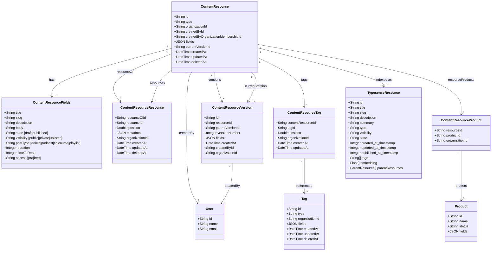
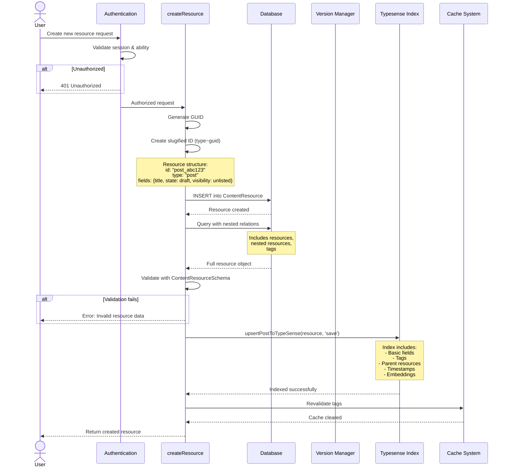
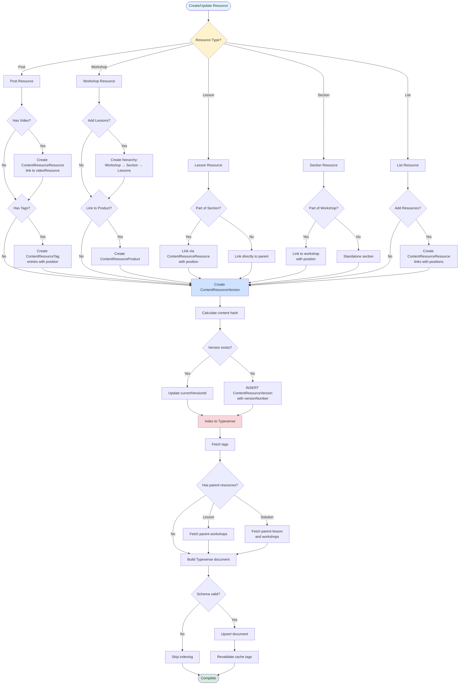
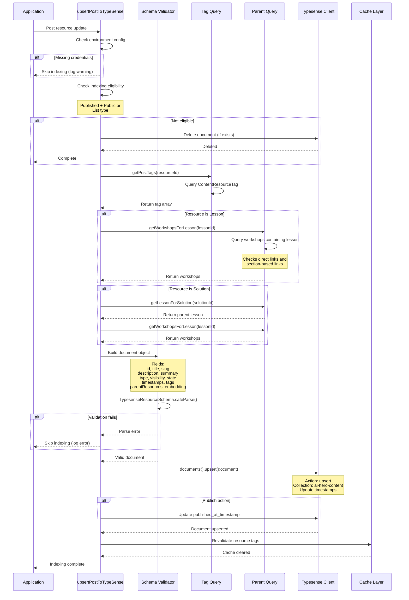
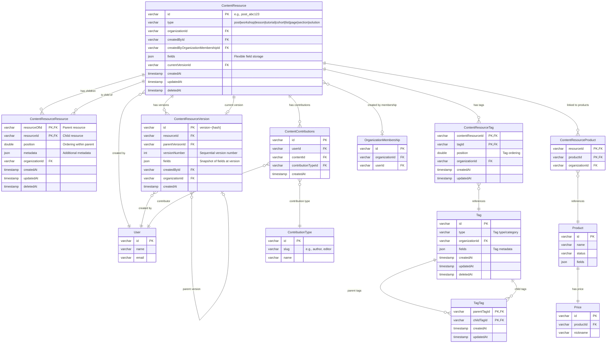
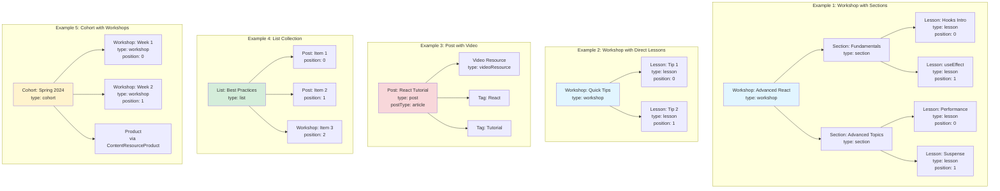

# Content Resource Management Flow

## Overview

The ai-hero application uses a flexible content resource system built around the `ContentResource` entity. Resources represent all content types in the system and support hierarchical relationships, versioning, tagging, and search indexing via Typesense.

### Resource Types

**Top-Level Resource Types:**
- `post` - Articles, podcasts, tips, courses, playlists (with subtypes)
- `workshop` - Multi-lesson workshop content
- `tutorial` - Tutorial content
- `cohort` - Group learning sessions
- `list` - Curated collections
- `page` - Static pages
- `lesson` - Individual lesson content
- `solution` - Problem solutions
- `section` - Organizational sections

**Post Subtypes:**
- `article` - Written content (supports video)
- `podcast` - Audio content
- `tip` - Short-form tips
- `course` - Course content
- `playlist` - Content collections

**Video Support:**
- Lessons: Full video support
- Posts (article subtype): Video support

---

## Architecture Diagrams

### 1. Content Resource Schema (Class Diagram)



---

### 2. Resource Creation Pipeline (Sequence Diagram)



---

### 3. Content Hierarchy Management (Flowchart)



---

### 4. Typesense Indexing Pipeline (Sequence Diagram)



---

### 5. Content Database Schema (Entity Relationship Diagram)



---

### 6. Content Hierarchy Examples (Flowchart)



---

## Key Workflows

### Resource Creation Flow

1. **Authentication & Authorization**
   - Validate user session
   - Check ability to create content
   - Throw error if unauthorized

2. **ID & Slug Generation**
   - Generate GUID using `guid()` utility
   - Create resource ID: `{type}_{guid}` (e.g., `post_abc123`)
   - Generate slug: `{slugified-title}~{guid}`

3. **Resource Insertion**
   - Insert into `ContentResource` table
   - Default state: `draft`
   - Default visibility: `unlisted`
   - Store flexible fields in JSON `fields` column

4. **Nested Relations**
   - Query with nested relations:
     - `resources` (children via `ContentResourceResource`)
     - Nested `resource.resources` (grandchildren)
     - `tags` via `ContentResourceTag`

5. **Schema Validation**
   - Parse with `ContentResourceSchema`
   - Validate all required fields
   - Return error if validation fails

6. **Typesense Indexing**
   - Call `upsertPostToTypeSense(resource, 'save')`
   - Include tags and parent resources
   - Generate embeddings for vector search
   - Update timestamps

7. **Cache Revalidation**
   - Revalidate affected cache tags
   - Clear related queries

### Version Management Flow

1. **Content Hash Calculation**
   - Generate hash from resource fields
   - Version ID format: `version~{hash}`

2. **Check Existing Version**
   - Query `ContentResourceVersion` by version ID
   - If exists, just update `currentVersionId` pointer
   - If new, proceed to create

3. **Create New Version**
   - Insert into `ContentResourceVersion`
   - Increment `versionNumber`
   - Reference `parentVersionId`
   - Snapshot current `fields` JSON
   - Record `createdById`

4. **Update Current Pointer**
   - Update `ContentResource.currentVersionId`
   - Maintain version chain via `parentVersionId`

### Tag Management Flow

1. **Adding Tags**
   - Insert into `ContentResourceTag`
   - Specify `position` for ordering
   - Link to existing `Tag` via `tagId`

2. **Updating Tags**
   - Delete all existing tags for resource
   - Insert new tag associations
   - Preserve order via position values

3. **Removing Tags**
   - Delete from `ContentResourceTag`
   - Match both `contentResourceId` and `tagId`

### Typesense Indexing Flow

1. **Eligibility Check**
   - Published and Public, OR
   - Type is 'list'
   - If ineligible, attempt deletion from index

2. **Fetch Related Data**
   - Query tags via `getPostTags()`
   - For lessons: Query parent workshops via `getWorkshopsForLesson()`
   - For solutions: Query lesson, then workshops

3. **Document Construction**
   - Map resource fields to Typesense schema
   - Include tags array
   - Include parentResources array with metadata
   - Set timestamps (created, updated, published)
   - Include embedding vector for similarity search

4. **Schema Validation**
   - Validate against `TypesenseResourceSchema`
   - Skip indexing if validation fails
   - Log error for debugging

5. **Upsert to Typesense**
   - Use `documents().upsert()` for atomic operation
   - Update `updated_at_timestamp`
   - Set `published_at_timestamp` if action is 'publish'
   - Handle errors gracefully (non-fatal)

6. **Vector Search Support**
   - Documents include `embedding` field
   - Used for nearest neighbor queries
   - Filter by distance threshold
   - Exclude completed items for users

---

## Important Implementation Details

### Resource Types with Video

Only specific resource types support video attachments:
- **Lessons**: Full video support
- **Posts (article subtype)**: Video support

### Hierarchical Queries

Workshops can contain lessons in two ways:
1. **Direct attachment**: Workshop → Lesson
2. **Via sections**: Workshop → Section → Lesson

Queries must handle both patterns using UNION:

```sql
-- Direct lesson in workshop
SELECT FROM workshop w
JOIN contentResourceResource crr ON w.id = crr.resourceOfId
WHERE crr.resourceId = {lessonId}

UNION

-- Lesson in section in workshop
SELECT FROM workshop w
JOIN contentResourceResource crr_section ON w.id = crr_section.resourceOfId
JOIN contentResource section ON section.id = crr_section.resourceId
JOIN contentResourceResource crr_lesson ON section.id = crr_lesson.resourceOfId
WHERE section.type = 'section' AND crr_lesson.resourceId = {lessonId}
```

### Product Association

Products can be linked to resources via:
1. **Direct**: Resource → Product (via `ContentResourceProduct`)
2. **Via Cohort**: Workshop → Cohort → Product (priority 2)

Priority is given to direct associations.

### Slug Management

Slugs maintain format: `{slugified-title}~{guid}`
- GUID persists across title changes
- Enables title updates without breaking URLs
- Can be manually overridden

### State & Visibility

**State:**
- `draft`: Work in progress
- `published`: Ready for consumption

**Visibility:**
- `public`: Visible to all users
- `private`: Visible only to authorized users
- `unlisted`: Accessible via direct link

### Cache Strategy

The system uses Next.js cache tags:
- `posts`: All posts
- `workshop`: Workshop content
- `workshop-navigation`: Workshop nav data
- Resource-specific: `{resourceId}`

Revalidation occurs on:
- Create
- Update
- Delete
- Publish

### Error Handling in Typesense

Typesense operations are non-fatal:
- Indexing errors are logged but don't fail the main operation
- Deletion errors for non-existent documents are ignored (404)
- Validation errors skip indexing but allow resource creation

---

## API Endpoints

### tRPC Routers

**contentResourceRouter:**
- `getList(slugOrId)`: Fetch list resource
- `getAll(contentTypes)`: Fetch all resources by type (protected)
- `getPublishedResourcesLength()`: Count published resources
- `getWorkshop(id)`: Fetch workshop with nested structure
- `getNextWorkshopInCohort(cohortId, currentWorkshopId)`: Navigation

### Server Actions

**create-resources.ts:**
- `createResource(type, title)`: Create new resource

**posts-query.ts:**
- `createPost(input)`: Create post with video
- `updatePost(input, action)`: Update post
- `deletePost(id)`: Delete post
- `addTagToPost(postId, tagId)`: Add tag
- `updatePostTags(postId, tags)`: Replace tags
- `writeNewPostToDatabase(input)`: Low-level post creation
- `writePostUpdateToDatabase(input)`: Low-level post update

**workshops-query.ts:**
- `getWorkshop(slugOrId)`: Fetch workshop
- `getAllWorkshops()`: List all workshops
- `updateWorkshop(input)`: Update workshop
- `addResourceToWorkshop(resource, workshopId)`: Add child
- `updateResourcePosition(...)`: Reorder children

**typesense-query.ts:**
- `upsertPostToTypeSense(post, action)`: Index resource
- `deletePostInTypeSense(postId)`: Remove from index
- `indexAllContentToTypeSense(resources)`: Bulk index
- `getNearestNeighbour(documentId, k, threshold)`: Vector search

---

## Search & Discovery

### Typesense Collection Schema

The `ai-hero-content` collection stores:
- **Text Fields**: `title`, `slug`, `description`, `summary`, `type`, `visibility`, `state`
- **Timestamps**: `created_at_timestamp`, `updated_at_timestamp`, `published_at_timestamp`
- **Arrays**: `tags[]`, `parentResources[]`
- **Vector**: `embedding[]` (for semantic search)

### Vector Search

Nearest neighbor queries:
- Use document embeddings for similarity
- Filter by `published` state and content type
- Exclude user's completed items
- Apply distance threshold
- Return top K results

### Faceted Search

Supports filtering by:
- `type`: Resource type
- `visibility`: Public/private/unlisted
- `state`: Draft/published
- `tags[]`: Associated tags

---

## Best Practices

1. **Always validate with schemas** before database operations
2. **Use transactions** for multi-table operations (tags, versions)
3. **Handle Typesense errors gracefully** - they should never block main operations
4. **Revalidate cache** after mutations
5. **Generate slugs with GUID suffix** for stable URLs
6. **Check authorization** via CASL abilities before operations
7. **Use nested queries** to fetch full resource trees efficiently
8. **Version on content changes** to maintain history
9. **Index to Typesense asynchronously** after database operations
10. **Support both direct and section-based hierarchies** in queries

---

## Troubleshooting

### Common Issues

**Resource not found after creation:**
- Check schema validation
- Verify all required fields are present
- Ensure visibility/state filters allow access

**Typesense indexing fails:**
- Verify environment variables (`TYPESENSE_WRITE_API_KEY`, `NEXT_PUBLIC_TYPESENSE_HOST`)
- Check resource eligibility (published + public, or list type)
- Validate document against `TypesenseResourceSchema`
- Review logs for specific errors

**Hierarchy queries return incomplete results:**
- Ensure queries handle both direct and section-based patterns
- Check `position` ordering
- Verify `ContentResourceResource` links exist

**Version creation fails:**
- Confirm content hash uniqueness
- Check `versionNumber` sequence
- Verify `parentVersionId` references valid version

**Cache not updating:**
- Ensure `revalidateTag()` is called
- Check cache key consistency
- Verify Next.js cache configuration
