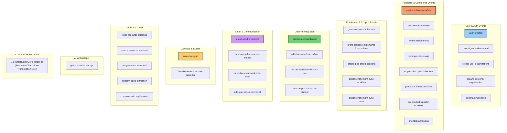
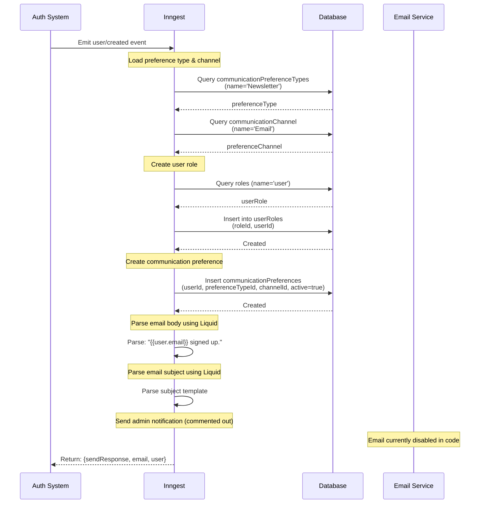
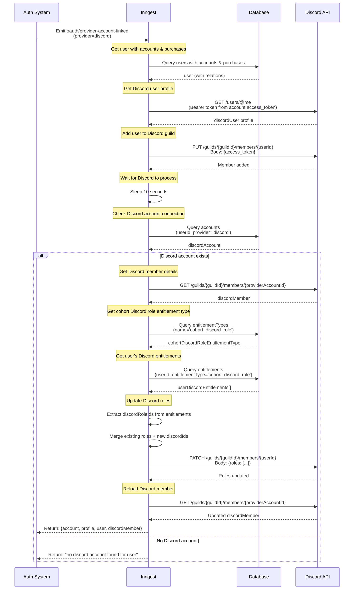
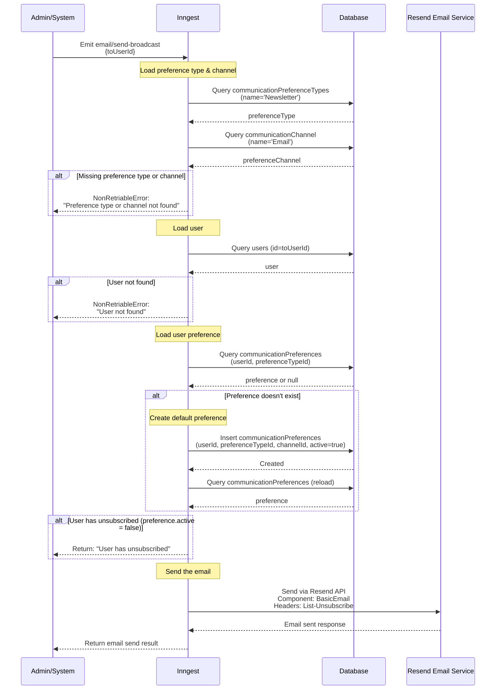
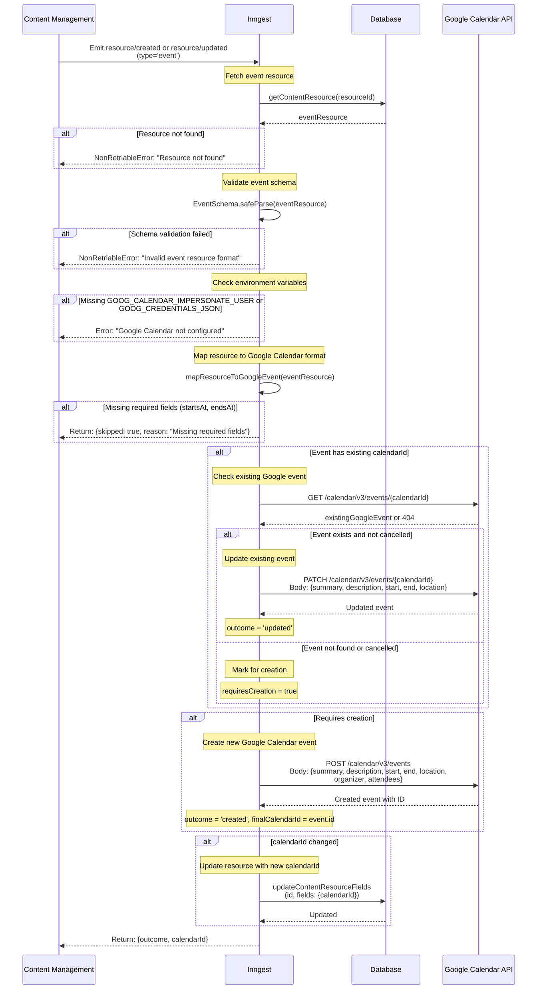
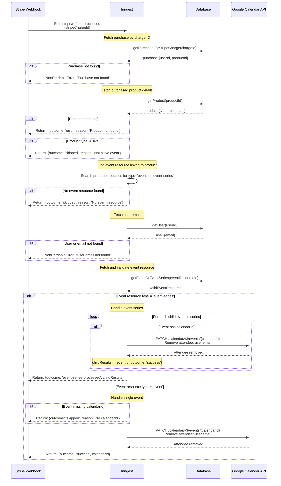

# Event Processing (Inngest)

## Overview

AI Hero uses Inngest for event-driven workflows and background job processing. The system orchestrates complex multi-step workflows including purchase fulfillment, user onboarding, Discord integration, email broadcasts, and Google Calendar synchronization.

**Key Components:**
- **Inngest Server**: Configured with middleware for AI providers (OpenAI, Deepgram), payment (Stripe), email (Resend), and notifications (Slack)
- **Event Registry**: 40+ registered functions handling various event types
- **External Integrations**: Discord API, Google Calendar API, Stripe webhooks, Postmark webhooks, ConvertKit
- **Database**: Drizzle ORM for entitlements, organizations, purchases, and user management

## Registered Inngest Functions



## Event Flow Architecture

```mermaid
flowchart LR
    subgraph "Event Sources"
        UI[User Actions]
        Webhooks[External Webhooks<br/>Stripe, Postmark]
        Scheduled[Scheduled Jobs]
        Internal[Internal Events]
    end

    subgraph "Inngest Core"
        API[/api/inngest Route]
        EventBus[Event Bus]
        Functions[Function Registry]
    end

    subgraph "Middleware Layer"
        Auth[Auth Provider]
        DB[Database Adapter]
        Payment[Payment Provider<br/>Stripe]
        Email[Email Provider<br/>Resend]
        AI[AI Providers<br/>OpenAI, Deepgram]
        Party[PartyKit Provider]
        Notify[Notification Provider<br/>Slack]
    end

    subgraph "External Services"
        Discord[Discord API]
        GCal[Google Calendar API]
        ConvertKit[ConvertKit API]
        Mux[Mux Video]
        Uploadthing[UploadThing]
    end

    UI --> API
    Webhooks --> API
    Scheduled --> API
    Internal --> EventBus

    API --> EventBus
    EventBus --> Functions

    Functions --> Auth
    Functions --> DB
    Functions --> Payment
    Functions --> Email
    Functions --> AI
    Functions --> Party
    Functions --> Notify

    Functions --> Discord
    Functions --> GCal
    Functions --> ConvertKit
    Functions --> Mux
    Functions --> Uploadthing

    style EventBus fill:#f96,stroke:#333,stroke-width:2px
    style Functions fill:#fc6,stroke:#333,stroke-width:2px
```

---

## User Created Workflow

**Event:** `user/created`
**Trigger:** New user signs up via OAuth or email authentication
**Idempotency:** `event.user.email`



**Key Steps:**
1. Load Newsletter preference type and Email channel from DB
2. Assign default 'user' role to new user
3. Create communication preference (active Newsletter via Email)
4. Parse email templates using Liquid templating engine
5. (Disabled) Send admin notification email

---

## Post-Purchase Workflow

**Event:** `purchase/created`, `coupon/full-price-redeemed`
**Trigger:** Successful purchase or full-price coupon redemption for cohorts/workshops
**Idempotency:** `event.data.purchaseId`

```mermaid
sequenceDiagram
    participant Stripe as Stripe/Commerce
    participant Inngest as Inngest
    participant DB as Database
    participant Email as Email Service
    participant Discord as Discord API
    participant Calendar as Event System

    Stripe->>Inngest: NEW_PURCHASE_CREATED or<br/>FULL_PRICE_COUPON_REDEEMED

    Note over Inngest: Step 1-3: Load purchase, product, user
    Inngest->>DB: getPurchase(purchaseId)
    DB-->>Inngest: purchase
    Inngest->>DB: getProduct(productId)
    DB-->>Inngest: product
    Inngest->>DB: getUserById(userId)
    DB-->>Inngest: user

    Note over Inngest: Step 4: Determine purchase type
    Inngest->>Inngest: Check: isTeamPurchase?<br/>isFullPriceCouponRedemption?

    Note over Inngest: Step 5: Grant coupon entitlements
    Inngest->>Inngest: Emit GRANT_COUPON_ENTITLEMENTS_FOR_PURCHASE

    Note over Inngest: Step 6: Mark entitlement coupons as used
    alt NEW_PURCHASE_CREATED with entitlement coupons
        Inngest->>Stripe: getCheckoutSession(checkoutSessionId)
        Stripe-->>Inngest: checkoutSession with metadata
        Inngest->>DB: UPDATE entitlements<br/>SET deletedAt = NOW()<br/>WHERE sourceId IN (usedCouponIds)
        DB-->>Inngest: Updated
    end

    Note over Inngest: Step 7: Get bulk coupon data (if redemption)
    alt Full Price Coupon Redemption
        Inngest->>DB: getCouponWithBulkPurchases(bulkCouponId)
        DB-->>Inngest: coupon + originalBulkPurchase
    end

    Note over Inngest: Step 8-9: Gather resource contexts & data
    Inngest->>Inngest: gatherResourceContexts(product, productType)
    loop For each resource context
        Inngest->>DB: getResourceData(resourceId)
        DB-->>Inngest: resourceData
    end

    alt Team Purchase
        Note over Inngest: Team purchase flow
        Inngest->>DB: getCoupon(bulkCouponId)
        DB-->>Inngest: bulkCoupon

        loop For each resource
            alt Product Type = cohort
                Inngest->>Email: Send CohortWelcomeEmail<br/>(team purchaser variant)
            else Product Type = self-paced
                Inngest->>Email: Send WorkshopWelcomeEmail<br/>(team purchaser variant)
            end
        end

    else Individual Purchase (Valid/Restricted status)
        Note over Inngest: Individual purchase flow

        Note over Inngest: Step 11a: Ensure org membership
        alt purchase.organizationId exists
            Inngest->>DB: addMemberToOrganization(orgId, userId, invitedById)
            DB-->>Inngest: orgMembership
            Inngest->>DB: addRoleForMember(memberId, 'learner')
        else No organizationId
            Inngest->>DB: ensurePersonalOrganizationWithLearnerRole(user)
            DB-->>Inngest: organization + orgMembership
        end

        loop For each resource context
            Note over Inngest: Get entitlement types for resource
            Inngest->>DB: Query entitlementTypes<br/>(name=contentAccess)
            DB-->>Inngest: contentAccessEntitlementType
            Inngest->>DB: Query entitlementTypes<br/>(name=discordRole)
            DB-->>Inngest: discordRoleEntitlementType

            Note over Inngest: Determine Discord role ID
            Inngest->>Inngest: getDiscordRoleId(productType, product)

            Note over Inngest: Send Discord role event
            alt Product Type = cohort
                Inngest->>Calendar: Emit USER_ADDED_TO_COHORT_EVENT
            else Product Type = self-paced
                Inngest->>Calendar: Emit USER_ADDED_TO_WORKSHOP_EVENT
            end

            Note over Inngest: Create Discord role entitlement
            alt Discord role exists
                Inngest->>DB: createEntitlement<br/>(type=discordRole, metadata={discordRoleId})
                DB-->>Inngest: Created
            end

            Note over Inngest: Create content access entitlements
            Inngest->>DB: createResourceEntitlements<br/>(resourceData, user, purchase, org)
            DB-->>Inngest: entitlements[]

            Note over Inngest: Send welcome email
            alt Product Type = cohort
                Inngest->>Email: Send CohortWelcomeEmail<br/>(individual variant)
            else Product Type = self-paced
                Inngest->>Email: Send WorkshopWelcomeEmail<br/>(individual variant)
            end
        end
    end

    Inngest-->>Stripe: Return workflow result
```



**Key Steps:**
1. Load purchase, product, and user data
2. Determine purchase characteristics (team vs individual, coupon redemption)
3. Grant coupon-based entitlements via event
4. Mark used entitlement coupons as deleted
5. Gather all resource contexts from product (cohorts/workshops)
6. **Team Purchase Path:**
   - Get bulk coupon data
   - Send welcome emails to team purchaser
7. **Individual Purchase Path:**
   - Ensure organization membership (either specified org or personal org)
   - For each resource:
     - Load entitlement types (content access, Discord role)
     - Emit Discord role events
     - Create Discord role entitlement
     - Create content access entitlements (recursive for nested resources)
     - Send personalized welcome email

**Product Types Handled:**
- `cohort`: Multi-session cohort-based courses
- `self-paced`: Self-paced workshops

---

## Discord Account Linked Workflow

**Event:** `oauth/provider-account-linked`
**Trigger:** User links Discord account via OAuth
**Condition:** `event.data.account.provider == "discord"`



**Key Steps:**
1. Load user with associated accounts and purchases
2. Fetch Discord user profile using OAuth access token
3. Add user to Discord guild with PUT request
4. Wait 10 seconds for Discord to process membership
5. Verify Discord account connection in DB
6. Load Discord member data from guild
7. Query cohort Discord role entitlement type
8. Get all user's Discord entitlements
9. Merge existing Discord roles with entitled roles
10. Update Discord member roles via PATCH
11. Reload Discord member to confirm changes

**Discord Entitlements:**
- Entitlement type: `cohort_discord_role`
- Metadata contains `discordRoleId` for each purchased cohort
- Roles are merged (existing + entitled) to preserve manual assignments

---

## Email Send Broadcast Workflow

**Event:** `email/send-broadcast`
**Trigger:** Manual broadcast email to user
**Purpose:** Send newsletter/broadcast emails with unsubscribe support



**Key Steps:**
1. Load Newsletter preference type and Email channel
2. Load target user by ID
3. Check if user has communication preference
4. Create preference if missing (default: active=true)
5. Check if user has unsubscribed (active=false)
6. Send email via Resend with:
   - BasicEmail component
   - List-Unsubscribe header pointing to `/unsubscribed?userId={userId}`
   - Type: broadcast

**Email Configuration:**
- From: `${SITE_TITLE} <${SUPPORT_EMAIL}>`
- Component: BasicEmail with body and preview
- Unsubscribe URL: `${PUBLIC_URL}/unsubscribed?userId={userId}`

---

## Calendar Sync Workflow

**Event:** `resource/created`, `resource/updated`
**Trigger:** Event resource created or updated
**Condition:** `event.data.type == 'event'`



**Key Steps:**
1. Fetch full event resource from DB
2. Validate resource against EventSchema (Zod validation)
3. Check required environment variables (Google credentials)
4. Map resource fields to Google Calendar format:
   - Convert markdown description to HTML
   - Map startsAt/endsAt to dateTime with timezone
   - Set guestsCanInviteOthers=false, guestsCanSeeOtherGuests=false
5. **If calendarId exists:**
   - Try to fetch existing Google Calendar event
   - If found and not cancelled: update event
   - If not found or cancelled: mark for creation
6. **If requires creation:**
   - Create new Google Calendar event with organizer and attendees
   - Store returned calendarId
7. Update resource with final calendarId if changed

**Google Calendar Configuration:**
- Organizer: `GOOG_CALENDAR_IMPERSONATE_USER`
- Display Name: "AI Hero"
- Attendees: Host is auto-added as accepted
- Timezone: Default `America/Los_Angeles`
- Description: Markdown converted to HTML

---

## Refund and Calendar Removal Workflow

**Event:** `stripe/refund-processed`
**Trigger:** Stripe refund processed
**Purpose:** Remove refunded user from Google Calendar events



**Key Steps:**
1. Fetch purchase by Stripe charge ID
2. Load purchased product details
3. Verify product type is 'live' (skip otherwise)
4. Find event or event-series resource linked to product
5. Fetch user's email address
6. Fetch and validate event resource
7. **If event-series:**
   - Iterate through all child events
   - Remove user from each event's Google Calendar attendees
   - Collect results for each child event
8. **If single event:**
   - Verify calendarId exists
   - Remove user from Google Calendar attendees

**Product Types:**
- Only processes products with `type='live'`
- Skips all other product types (cohort, self-paced, etc.)

**Google Calendar Operations:**
- Uses `removeUserFromGoogleCalendarEvent(calendarId, userEmail)`
- PATCH request to remove attendee
- Handles both single events and event series

---

## Event Type Registry

### User & Authentication Events

| Event Name | Type | Payload | Description |
|------------|------|---------|-------------|
| `user/created` | UserCreated | `{user}` | New user account created via OAuth or email |
| `user/signup` | UserSignup | `{user}` | User completes signup (triggers admin notification) |
| `oauth/provider-account-linked` | OauthProviderAccountLinked | `{account, profile}` | OAuth provider linked (Discord, GitHub, etc.) |
| `user-organizations/create` | CreateUserOrganizations | `{userId}` | Create organizations for user |
| `personal-organization/ensure` | EnsurePersonalOrganization | `{userId}` | Ensure user has personal organization |

### Purchase & Commerce Events

| Event Name | Type | Payload | Description |
|------------|------|---------|-------------|
| `purchase/created` | NewPurchaseCreated | `{purchaseId, productType, checkoutSessionId}` | New purchase completed (Stripe checkout) |
| `coupon/full-price-redeemed` | FullPriceCouponRedeemed | `{purchaseId, productType}` | Full-price bulk coupon redeemed |
| `stripe/checkout-session-completed` | StripeCheckoutSessionCompleted | `{stripeEvent}` | Stripe checkout session completed |
| `subscription/created` | NewSubscriptionCreated | `{subscriptionId, checkoutSessionId}` | New subscription created |
| `stripe/refund-processed` | RefundProcessed | `{stripeChargeId, merchantChargeId}` | Stripe refund processed |
| `purchase/transferred` | PurchaseTransferred | `{purchaseId, fromUserId, toUserId}` | Purchase transferred to another user |
| `purchase/transferred-api` | PurchaseTransferredApi | `{purchaseId, fromUserId, toUserId}` | Purchase transferred via API |

### Entitlement & Coupon Events

| Event Name | Type | Payload | Description |
|------------|------|---------|-------------|
| `coupon/grant-entitlements` | GrantCouponEntitlements | `{couponId, userId}` | Grant entitlements from coupon |
| `coupon/grant-entitlements-for-purchase` | GrantCouponEntitlementsForPurchase | `{purchaseId, userId, productId}` | Grant coupon entitlements after purchase |
| `coupon/create-ppp-credit` | CreatePPPCreditCoupons | `{productId}` | Create PPP credit coupons for purchasers |
| `cohort/updated` | CohortUpdated | `{cohortId, changes: {resourcesAdded, resourcesRemoved}}` | Cohort resources changed |
| `cohort-entitlement/sync.user` | CohortEntitlementSyncUser | `{cohortId, userId, cohortResourceIds}` | Sync entitlements for one user after cohort update |
| `sync/purchase-tags` | SyncPurchaseTags | `{purchaseId}` | Sync purchase tags with external systems |

### Discord Integration Events

| Event Name | Type | Payload | Description |
|------------|------|---------|-------------|
| `discord/account-linked` | OauthProviderAccountLinked | `{account.provider='discord'}` | Discord account linked via OAuth |
| `discord/user-added-to-cohort` | UserAddedToCohort | `{cohortId, userId, discordRoleId}` | User added to cohort (grant Discord role) |
| `discord/user-added-to-workshop` | UserAddedToWorkshop | `{workshopId, userId, discordRoleId}` | User added to workshop (grant Discord role) |

### Email & Communication Events

| Event Name | Type | Payload | Description |
|------------|------|---------|-------------|
| `email/send-broadcast` | EmailSendBroadcast | `{toUserId}` | Send broadcast email to user |
| `postmark/webhook` | PostmarkWebhook | `{event, data}` | Postmark webhook event (bounce, delivery, etc.) |

### Calendar & Event Management

| Event Name | Type | Payload | Description |
|------------|------|---------|-------------|
| `resource/created` | ResourceCreated | `{id, type='event'}` | Event resource created |
| `resource/updated` | ResourceUpdated | `{id, type='event'}` | Event resource updated |

### Media & Content Events

| Event Name | Type | Payload | Description |
|------------|------|---------|-------------|
| `video/attached` | VideoAttached | `{resourceId, videoResourceId}` | Video resource attached to content |
| `video/detached` | VideoDetached | `{resourceId, videoResourceId}` | Video resource detached from content |
| `image/resource-created` | ImageResourceCreated | `{imageResourceId}` | Image resource created |
| `ocr/webhook` | OcrWebhook | `{data}` | OCR processing webhook |
| `video/split-points-requested` | RequestVideoSplitPoints | `{videoResourceId}` | Request video split points calculation |

### AI & Concept Events

| Event Name | Type | Payload | Description |
|------------|------|---------|-------------|
| `concept/tags-requested` | ConceptTagsRequested | `{text}` | Request concept tag suggestions |
| `concept/selection-requested` | RequestConceptSelection | `{text, tags}` | Request concept selection from tags |
| `concept/selected` | ConceptSelected | `{conceptId, text}` | Concept selected for resource |
| `resource/chat-request` | ResourceChat | `{resourceId, message}` | AI chat request for resource |

### Progress & Engagement Events

| Event Name | Type | Payload | Description |
|------------|------|---------|-------------|
| `lesson/completed` | LessonCompleted | `{lessonId, userId}` | User completed lesson |
| `progress/no-progress-made` | NoProgressMade | `{userId, days}` | User hasn't made progress in X days |

---

## Configuration & Setup

### Inngest Server Configuration

**File:** `src/inngest/inngest.server.ts`

```typescript
// Inngest client with middleware
export const inngest = new Inngest({
  id: env.NEXT_PUBLIC_APP_NAME,
  middleware: [middleware],
  schemas: new EventSchemas().fromRecord<Events & CourseBuilderCoreEvents>(),
})
```

**Middleware Providers:**
- **Database**: `courseBuilderAdapter` (Drizzle ORM)
- **Payment**: `stripeProvider` (Stripe API)
- **Email**: `emailProvider` (Resend)
- **Notification**: `slackProvider` (Slack webhooks)
- **AI**:
  - `OpenAIProvider` (OpenAI API)
  - `DeepgramProvider` (Deepgram transcription)
- **Media**: `UTApi` (UploadThing)
- **Collaboration**: `PartykitProvider` (PartyKit websockets)
- **Auth**: `authOptions` (NextAuth.js)

### API Route Setup

**File:** `src/app/api/inngest/route.ts`

```typescript
import { inngestConfig } from '@/inngest/inngest.config'
import { withSkill } from '@/server/with-skill'
import { serve } from 'inngest/next'

export const maxDuration = 300  // 5 minutes

const inngest = serve(inngestConfig)

export const GET = withSkill(inngest.GET)
export const POST = withSkill(inngest.POST)
export const PUT = withSkill(inngest.PUT)
```

- **Max Duration**: 5 minutes (300 seconds) for long-running functions
- **Skill Integration**: Wrapped with `withSkill` for additional middleware
- **HTTP Methods**: GET (UI), POST/PUT (event ingestion)

### Environment Variables

**Required:**
- `NEXT_PUBLIC_APP_NAME` - Inngest client ID
- `NEXT_PUBLIC_URL` - Site base URL
- `INNGEST_EVENT_KEY` - Inngest event key
- `INNGEST_SIGNING_KEY` - Inngest signing key (production)

**External Services:**
- `STRIPE_SECRET_KEY` - Stripe payment processing
- `RESEND_API_KEY` - Email sending
- `OPENAI_API_KEY` - AI features
- `DEEPGRAM_API_KEY` - Transcription
- `DISCORD_BOT_TOKEN` - Discord integration
- `DISCORD_GUILD_ID` - Discord server ID
- `GOOG_CALENDAR_IMPERSONATE_USER` - Google Calendar service account
- `GOOG_CREDENTIALS_JSON` - Google service account credentials
- `UPLOADTHING_SECRET` - Media upload
- `NEXT_PUBLIC_PARTY_KIT_URL` - PartyKit collaboration

**Optional:**
- `SLACK_WEBHOOK_URL` - Slack notifications
- `CONVERTKIT_API_KEY` - ConvertKit integration
- `POSTMARK_API_KEY` - Email delivery tracking

### Function Registration

**File:** `src/inngest/inngest.config.ts`

Functions are registered in the `inngestConfig.functions` array:

```typescript
export const inngestConfig = {
  client: inngest,
  functions: [
    // Core builder functions from package
    ...courseBuilderCoreFunctions.map(({ config, trigger, handler }) =>
      inngest.createFunction(config, trigger, handler),
    ),
    // App-specific functions
    userCreated,
    postPurchaseWorkflow,
    discordAccountLinked,
    emailSendBroadcast,
    calendarSync,
    // ... 40+ total functions
  ],
}
```

### Idempotency & Retries

**Idempotency Keys:**
- `user/created`: `event.user.email`
- `post-purchase-workflow`: `event.data.purchaseId`
- Most purchase-related workflows use purchaseId for idempotency

**Retry Strategy:**
- Inngest default: 3 retries with exponential backoff
- `NonRetriableError`: Skip retries for permanent failures (missing data, invalid state)

### Step Functions & Durability

Inngest functions use `step.run()` for durable execution:
- Each step is retryable independently
- State persists between retries
- Steps can be viewed in Inngest dashboard
- `step.sleep()`: Delay execution (e.g., "give Discord 10 seconds")
- `step.sendEvent()`: Emit events to trigger other functions

---

## Key Patterns & Best Practices

### Event Orchestration

**Fan-Out Pattern:**
```typescript
// Post-purchase emits multiple events
await step.sendEvent('grant coupon entitlements', {
  name: GRANT_COUPON_ENTITLEMENTS_FOR_PURCHASE_EVENT,
  data: { purchaseId, userId, productId }
})

await step.sendEvent('discord role event', {
  name: USER_ADDED_TO_COHORT_EVENT,
  data: { cohortId, userId, discordRoleId }
})
```

**Conditional Execution:**
```typescript
// Only process for specific product types
{
  event: NEW_PURCHASE_CREATED_EVENT,
  if: 'event.data.productType == "cohort" || event.data.productType == "self-paced"'
}
```

### Error Handling

**Retriable Errors:**
```typescript
// Let Inngest retry network failures
throw new Error('Failed to fetch from external API')
```

**Non-Retriable Errors:**
```typescript
// Don't retry missing data
if (!user) {
  throw new NonRetriableError('User not found')
}
```

### External API Integration

**Discord API:**
- Use `fetchAsDiscordBot()` for authenticated requests
- Sleep 10s after adding user to guild (Discord processing time)
- Merge existing roles with new roles (preserve manual assignments)

**Google Calendar API:**
- Check for existing event before creating new one
- Update resource with calendarId after creation
- Handle 404s gracefully (deleted events)

**Stripe API:**
- Use payment provider adapter from middleware
- Parse checkout session metadata for entitlement coupons
- Handle subscription vs one-time purchase modes

### Database Transactions

Functions use `step.run()` for database operations:
```typescript
await step.run('create entitlement', async () => {
  await db.insert(entitlements).values({...})
})
```

This ensures each DB operation is:
- Retryable on failure
- Logged separately in Inngest UI
- Traceable for debugging

---

## Monitoring & Debugging

### Inngest Dashboard

View function execution at: `https://app.inngest.com`

**Available Metrics:**
- Function run history
- Step-by-step execution logs
- Retry counts and failures
- Event payload inspection
- Execution duration

### Local Development

**Run Inngest Dev Server:**
```bash
npx inngest-cli@latest dev
```

Then start Next.js:
```bash
pnpm dev
```

Inngest UI available at: `http://localhost:8288`

### Logging

Functions inherit logger from middleware:
```typescript
await log.info('cohort_welcome_email.sent', {
  purchaseId: purchase.id,
  resourceId: context.resourceId,
  emailType: 'individual'
})
```

Log levels: `info`, `warn`, `error`

---

## Related Documentation

- [Purchase Flow](./purchase-flow.md) - Checkout and payment processing
- [Entitlements System](./entitlements.md) - Access control and permissions
- [Discord Integration](./discord-integration.md) - Discord role management
- [Email System](./email-system.md) - Email templates and delivery

---

**Last Updated:** 2026-02-02
**Maintained By:** AI Hero Development Team

