# Newsletter Signup Flow Documentation

## Overview

The code-with-antonio newsletter signup system provides database-backed email subscription with cookie tracking and reactivation support. The flow is simpler than external providers (like ConvertKit), storing preferences directly in the database.

### Key Components

- **Database-Backed**: Stores email subscriptions in CommunicationPreference tables
- **User Creation**: Automatically creates user record if email is new
- **Cookie Tracking**: Persists subscription state via `cb_subscriber` cookie (1 year expiry)
- **Reactivation**: Re-subscribes users who previously opted out
- **Type-Safe**: Zod validation with React Hook Form integration
- **Redirect Flow**: Form → Success → Redirect to /confirmed → Cookie set

---

## 1. Entity Relationship Diagram


---

## 2. Newsletter Subscription Flow

```mermaid
sequenceDiagram
    autonumber
    %% ━━━━━━━━━━━━━━━━━━━━━━━━━━━━━━━━━━━━━━━━━━━━━━━━━━━━━━━━━━━━━━
    %% User subscribes → database → redirect → cookie set
    %% ━━━━━━━━━━━━━━━━━━━━━━━━━━━━━━━━━━━━━━━━━━━━━━━━━━━━━━━━━━━━━━

    participant U as 👤 User
    participant F as 📋 SubscribeForm
    participant H as 🎣 useSubscribeForm
    participant S as 🔒 subscribeToNewsletter<br/>(Server Action)
    participant AD as 🗄️ Adapter
    participant DB as 💾 Database
    participant R as 🌐 Router
    participant CP as ✅ /confirmed Page

    %% Step 1: Form interaction
    U->>F: Enter email + firstName
    U->>F: Click "Subscribe"
    F->>H: handleSubmit(data)

    %% Step 2: Validation
    H->>H: zodResolver.parse()<br/>{email, first_name}

    alt ❌ Validation fails
        H->>F: Show field errors
        F->>U: Display error message
    end

    %% Step 3: Server action call
    rect rgb(240, 255, 240)
        Note over H,S: 🔐 Server Action (uses 'use server')
        H->>S: subscribeToNewsletter({email, firstName})
        S->>S: subscribeInputSchema.parse()

        %% Step 4: Find or create user
        S->>AD: findOrCreateUser(email, firstName)
        AD->>DB: SELECT * FROM User WHERE email=?

        alt User doesn't exist
            AD->>DB: INSERT INTO User
            DB-->>AD: new user record
            Note over AD: isNewUser = true
        else User exists
            DB-->>AD: existing user
            Note over AD: isNewUser = false
        end

        AD-->>S: {user, isNewUser}
    end

    %% Step 5: Lookup preference type & channel
    rect rgb(240, 248, 255)
        Note over S,DB: 📊 Lookup seeded reference data
        S->>DB: SELECT * FROM CommunicationPreferenceType<br/>WHERE name='Newsletter'
        DB-->>S: preferenceType
        S->>DB: SELECT * FROM CommunicationChannel<br/>WHERE name='Email'
        DB-->>S: preferenceChannel

        alt ⚠️ Missing seeded data
            S->>S: console.warn('Run db:seed')
            S-->>H: {success: true, isNewSubscriber, email}
            Note over S: Graceful fallback (no DB error)
        end
    end

    %% Step 6: Check existing preference
    rect rgb(255, 250, 240)
        Note over S,DB: 🔍 Deduplication check
        S->>DB: SELECT * FROM CommunicationPreference<br/>WHERE userId=? AND preferenceTypeId=? AND channelId=?

        alt ✅ Already subscribed
            DB-->>S: existing preference (active=true)
            S-->>H: {success: true, isNewSubscriber: false, email}
        else ♻️ Previously opted out
            DB-->>S: existing preference (active=false OR optOutAt != null)
            S->>DB: UPDATE CommunicationPreference<br/>SET active=true, optInAt=NOW(), optOutAt=null
            DB-->>S: updated
            S-->>H: {success: true, isNewSubscriber: false, email}
        else 🆕 No existing preference
            DB-->>S: null
            S->>DB: INSERT INTO CommunicationPreference<br/>{id, userId, preferenceTypeId, channelId,<br/>active=true, optInAt=NOW()}
            DB-->>S: created
            S-->>H: {success: true, isNewSubscriber: true, email}
        end
    end

    %% Step 7: Redirect to confirmed page
    rect rgb(232, 245, 233)
        Note over H,R: 🔄 Client-side redirect
        H->>F: onSuccess(result)
        F->>R: router.push('/confirmed?email=...')
        R->>CP: Navigate to confirmation page
    end

    %% Step 8: Set cookie
    rect rgb(255, 240, 245)
        Note over CP: 🍪 Cookie persistence (1 year)
        CP->>CP: <SetSubscriberCookie email={email} />
        CP->>CP: Call setSubscriberCookie(email)
        Note over CP: Set-Cookie: cb_subscriber<br/>{email, subscribedAt}<br/>maxAge: 365 days<br/>httpOnly: true<br/>sameSite: lax
    end

    CP->>U: Show "You're Subscribed" message
```



**Key Steps:**
1. User submits form with email and optional first name
2. React Hook Form validates with Zod schema
3. Server action `subscribeToNewsletter` called
4. Find or create user via adapter (idempotent)
5. Lookup seeded "Newsletter" preference type and "Email" channel
6. Check for existing preference (reactivate if opted out)
7. Create new preference if none exists
8. Return success with `isNewSubscriber` flag
9. Client-side redirect to `/confirmed?email=...`
10. Confirmation page sets `cb_subscriber` cookie

---

## 3. Subscription Logic Flowchart

```mermaid
%%{init: {'theme': 'base', 'themeVariables': { 'primaryColor': '#e8f5e9', 'primaryBorderColor': '#43a047'}}}%%
flowchart TD
    %% ━━━━━━━━━━━━━━━━━━━━━━━━━━━━━━━━━━━━━━━━━━━━━━━━━━━━━━━━━━━━━━
    %% Decision tree for subscription creation and reactivation
    %% ━━━━━━━━━━━━━━━━━━━━━━━━━━━━━━━━━━━━━━━━━━━━━━━━━━━━━━━━━━━━━━

    A([📧 subscribeToNewsletter]) --> B[Parse & validate input]
    B --> C{Zod validation}

    C -->|❌ Invalid| D[Return error:<br/>Invalid input]
    C -->|✅ Valid| E[findOrCreateUser]

    E --> F[(🔍 Query User by email)]
    F --> G{User exists?}

    G -->|No| H[INSERT User]
    G -->|Yes| I[Load existing User]

    H --> J[isNewUser = true]
    I --> K[isNewUser = false]

    J --> L[(🔍 Query preference type<br/>'Newsletter')]
    K --> L

    L --> M{PreferenceType<br/>found?}
    M -->|❌ No| N[console.warn<br/>'Run db:seed']
    M -->|✅ Yes| O[(🔍 Query channel<br/>'Email')]

    N --> P[Return success<br/>with warning]

    O --> Q{Channel<br/>found?}
    Q -->|❌ No| N
    Q -->|✅ Yes| R[(🔍 Query existing preference<br/>userId + typeId + channelId)]

    R --> S{Preference<br/>exists?}

    S -->|✅ Yes| T{active = true<br/>AND optOutAt = null?}
    T -->|✅ Yes| U[Already subscribed]
    T -->|❌ No| V[UPDATE preference<br/>active=true<br/>optInAt=NOW<br/>optOutAt=null]

    U --> W[Return:<br/>isNewSubscriber=false]
    V --> W

    S -->|❌ No| X[INSERT preference<br/>active=true<br/>optInAt=NOW]
    X --> Y[Return:<br/>isNewSubscriber=true]

    D --> Z([❌ Error])
    P --> ZZ([✅ Success])
    W --> ZZ
    Y --> ZZ

    %% Styling
    classDef success fill:#c8e6c9,stroke:#388e3c,stroke-width:2px
    classDef error fill:#ffcdd2,stroke:#c62828,stroke-width:2px
    classDef warning fill:#fff3e0,stroke:#f57c00,stroke-width:2px
    classDef db fill:#bbdefb,stroke:#1976d2,stroke-width:2px

    class ZZ success
    class Z,D error
    class N,P warning
    class F,L,O,R db
```



---

## 4. File References

### Core Server Logic

| File | Purpose | Key Functions |
|------|---------|---------------|
| `/src/lib/subscribe-actions.ts` | Server actions for newsletter subscription | `subscribeToNewsletter()`, `setSubscriberCookie()`, `getSubscriberFromCookie()`, `isSubscribed()` |
| `/src/lib/subscriber-cookie.ts` | Cookie types and constants | `SUBSCRIBER_COOKIE_NAME`, `SubscriberCookie` type |

### Client Components

| File | Purpose | Key Features |
|------|---------|--------------|
| `/src/components/subscribe-form.tsx` | Main subscription form component | Email + firstName fields, Zod validation, redirect to `/confirmed` |
| `/src/hooks/use-subscribe-form.ts` | React Hook Form integration | `useSubscribeForm()` hook with zodResolver, form state management |
| `/src/app/(email-list)/confirmed/page.tsx` | Confirmation page after signup | Displays success message, triggers cookie setting |
| `/src/app/(email-list)/confirmed/set-subscriber-cookie.tsx` | Client component for cookie | Calls `setSubscriberCookie()` server action |

### Database Schema

| File | Table | Purpose |
|------|-------|---------|
| `packages/adapter-drizzle/src/lib/mysql/schemas/communication/communication-preferences.ts` | `CommunicationPreference` | Stores user subscription preferences |
| `packages/adapter-drizzle/src/lib/mysql/schemas/communication/communication-preference-types.ts` | `CommunicationPreferenceType` | Reference table (seeded with "Newsletter") |
| `packages/adapter-drizzle/src/lib/mysql/schemas/communication/communication-channel.ts` | `CommunicationChannel` | Reference table (seeded with "Email") |

---

## 5. Key Types & Schemas

### Input Schema

```typescript
// Zod schema for form validation
const subscribeInputSchema = z.object({
  email: z.string().email('Invalid email address'),
  firstName: z.string().optional(),
})
```

### Return Type

```typescript
export type SubscribeResult =
  | { success: true; isNewSubscriber: boolean; email: string }
  | { success: false; error: string }
```

### Cookie Type

```typescript
export type SubscriberCookie = {
  email: string
  subscribedAt: string // ISO 8601
}
```

### Database Schema Types

```typescript
// CommunicationPreference fields
{
  id: string // nanoid(5)
  userId: string
  channelId: string // FK to CommunicationChannel
  preferenceTypeId: string // FK to CommunicationPreferenceType
  active: boolean // true if subscribed
  preferenceLevel: 'low' | 'medium' | 'high' // default: 'medium'
  optInAt: Date | null
  optOutAt: Date | null
  createdAt: Date
  updatedAt: Date
}
```

---

## 6. Configuration & Environment

### Cookie Settings

```typescript
// Cookie name constant
export const SUBSCRIBER_COOKIE_NAME = 'cb_subscriber'

// Cookie options
{
  httpOnly: true, // Cannot be accessed via JavaScript
  secure: process.env.NODE_ENV === 'production', // HTTPS only in prod
  sameSite: 'lax', // CSRF protection
  maxAge: 60 * 60 * 24 * 365, // 1 year (31,536,000 seconds)
  path: '/', // Available across entire site
}
```

### Required Seeded Data

The following data must be seeded via `db:seed`:

```typescript
// CommunicationChannel
{
  name: 'Email',
  description: 'Email communication channel',
  active: true
}

// CommunicationPreferenceType
{
  name: 'Newsletter',
  description: 'Newsletter subscription',
  active: true
}
```

**Fallback Behavior:** If seeded data is missing, the function logs a warning but still returns success (no error thrown).

---

## 7. UI Components Structure

### Form Component Props

```typescript
type SubscribeFormProps = {
  actionLabel?: string // Default: "Subscribe"
  successMessage?: string | React.ReactElement
  errorMessage?: string | React.ReactElement
  submitButtonElem?: React.ReactElement // Custom submit button
  onError?: (error?: string) => void
  onSuccess?: (result: SubscribeResult & { success: true }, email?: string) => void
  id?: string // For unique field IDs
  className?: string
  validationSchema?: z.ZodType<any, any, any> // Custom schema
  mode?: 'onSubmit' | 'onChange' | 'onBlur' | 'onTouched' | 'all'
  emailPlaceholder?: string // Default: "you@example.com"
  redirectTo?: string | null // Default: "/confirmed", pass null to disable
}
```

### Form Fields

1. **First Name** (optional)
   - Input: `text`
   - ID: `first_name` or `first_name_{id}`
   - Validation: Optional string

2. **Email** (required)
   - Input: `email`
   - ID: `email` or `email_{id}`
   - Validation: Valid email format via Zod
   - HTML5 `required` attribute

3. **Submit Button**
   - Default label: "Subscribe"
   - Shows spinner during submission
   - Disabled during submission
   - Custom button via `submitButtonElem` prop

---

## 8. Integration with Auth System

### User Creation Flow

When a newsletter subscriber signs up:


**Key Points:**
- Newsletter signup creates a User record (lightweight, no password)
- User can later sign in via magic link or OAuth
- Same email links to same User record across newsletter + auth
- No duplicate users created (adapter handles deduplication)

---

## 9. Reactivation Logic

Users who previously unsubscribed can re-subscribe:


**Reactivation Behavior:**
- Existing preference with `active=false` or `optOutAt != null` is updated
- No new row created (preserves history)
- Returns `isNewSubscriber: false`
- Cookie is re-set with fresh `subscribedAt` timestamp

---

## 10. Error Handling

### Validation Errors

```typescript
// Zod validation failure
{
  success: false,
  error: "Invalid email address" // First error message
}
```

### Server Errors

```typescript
// Unexpected error
{
  success: false,
  error: "An unexpected error occurred. Please try again."
}
```

### Missing Seeded Data

```typescript
// Preference type or channel not found
console.warn('Communication preference type or channel not found. Run db:seed to set up.')

// Still returns success (graceful degradation)
{
  success: true,
  isNewSubscriber: true,
  email: "user@example.com"
}
```

**Error Display:**
- Form shows inline field errors (Zod validation)
- Form shows global error message on submission failure
- Errors do not block successful user creation (user record still created)

---

## 11. Security & Privacy

### Cookie Security

- **HttpOnly**: `true` (prevents XSS attacks)
- **Secure**: `true` in production (HTTPS only)
- **SameSite**: `lax` (CSRF protection)
- **Max Age**: 1 year (can be checked for returning subscribers)

### Data Protection

- **Email validation**: Zod schema ensures valid email format
- **No password storage**: Newsletter users have no password
- **Opt-out tracking**: `optOutAt` timestamp preserves unsubscribe history
- **Soft deletes**: Schema includes `deletedAt` for GDPR compliance

### Input Sanitization

- **Zod validation**: All inputs validated before database operations
- **Email format**: `z.string().email()` ensures valid format
- **firstName**: Optional string (no strict validation)
- **No SQL injection**: Uses Drizzle ORM parameterized queries

---

## 12. Testing Considerations

### Unit Tests

- **subscribeToNewsletter()**: Test new user, existing user, reactivation
- **setSubscriberCookie()**: Verify cookie options and JSON serialization
- **getSubscriberFromCookie()**: Test cookie parsing, invalid data, missing cookie
- **isSubscribed()**: Test true/false return based on cookie presence

### Integration Tests

- **Form submission**: Test full flow from form to database
- **Redirect behavior**: Verify `/confirmed` redirect with email param
- **Cookie persistence**: Check cookie set after successful signup
- **Error handling**: Test validation errors, server errors, missing seeded data

### Edge Cases

- **Duplicate submission**: User submits form twice (idempotent)
- **Email case sensitivity**: `user@example.com` vs `User@Example.com`
- **Missing firstName**: Optional field handling
- **Reactivation**: Previously opted out user re-subscribes
- **Missing seeded data**: Graceful fallback without error

---

## Summary

The newsletter signup flow provides:

**Core Features:**
- Database-backed email subscriptions (no external provider)
- Automatic user creation via adapter
- Cookie-based subscription tracking (1 year expiry)
- Reactivation support for previously opted-out users
- Type-safe Zod validation with React Hook Form

**Architecture Highlights:**
- Server actions for database operations (`'use server'`)
- Idempotent user creation (no duplicates)
- Graceful fallback if seeded data is missing
- Client-side redirect to confirmation page
- Cookie set on confirmation page (not during form submission)

**Integration Points:**
- User records shared with auth system (same email = same user)
- CommunicationPreference tables used across app
- Cookie checked for returning subscriber status
- Can extend with additional preference types/channels

**Performance:**
- ~50-100ms typical subscription flow (database-dependent)
- No external API calls (faster than ConvertKit)
- Cookie lookup for subscriber status (<1ms)

**Use Cases:**
- Newsletter signups from landing pages
- In-post email capture forms
- Footer subscription forms
- Returning subscriber detection via cookie

---

**Last Updated:** 2026-02-04
**App:** code-with-antonio
**Maintained By:** Course Builder Team
