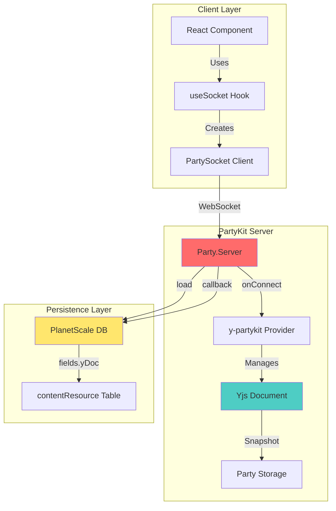
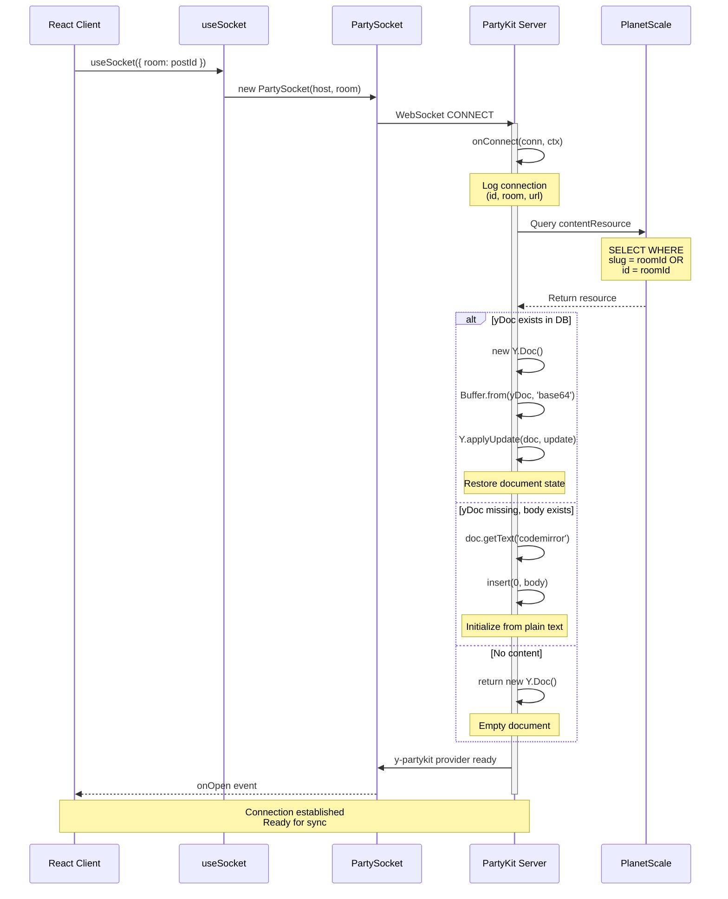
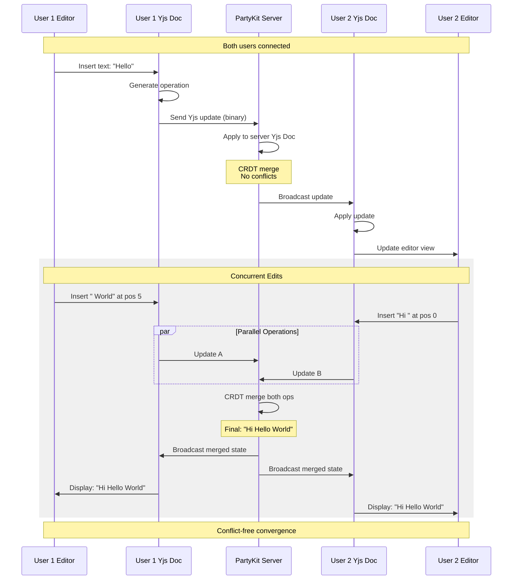
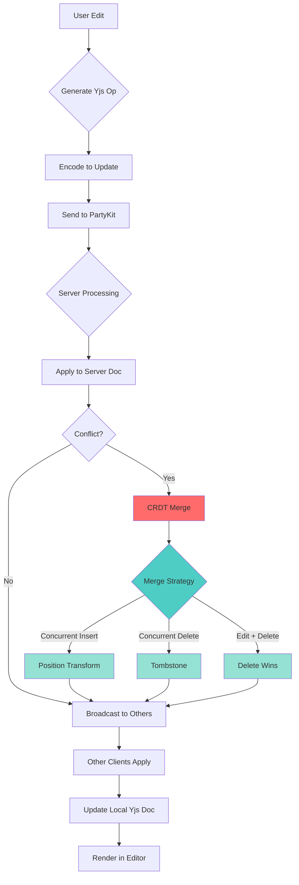
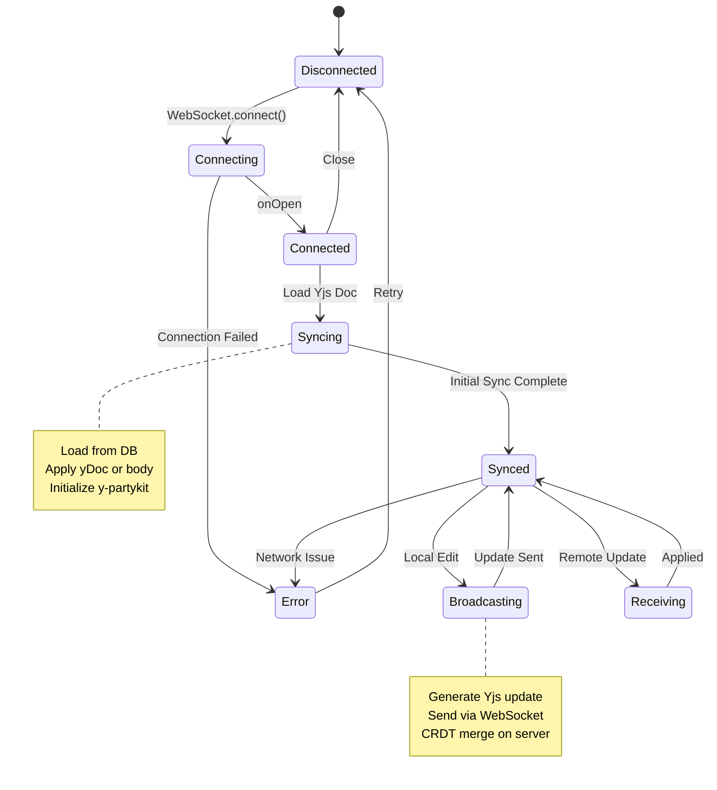
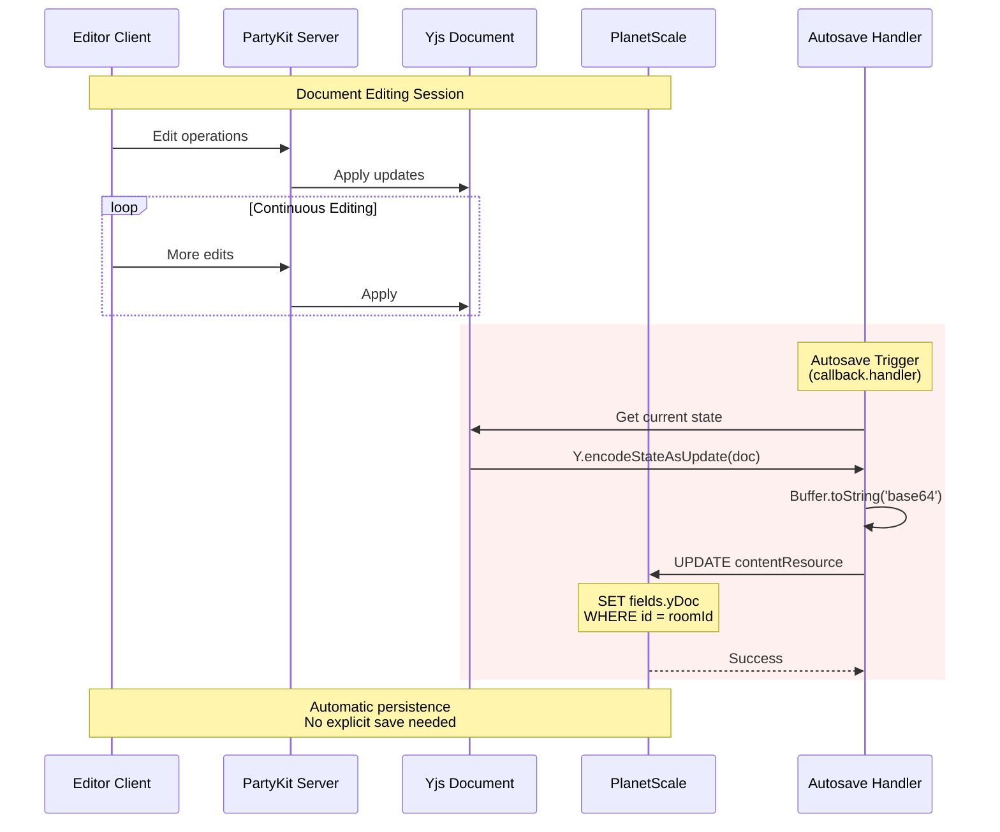
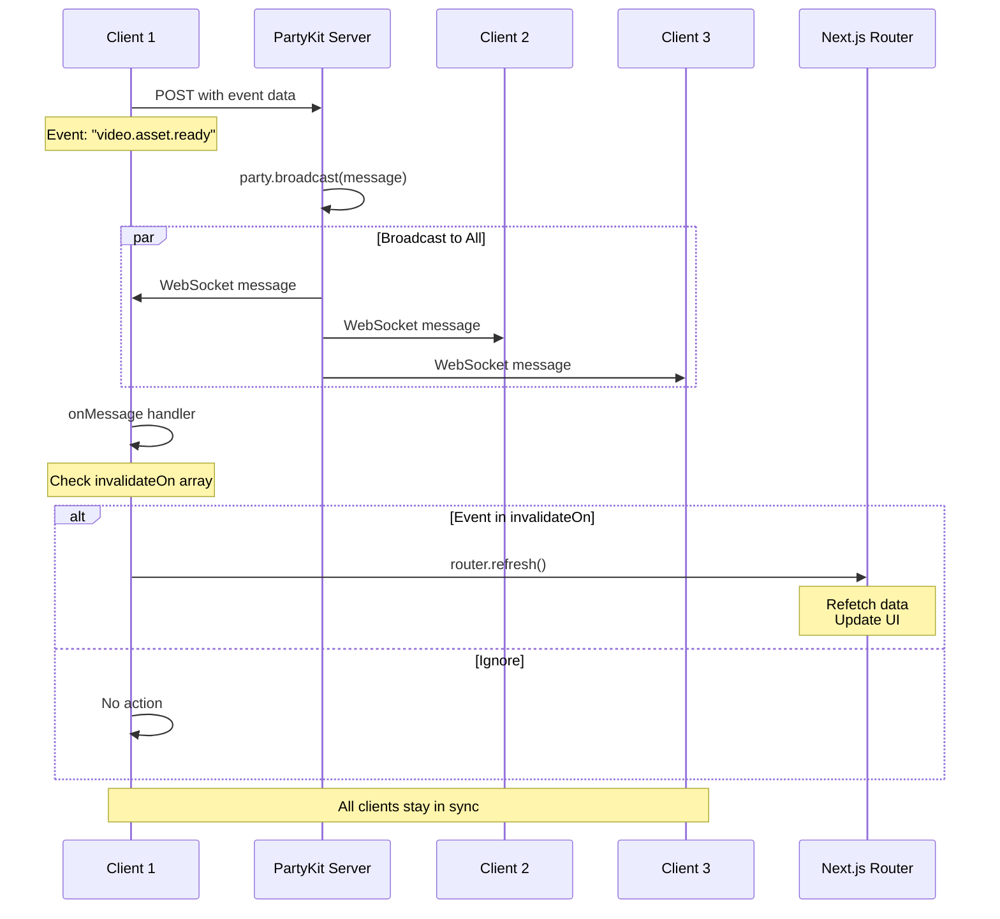
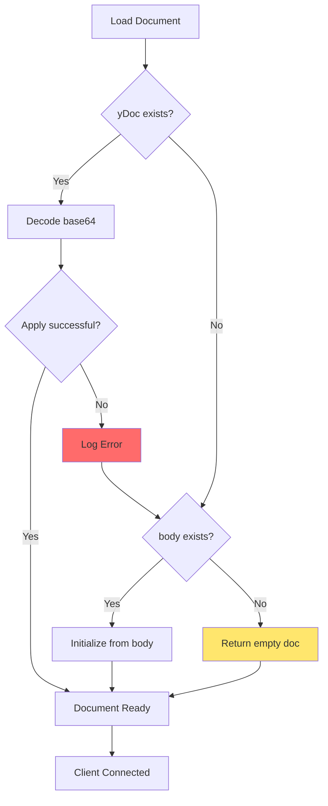

# Real-time Collaboration Flow (PartyKit + Yjs)

## Overview

AI-Hero implements real-time collaborative editing using PartyKit as the WebSocket server and Yjs for Conflict-free Replicated Data Types (CRDT). This enables multiple users to edit content simultaneously with automatic conflict resolution and persistence to PlanetScale database.

**Key Components:**
- **PartyKit Server**: WebSocket server handling connections and document lifecycle
- **Yjs**: CRDT library for conflict-free document synchronization
- **y-partykit**: Binding layer between PartyKit and Yjs
- **PlanetScale**: Database for persistent storage of Yjs documents
- **partysocket/react**: React hook for client-side WebSocket connections

**Configuration:**
- Server: `party/index.ts`
- Config: `partykit.json` (team: skillrecordings, compat: 2023-10-20)
- Host: `env.NEXT_PUBLIC_PARTY_KIT_URL`
- Room: Resource ID or slug (e.g., post ID)

---

## Architecture Diagram



**Legend:**
- Red: PartyKit Server
- Teal: Yjs Layer
- Yellow: Database

---

## Connection Lifecycle Sequence



---

## Yjs Document Synchronization



---

## Conflict Resolution Flow



**CRDT Rules:**
- **Concurrent Inserts**: Position-based transformation maintains both edits
- **Concurrent Deletes**: Tombstone markers prevent data loss
- **Edit + Delete conflict**: Delete operation takes precedence
- **Convergence**: All clients reach identical state after applying all operations

---

## Connection State Machine



---

## Persistence Flow



**Autosave Details:**
- Triggered via `callback.handler` in y-partykit config
- Encodes Yjs document state to binary
- Stores as base64 string in `fields.yDoc`
- Currently configured but handler is empty (placeholder for future implementation)

---

## HTTP API Endpoints

```mermaid
graph LR
    subgraph "PartyKit HTTP API"
        A[GET /parties/main/:room]
        B[POST /parties/main/:room]
        C[OPTIONS /parties/main/:room]
    end

    A -->|Fetch| D[Room State]
    B -->|Broadcast| E[Message to All]
    C -->|CORS| F[Preflight OK]

    D --> G[{"{ users: [] }"}]
    E --> H[party.broadcast]
    F --> I[CORS Headers]

    style A fill:#4ecdc4
    style B fill:#ff6b6b
    style C fill:#ffe66d
```

**Endpoint Details:**

### GET `/parties/main/:room`
```typescript
// Returns current room state
// Currently returns empty users array
// CORS enabled for SSR
Response: { users: [] }
Headers: Access-Control-Allow-Origin: *
```

### POST `/parties/main/:room`
```typescript
// Broadcast message to all connections
Body: {
  requestId: string
  body: string
  name: string
}

// Broadcasts via party.broadcast()
// Returns message count
```

### OPTIONS `/parties/main/:room`
```typescript
// CORS preflight
// Required for cross-origin requests
Response: { ok: true }
```

---

## Message Broadcasting Flow



**Event System:**
- Events broadcast via HTTP POST to PartyKit
- `Party` component listens via `useSocket`
- Specific events trigger router refresh:
  - `videoResource.created`
  - `video.asset.ready`
  - `transcript.ready`
  - `ai.tip.draft.completed`
  - `video.asset.detached`
  - `video.asset.attached`

---

## Client Integration Pattern

```typescript
// Hook wrapper for PartySocket
// src/hooks/use-socket.ts
export function useSocket(options: {
  room?: string | null
  onOpen?: (event) => void
  onMessage?: (event) => void
  onClose?: (event) => void
  onError?: (event) => void
}) {
  return usePartySocket({
    host: env.NEXT_PUBLIC_PARTY_KIT_URL,
    room: options.room || env.NEXT_PUBLIC_PARTYKIT_ROOM_NAME,
    ...options
  })
}

// Component usage
// src/components/party.tsx
export function Party({ room }: { room?: string }) {
  const router = useRouter()
  const utils = api.useUtils()

  useSocket({
    room,
    onMessage: async (messageEvent) => {
      const data = JSON.parse(messageEvent.data)
      if (invalidateOn.includes(data.name)) {
        router.refresh()
      }
    }
  })

  return null
}
```

---

## Data Model

### Database Schema (contentResource)
```typescript
{
  id: string              // Primary key
  type: string            // 'post', 'lesson', etc.
  fields: {
    slug: string
    body: string | null   // Plain text fallback
    yDoc: string | null   // Base64-encoded Yjs state
    // ... other fields
  }
}
```

### Yjs Document Structure
```typescript
// Shared text type for CodeMirror
doc.getText('codemirror')
  .insert(0, 'Initial content')
  .toString() // => 'Initial content'

// Encoding for storage
const update = Y.encodeStateAsUpdate(doc)
const base64 = Buffer.from(update).toString('base64')

// Decoding from storage
const buffer = Buffer.from(base64, 'base64')
Y.applyUpdate(doc, new Uint8Array(buffer))
```

---

## Performance Characteristics

**Broadcast Rate:**
- 60 FPS (16.6ms interval)
- Defined: `BROADCAST_INTERVAL = 1000 / 60`
- Ensures smooth real-time updates

**Database Strategy:**
- **Load**: On connection (slug or ID lookup)
- **Save**: Autosave via callback (currently placeholder)
- **Fallback**: `yDoc` → `body` → empty doc

**Connection Scaling:**
- PartyKit handles connection pooling
- Each room (resource) = separate party instance
- Horizontal scaling via PartyKit infrastructure

---

## Error Handling



**Error Recovery:**
1. **yDoc decode failure**: Fall back to plain text `body`
2. **body missing**: Return empty Yjs document
3. **Database query failure**: Return empty doc (last resort)
4. **All errors logged**: Console output for debugging

---

## Security Considerations

**CORS Configuration:**
```typescript
const CORS = {
  'Access-Control-Allow-Origin': '*',
  'Access-Control-Allow-Methods': 'GET',
  'Access-Control-Allow-Headers': 'Origin, X-Requested-With, Content-Type, Accept'
}
```

**Current State:**
- ⚠️ Open CORS (`*`) - suitable for public content
- No authentication on WebSocket connections
- Room isolation by resource ID/slug

**Recommendations for Production:**
- Add authentication layer (JWT in WebSocket headers)
- Restrict CORS to known domains
- Implement rate limiting
- Add user presence tracking
- Implement document access control

---

## Key Files Reference

| File | Purpose |
|------|---------|
| `party/index.ts` | PartyKit server implementation |
| `partykit.json` | PartyKit deployment config |
| `src/hooks/use-socket.ts` | Client WebSocket hook |
| `src/components/party.tsx` | Event listener component |
| `src/lib/posts.ts` | Post schema with yDoc field |

---

## Implementation Notes

1. **y-partykit Integration**: Uses `onConnect` from `y-partykit` package to handle Yjs document lifecycle automatically

2. **Snapshot Mode**: Configured with `persist: { mode: 'snapshot' }` for efficient storage

3. **Room Naming**: Rooms identified by either resource `slug` or `id` (flexible lookup)

4. **CodeMirror Text Type**: Yjs document uses shared text type named `'codemirror'` for editor integration

5. **No Explicit Save**: CRDT nature means document is always in valid state; autosave planned but not yet implemented

6. **Party Storage**: Server has access to `party.storage` for ephemeral state (currently used for messages array)

---

## Future Enhancements

- [ ] Implement autosave callback to persist yDoc to database
- [ ] Add user presence (cursors, selections)
- [ ] Implement undo/redo with Yjs history
- [ ] Add conflict visualization for debugging
- [ ] Implement authentication on WebSocket connections
- [ ] Add metrics/observability (connection count, edit rate)
- [ ] Implement document versioning/snapshots
- [ ] Add collaboration awareness (who's editing)
