# Shortlinks Flow Documentation

## Overview

The ai-hero shortlinks system provides URL shortening with click tracking, analytics, and purchase attribution. Shortlinks enable marketing campaigns, social media sharing, and referral tracking with detailed insights into conversion rates.

### Key Components

- **URL Shortening**: Generate short `/s/{slug}` URLs that redirect to any destination
- **Click Tracking**: Record every click with metadata (referrer, device, country, user agent)
- **Redis Caching**: Fast lookups with database fallback
- **Purchase Attribution**: Link shortlinks to signups and purchases via cookies
- **Analytics Dashboard**: View clicks, referrers, devices, and attribution metrics
- **Admin UI**: Create, edit, delete shortlinks with real-time stats

---

## 1. Entity Relationship Diagram


---

## 2. Shortlink Creation Flow


**Key Steps:**
1. Admin submits form with URL and optional custom slug
2. Validate authentication and input schema
3. Check slug availability or generate unique 6-character slug
4. Insert into database (unique constraint protects against race conditions)
5. Cache full shortlink record in Redis
6. Revalidate Next.js cache tag
7. Return created shortlink to UI

**Slug Generation:**
- Custom alphabet: `0-9A-Za-z` (62 characters)
- Length: 6 characters = 62^6 = ~56.8 billion combinations
- Collision handling: Max 10 retry attempts

---

## 3. Redirect & Click Tracking Flow

```mermaid
sequenceDiagram
    autonumber
    %% ━━━━━━━━━━━━━━━━━━━━━━━━━━━━━━━━━━━━━━━━━━━━━━━━━━━━━━━━━━━━━━
    %% User clicks shortlink → fast redirect + async click tracking
    %% Critical path: lookup → redirect (must be fast!)
    %% ━━━━━━━━━━━━━━━━━━━━━━━━━━━━━━━━━━━━━━━━━━━━━━━━━━━━━━━━━━━━━━

    participant User as 🌐 Visitor
    participant Route as 🚀 /s/[slug]
    participant Query as 📦 Query Layer
    participant Redis as ⚡ Redis
    participant DB as 🗄️ Database

    %% Step 1: Incoming request
    User->>Route: GET /s/{slug}

    Note over Route: 📋 Extract metadata<br/>• referrer<br/>• user-agent<br/>• x-vercel-ip-country

    %% Step 2: Fast lookup (Redis-first)
    Route->>Query: getShortlinkBySlug(slug)

    rect rgb(255, 250, 240)
        Note over Query,Redis: ⚡ Cache-first lookup (~1ms)
        Query->>Redis: GET shortlink:{slug}

        alt ✅ Cache HIT
            Redis-->>Query: shortlink data
            Query-->>Route: shortlink
        else ❌ Cache MISS
            Redis-->>Query: null
            Query->>DB: SELECT * WHERE slug=?
            DB-->>Query: shortlink or null

            opt Found in DB
                Query->>Redis: SET shortlink:{slug}
                Redis-->>Query: cached
            end

            Query-->>Route: shortlink or null
        end
    end

    %% Step 3: Handle not found
    alt ⚠️ Shortlink not found
        Route-->>User: 404 Not Found
    end

    %% Step 4: Fast response (don't wait for click recording)
    rect rgb(240, 255, 240)
        Note over Route: 🏃 Respond immediately
        Route->>Route: NextResponse.redirect(url)
        Route->>Route: Set-Cookie: sl_ref={slug}<br/>maxAge=30d
        Route-->>User: 302 Redirect
    end

    User->>User: → Browser follows redirect

    %% Step 5: Async click recording (background)
    rect rgb(248, 248, 255)
        Note over Query,DB: 🔄 Background task (fire & forget)
        Query->>DB: UPDATE clicks = clicks + 1
        DB-->>Query: OK
        Query->>DB: INSERT ShortlinkClick
        DB-->>Query: OK
    end
```



**Key Steps:**
1. User visits `/s/{slug}` URL
2. Extract request metadata (referrer, user agent, country, device)
3. Lookup shortlink in Redis cache (fallback to DB)
4. Return 404 if shortlink doesn't exist
5. Trigger async click recording (don't block redirect)
6. Set `sl_ref` cookie with 30-day expiration
7. Redirect user to destination URL
8. **Background:** Increment click counter and insert click event

**Cookie Details:**
- Name: `sl_ref`
- Value: Shortlink slug
- Max Age: 30 days (2,592,000 seconds)
- HttpOnly: `false` (allows JS access for form submission)
- SameSite: `lax`
- Secure: Production only

**Device Detection:**
- Mobile: User-agent contains "mobile" or "android"
- Tablet: User-agent contains "tablet" or "ipad"
- Desktop: Default fallback

---

## 4. Purchase Attribution Flow


**Key Steps:**
1. User completes purchase with `sl_ref` cookie present
2. Stripe checkout session includes `shortlinkRef` in metadata
3. Webhook processes purchase and emits `NEW_PURCHASE_CREATED_EVENT`
4. Attribution function triggered by Inngest event
5. Load purchase, product, and user details
6. Extract `shortlinkRef` from checkout session metadata
7. Create attribution record linking shortlink → purchase
8. Store rich metadata (product details, amount, purchase ID)

**Metadata Stored:**
```json
{
  "productId": "prod_abc123",
  "productName": "Advanced TypeScript Course",
  "purchaseId": "pur_xyz789",
  "totalAmount": "199.00",
  "productType": "self-paced"
}
```

**Deduplication:**
- **Signups**: One attribution per email per shortlink
- **Purchases**: No deduplication (user can buy multiple products)

---

## 5. Signup Attribution Flow

```mermaid
%%{init: {'theme': 'base', 'themeVariables': { 'primaryColor': '#e1f5fe', 'primaryBorderColor': '#0288d1'}}}%%
flowchart TD
    %% ━━━━━━━━━━━━━━━━━━━━━━━━━━━━━━━━━━━━━━━━━━━━━━━━━━━━━━━━━━━━━━
    %% Signup attribution: one per email per shortlink (deduplicated)
    %% ━━━━━━━━━━━━━━━━━━━━━━━━━━━━━━━━━━━━━━━━━━━━━━━━━━━━━━━━━━━━━━

    A([🔗 User clicks shortlink]) --> B[🍪 Set sl_ref cookie]
    B --> C[📝 User creates account]

    C --> D[🔐 Auth creates user record]
    D --> E{🍪 sl_ref cookie?}

    E -->|✅ Present| F[Extract shortlinkRef]
    E -->|❌ Missing| Z

    F --> G[📦 createShortlinkAttribution]
    G --> H[(🗄️ Lookup shortlink)]

    H --> I{Found?}
    I -->|❌ No| Z
    I -->|✅ Yes| J{Check dedup}

    J --> K[(🔍 Query existing:<br/>shortlinkId + email)]
    K --> L{Already exists?}

    L -->|⚠️ Yes| M[Log: duplicate]
    L -->|✅ No| N[INSERT attribution]

    M --> Z
    N --> O[Store: userId, email<br/>type='signup']
    O --> P[📊 Log: recorded]
    P --> Z([✨ Done])

    %% Styling
    classDef success fill:#c8e6c9,stroke:#388e3c,stroke-width:2px
    classDef warning fill:#fff3e0,stroke:#f57c00,stroke-width:2px
    classDef endpoint fill:#fff9c4,stroke:#f9a825,stroke-width:2px
    classDef database fill:#e3f2fd,stroke:#1976d2,stroke-width:2px

    class N success
    class M warning
    class Z endpoint
    class H,K database
```



**Key Points:**
- Attribution cookie checked during signup flow
- One signup attribution per email per shortlink (deduplicated)
- No metadata stored for signups (unlike purchases)
- Failed lookups logged but don't block signup

---

## 6. Analytics Dashboard

### Available Metrics

```mermaid
%%{init: {'theme': 'base', 'themeVariables': { 'primaryColor': '#f3e5f5', 'primaryBorderColor': '#7b1fa2'}}}%%
flowchart LR
    %% ━━━━━━━━━━━━━━━━━━━━━━━━━━━━━━━━━━━━━━━━━━━━━━━━━━━━━━━━━━━━━━
    %% Analytics dashboard data sources and metrics
    %% ━━━━━━━━━━━━━━━━━━━━━━━━━━━━━━━━━━━━━━━━━━━━━━━━━━━━━━━━━━━━━━

    subgraph overview ["📊 Overview Stats"]
        A["🔢 Total Clicks<br/><small>Shortlink.clicks</small>"]
        B["⏱️ Last 60 min"]
        C["📅 Last 24 hrs"]
    end

    subgraph clicks ["📈 Click Analytics"]
        D["📉 Clicks by Day<br/><small>30-day chart</small>"]
        E["🔗 Top Referrers<br/><small>GROUP BY referrer</small>"]
        F["📱 Device Split<br/><small>mobile/tablet/desktop</small>"]
        G["🕐 Recent Clicks<br/><small>last 50 events</small>"]
    end

    subgraph attribution ["🎯 Conversions"]
        H["👤 Signups<br/><small>type='signup'</small>"]
        I["💰 Purchases<br/><small>type='purchase'</small>"]
        J["📊 Conversion Rate<br/><small>purchases ÷ clicks</small>"]
    end

    %% Data flow
    A --> D
    D --> E
    E --> F
    F --> G

    H --> I
    I --> J

    %% Styling
    classDef metric fill:#e8f5e9,stroke:#43a047
    classDef conversion fill:#fff3e0,stroke:#fb8c00

    class A,B,C,D,E,F,G metric
    class H,I,J conversion
```



### Analytics Queries

**Clicks by Day (Last 30 Days):**
```sql
SELECT
  DATE(timestamp) as date,
  COUNT(*) as clicks
FROM ShortlinkClick
WHERE shortlinkId = ?
  AND timestamp >= DATE_SUB(NOW(), INTERVAL 30 DAY)
GROUP BY DATE(timestamp)
ORDER BY date
```

**Top Referrers:**
```sql
SELECT
  COALESCE(referrer, 'Direct') as referrer,
  COUNT(*) as clicks
FROM ShortlinkClick
WHERE shortlinkId = ?
GROUP BY referrer
ORDER BY clicks DESC
LIMIT 10
```

**Device Breakdown:**
```sql
SELECT
  COALESCE(device, 'Unknown') as device,
  COUNT(*) as clicks
FROM ShortlinkClick
WHERE shortlinkId = ?
GROUP BY device
ORDER BY clicks DESC
```

**Recent Clicks:**
```sql
SELECT *
FROM ShortlinkClick
WHERE shortlinkId = ?
ORDER BY timestamp DESC
LIMIT 50
```

---

## 7. Admin Interface Structure

```mermaid
%%{init: {'theme': 'base', 'themeVariables': { 'primaryColor': '#e3f2fd', 'primaryBorderColor': '#1976d2'}}}%%
flowchart TD
    %% ━━━━━━━━━━━━━━━━━━━━━━━━━━━━━━━━━━━━━━━━━━━━━━━━━━━━━━━━━━━━━━
    %% Admin UI component hierarchy and navigation
    %% ━━━━━━━━━━━━━━━━━━━━━━━━━━━━━━━━━━━━━━━━━━━━━━━━━━━━━━━━━━━━━━

    subgraph list ["📋 Main List View"]
        direction TB
        A["🏠 /admin/shortlinks"]
        A1["📊 Stats Cards<br/><small>60min • 24hrs</small>"]
        A2["🔍 Search Bar"]
        A3["➕ Create Button"]
        A4["📱 Table/Cards<br/><small>responsive</small>"]

        A --> A1
        A --> A2
        A --> A3
        A --> A4
    end

    subgraph columns ["📑 Table Columns"]
        B1["🔗 Short URL<br/><small>+ copy btn</small>"]
        B2["🎯 Destination"]
        B3["👆 Clicks"]
        B4["👤 Signups"]
        B5["💰 Purchases"]
        B6["📅 Created"]
        B7["⚙️ Actions"]

        A4 --> B1 & B2 & B3 & B4 & B5 & B6 & B7
    end

    subgraph dialog ["✏️ CRUD Dialog"]
        C1["🆕 Create Mode"]
        C2["📝 Edit Mode"]
        C3["📋 Fields:<br/>URL • Slug • Desc"]
        C4["🎲 Generate Slug"]
        C5["💾 Save"]

        C1 & C2 --> C3
        C3 --> C4
        C3 --> C5
    end

    subgraph analytics ["📈 Analytics View"]
        D["📊 /admin/shortlinks/:id/analytics"]
        D1["⬅️ Back"]
        D2["🏷️ Header"]
        D3["🔢 Total Clicks"]
        D4["📉 30-day Chart"]
        D5["🔗 Top Referrers"]
        D6["📱 Device Split"]
        D7["🕐 Recent 50"]

        D --> D1 & D2 & D3
        D --> D4 & D5 & D6 & D7
    end

    %% Navigation
    A3 ==> C1
    B7 -.->|edit| C2
    B7 ==>|analytics| D

    %% Styling
    classDef page fill:#bbdefb,stroke:#1976d2,stroke-width:2px
    classDef action fill:#c8e6c9,stroke:#388e3c,stroke-width:2px
    classDef data fill:#fff3e0,stroke:#f57c00

    class A,D page
    class A3,C5 action
    class B3,B4,B5,D3,D4,D5,D6,D7 data
```



### Page Routes

| Route | Purpose | Access |
|-------|---------|--------|
| `/admin/shortlinks` | List all shortlinks with stats | Admin (`manage`, `all`) |
| `/admin/shortlinks/[id]/analytics` | Detailed analytics for one link | Admin (`manage`, `all`) |
| `/api/shortlinks` | CRUD API endpoint | Admin (create/update/delete `Content`) |
| `/s/[slug]` | Public redirect route | Public (no auth) |

### UI Components

**ShortlinksManagement** (`shortlinks-client-page.tsx`)
- Server-side data loading with `getShortlinksWithAttributions()`
- Client-side search with 250ms debounce
- Real-time stats cards (60min, 24hr)
- Responsive table (desktop) and cards (mobile)
- Delete confirmation dialog

**ShortlinkCrudDialog** (`shortlink-crud-dialog.tsx`)
- Create/edit modal form
- Slug validation regex: `^[a-zA-Z0-9_-]+$`
- URL validation with Zod schema
- Optional description (max 255 chars)
- Generate unique slug button

**ShortlinkAnalyticsView** (`analytics-client-page.tsx`)
- Total clicks metric card
- Clicks by day chart (30 days)
- Top 10 referrers table
- Device breakdown chart
- Recent 50 clicks table with metadata

---

## 8. API Endpoints

### GET /api/shortlinks

**Purpose:** List all shortlinks or get single by ID

**Auth:** Admin (`manage`, `all`)

**Query Params:**
- `id` (optional): Get single shortlink by ID
- `search` (optional): Filter by slug/url/description

**Response:**
```json
// Single shortlink
{
  "id": "slnk_123",
  "slug": "abc123",
  "url": "https://aihero.dev/courses/typescript",
  "description": "TypeScript Course Link",
  "clicks": 1247,
  "createdById": "user_789",
  "createdAt": "2026-01-15T10:30:00Z",
  "updatedAt": "2026-02-01T14:22:00Z"
}

// List with attributions
[
  {
    ...shortlink,
    "signups": 23,
    "purchases": 8
  }
]
```

### POST /api/shortlinks

**Purpose:** Create new shortlink

**Auth:** Content Creator (`create`, `Content`)

**Body:**
```json
{
  "url": "https://aihero.dev/courses/typescript",
  "slug": "ts-course",  // optional
  "description": "TypeScript Course"  // optional
}
```

**Response:** `201 Created` with shortlink object

**Errors:**
- `400`: Invalid input (schema validation)
- `409`: Slug already exists
- `401`: Unauthorized
- `403`: Forbidden

### PATCH /api/shortlinks

**Purpose:** Update existing shortlink

**Auth:** Content Creator (`update`, `Content`)

**Body:**
```json
{
  "id": "slnk_123",
  "url": "https://aihero.dev/courses/advanced-typescript",  // optional
  "slug": "adv-ts",  // optional
  "description": "Advanced TypeScript"  // optional
}
```

**Response:** `200 OK` with updated shortlink

**Errors:**
- `400`: Invalid input
- `404`: Shortlink not found
- `409`: New slug already exists

### DELETE /api/shortlinks

**Purpose:** Delete shortlink and all associated data

**Auth:** Content Creator (`delete`, `Content`)

**Query Params:**
- `id`: Shortlink ID to delete

**Response:** `200 OK`

**Cascade Behavior:**
- Deletes all `ShortlinkClick` records
- Deletes all `ShortlinkAttribution` records
- Removes from Redis cache
- Manual cascade (PlanetScale doesn't support FK constraints)

---

## 9. Integration with Commerce

### Checkout Flow Integration


**Key Integration Points:**

1. **Cookie Persistence:** 30-day cookie ensures attribution even if user returns later
2. **Metadata Passthrough:** `shortlinkRef` stored in Stripe session metadata
3. **Webhook Processing:** Attribution triggered by purchase creation event
4. **No Server-Side Session:** Uses HTTP-only cookie for attribution (no session storage)

### Conversion Funnel

```
Shortlink Click → Cookie Set → Browse Site → Checkout → Purchase → Attribution
     ↓              ↓             ↓            ↓           ↓            ↓
  recordClick   sl_ref=slug   (browse)    metadata    purchase    linkAttribution
```

**Conversion Metrics:**
- **Click-to-Purchase Rate**: `purchases / clicks`
- **Click-to-Signup Rate**: `signups / clicks`
- **Purchase-per-Signup**: `purchases / signups`

---

## 10. Redis Caching Strategy

### Cache Key Format

```
shortlink:{slug} → Full Shortlink object
```

### Cache Lifecycle

**Set Cache:**
- On create: `createShortlink()`
- On update: `updateShortlink()`
- On cache miss: `getShortlinkBySlug()`

**Delete Cache:**
- On update (if slug changed): Delete old key
- On delete: `deleteShortlink()`

**Cache Hit Flow:**

```mermaid
%%{init: {'theme': 'base', 'themeVariables': { 'primaryColor': '#fff3e0'}}}%%
flowchart LR
    %% ━━━━━━━━━━━━━━━━━━━━━━━━━━━━━━━━━━━━━━━━━━━━━━━━━━━━━━━━━━━━━━
    %% Redis-first lookup with DB fallback and cache-aside pattern
    %% ━━━━━━━━━━━━━━━━━━━━━━━━━━━━━━━━━━━━━━━━━━━━━━━━━━━━━━━━━━━━━━

    A["🌐 GET /s/abc123"] --> B{"⚡ Redis?"}
    B -->|"✅ Hit<br/><small>~1ms</small>"| C["📦 Cached data"]
    B -->|"❌ Miss"| D["🗄️ Query DB<br/><small>~10-50ms</small>"]
    D --> E["💾 Cache result"]
    E --> F["📦 Fresh data"]
    C --> G["🚀 302 Redirect"]
    F --> G

    %% Styling
    classDef fast fill:#c8e6c9,stroke:#388e3c,stroke-width:2px
    classDef slow fill:#ffecb3,stroke:#ffa000,stroke-width:2px
    classDef endpoint fill:#bbdefb,stroke:#1976d2,stroke-width:2px

    class C fast
    class D slow
    class A,G endpoint
```


**Benefits:**
- **Fast redirects**: Redis lookup ~1ms vs DB ~10-50ms
- **Reduced DB load**: Popular links hit cache
- **Consistent data**: Cache updated on create/update/delete

---

## 11. Security & Validation

### Slug Validation

**Regex:** `^[a-zA-Z0-9_-]+$`

**Restrictions:**
- Alphanumeric characters only
- Hyphens and underscores allowed
- No spaces or special characters
- Min length: 1 character
- Max length: 50 characters

**Purpose:** URL-safe, readable, no XSS risk

### URL Validation

**Schema:** `z.string().url()`

**Checks:**
- Valid protocol (http/https)
- Valid domain format
- No SQL injection risk
- Stored as plain text in database

### Authorization Levels

| Action | Permission Required | CASL Check |
|--------|---------------------|------------|
| View list | Admin | `can('manage', 'all')` |
| Create | Content creator | `can('create', 'Content')` |
| Update | Content creator | `can('update', 'Content')` |
| Delete | Content creator | `can('delete', 'Content')` |
| Analytics | Admin | `can('manage', 'all')` |
| Redirect | Public | None (no auth) |

### Race Condition Protection

**Database Unique Constraint:**
```sql
CREATE UNIQUE INDEX slug_idx ON Shortlink(slug)
```

**Behavior:**
- Availability check is advisory only
- Database constraint provides final protection
- Duplicate insert returns error
- Client retries with new slug

---

## 12. Performance Characteristics

### Redirect Performance

**Typical Flow:**
1. DNS lookup: ~20ms
2. TLS handshake: ~50ms
3. Redis lookup: ~1ms (cache hit)
4. HTTP redirect: ~5ms
5. **Total:** ~76ms + destination load

**Cache Miss:**
1-3. Same as above: ~70ms
4. Database query: ~10-50ms
5. Cache write: ~1ms
6. HTTP redirect: ~5ms
7. **Total:** ~86-126ms + destination load

### Click Recording

**Async Processing:**
- Redirect happens immediately
- Click recording runs in background
- Failed recordings logged but don't block user

**Database Operations:**
1. `UPDATE Shortlink SET clicks = clicks + 1` (~5ms)
2. `INSERT INTO ShortlinkClick` (~10ms)
3. **Total:** ~15ms (async)

### Analytics Queries

| Query | Typical Time | Optimization |
|-------|-------------|--------------|
| List with attributions | ~50-100ms | LEFT JOIN + GROUP BY |
| Clicks by day | ~20-50ms | Index on (shortlinkId, timestamp) |
| Top referrers | ~20-40ms | Index on (shortlinkId, referrer) |
| Device breakdown | ~15-30ms | Index on (shortlinkId, device) |
| Recent clicks | ~10-20ms | Index on (shortlinkId, timestamp DESC) |

**Recommended Indexes:**
```sql
CREATE INDEX idx_click_shortlink_timestamp ON ShortlinkClick(shortlinkId, timestamp DESC);
CREATE INDEX idx_click_shortlink_referrer ON ShortlinkClick(shortlinkId, referrer);
CREATE INDEX idx_click_shortlink_device ON ShortlinkClick(shortlinkId, device);
CREATE INDEX idx_attribution_shortlink ON ShortlinkAttribution(shortlinkId, type);
CREATE INDEX idx_attribution_email ON ShortlinkAttribution(shortlinkId, email, type);
```

---

## 13. Error Handling

### Common Error Scenarios

**Shortlink Not Found (404):**
- User visits `/s/invalid-slug`
- Response: "Shortlink not found"
- No click recorded
- Logged: `log.warn('shortlink.lookup.not_found')`

**Slug Already Exists (409):**
- Admin creates shortlink with taken slug
- Response: "Slug already exists"
- UI shows error toast
- User can retry with different slug

**Rate Limit Protection:**
- Not currently implemented
- Consider adding per-IP rate limits
- Cloudflare/Vercel edge protection recommended

**Database Failures:**
- Redis cache miss handled gracefully
- Database timeout: Return 500 error
- Click recording failure: Logged, doesn't block redirect

### Logging Strategy

**Info Logs:**
- `shortlink.created`: New shortlink created
- `shortlink.cache.hit`: Redis cache hit
- `shortlink.cache.miss`: Redis cache miss (with cache write)
- `shortlink.click.recorded`: Click successfully tracked
- `shortlink.attribution.recorded`: Attribution created

**Warning Logs:**
- `shortlink.lookup.not_found`: Invalid slug accessed
- `shortlink.attribution.notfound`: Attribution for missing shortlink
- `shortlink.attribution.duplicate`: Duplicate signup attribution

**Error Logs:**
- `shortlink.click.error`: Failed to record click
- `shortlink.attribution.error`: Failed to create attribution
- `shortlink.redirect.failed`: Redirect handler error

---

## Summary

The shortlinks system provides:

**Core Features:**
- Short URL generation with custom or auto-generated slugs
- Fast redirects with Redis caching and database fallback
- Comprehensive click tracking with metadata (referrer, device, country)
- Purchase and signup attribution via cookies and Stripe metadata
- Real-time analytics dashboard with charts and tables

**Architecture Highlights:**
- Event-driven attribution via Inngest
- Async click recording (doesn't block redirects)
- Race condition protection via database constraints
- Manual cascade deletes (PlanetScale compatibility)
- Redis caching for performance

**Integration Points:**
- Stripe checkout session metadata
- Commerce purchase workflow (Inngest events)
- Authentication system (signup attribution)
- Analytics queries (aggregated metrics)

**Performance:**
- ~76ms redirect time (Redis cache hit)
- ~15ms async click recording
- ~50-100ms analytics queries with proper indexes

**Use Cases:**
- Marketing campaign tracking
- Social media link sharing
- Referral program attribution
- A/B testing different landing pages
- Conversion funnel analysis

---

**Last Updated:** 2026-02-04
**Maintained By:** AI Hero Development Team
