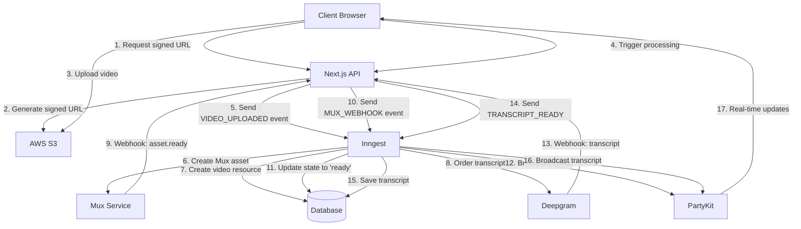
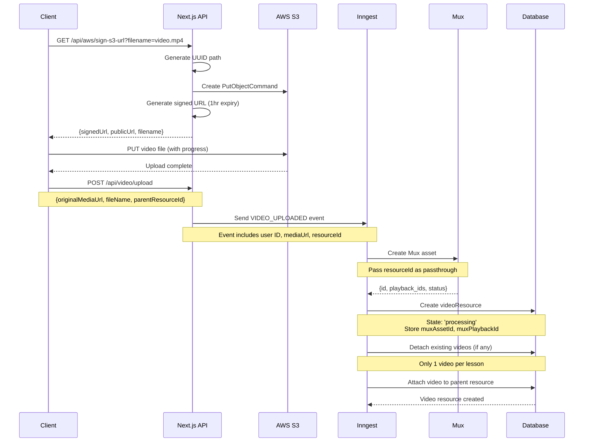
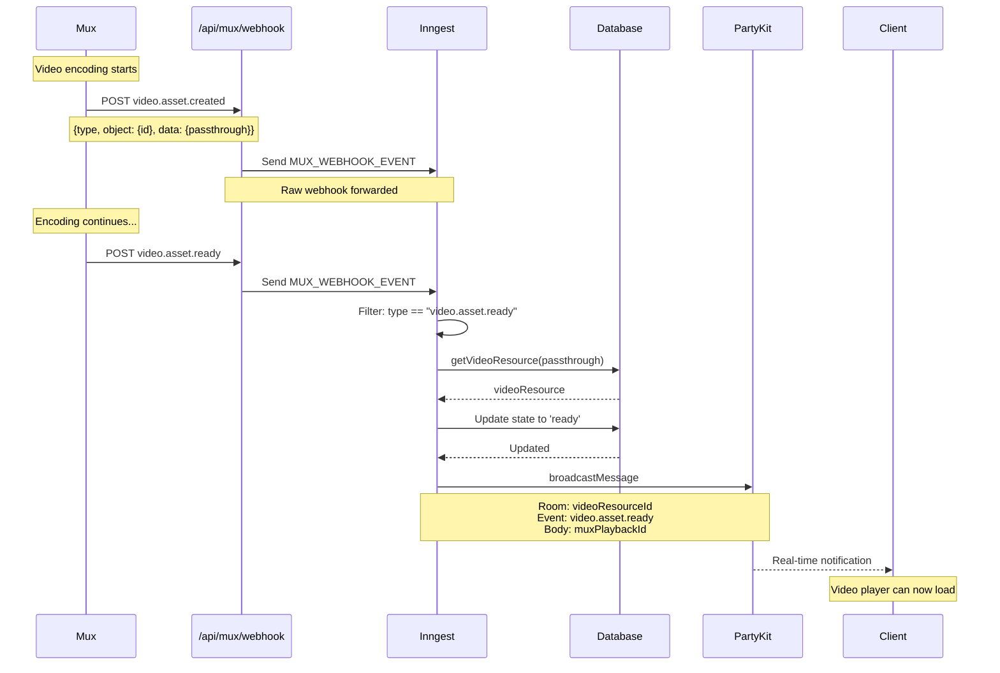
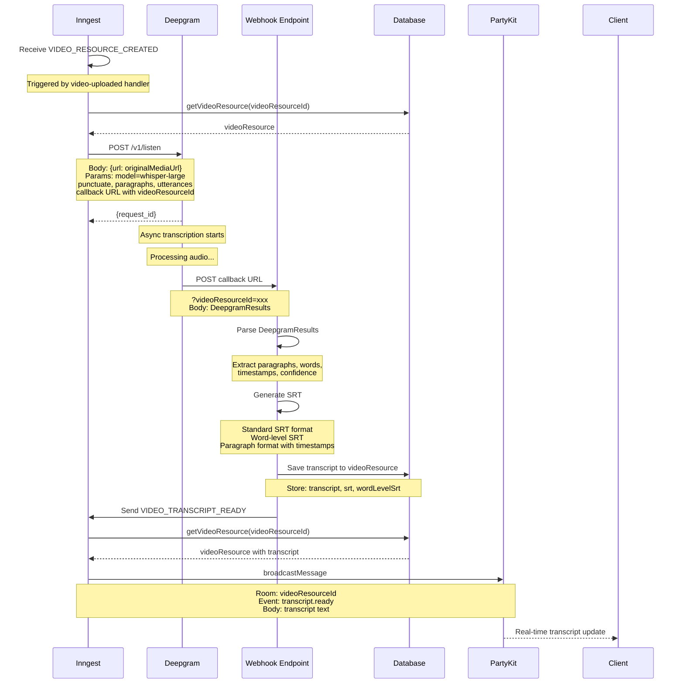
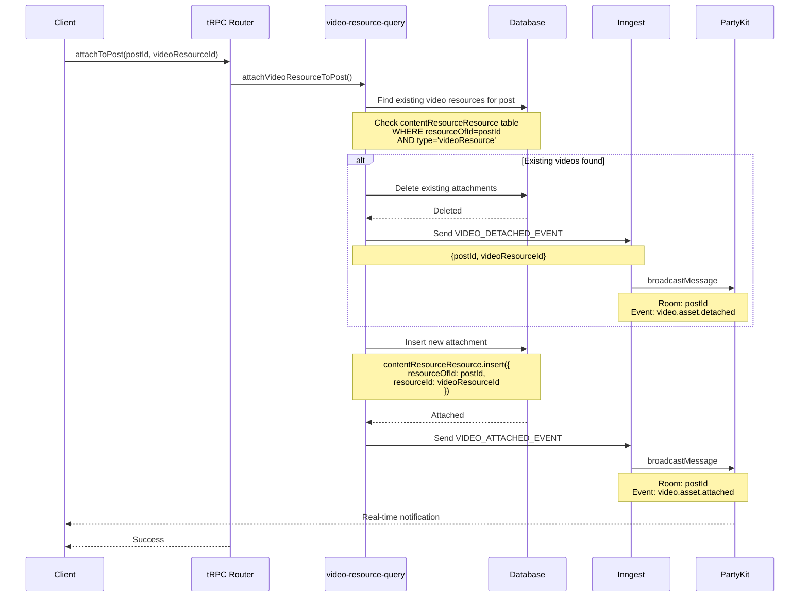
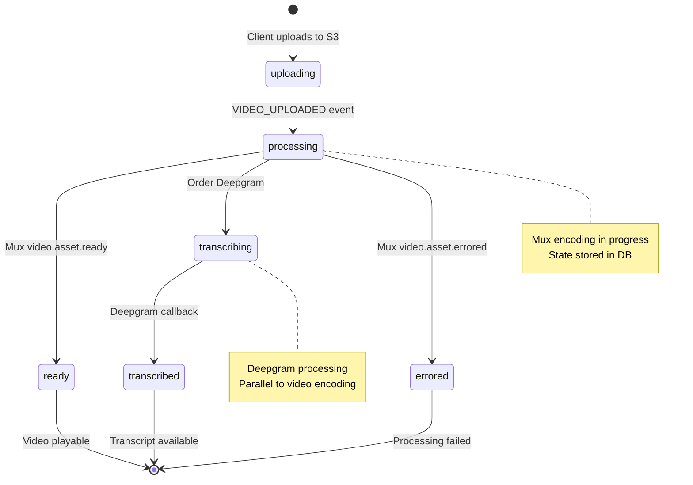
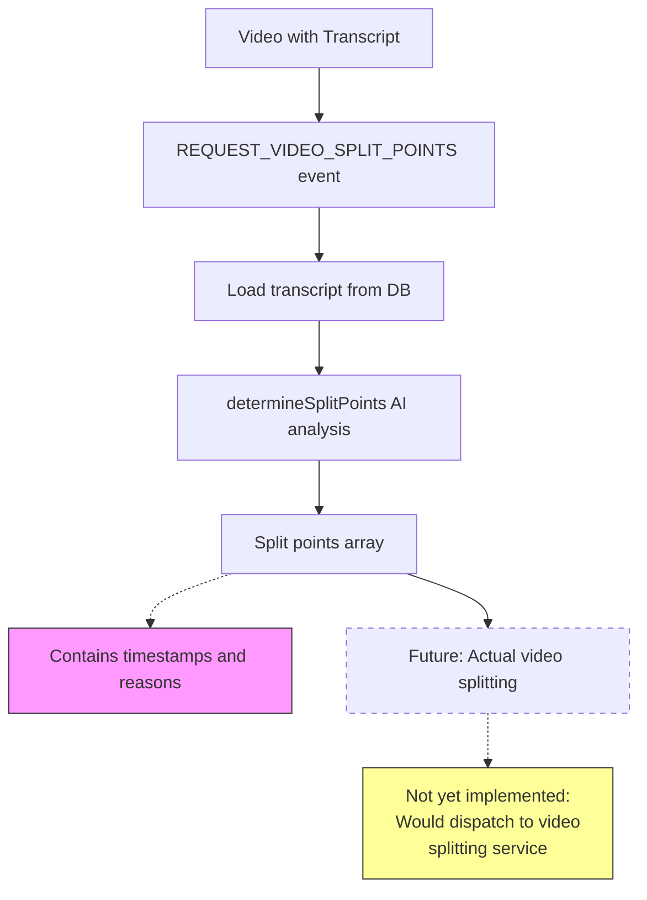
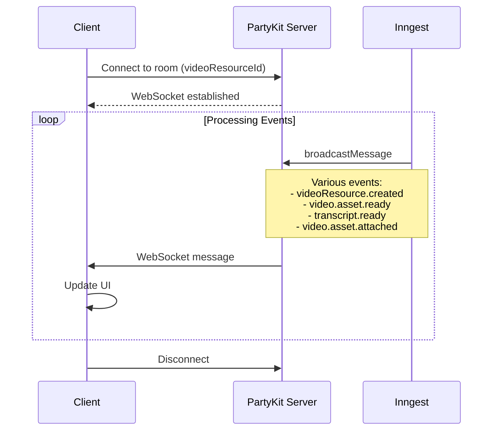

# Video Processing Pipeline

This document details the complete video processing pipeline in ai-hero, from initial upload through transcription and real-time status updates.

## Overview

The video processing pipeline orchestrates multiple services to handle video uploads, processing, and transcription:

- **AWS S3**: Temporary video file storage
- **Mux**: Video encoding, hosting, and delivery
- **Deepgram**: Audio transcription with timestamps
- **Inngest**: Event-driven workflow orchestration
- **PartyKit**: Real-time status broadcasting to clients
- **Database**: Video resource state management

## Architecture Diagram



## Video Upload Flow

The upload flow uses AWS S3 with pre-signed URLs for direct client-side uploads.



### Key Files

- `src/video-uploader/get-signed-s3-url.ts` - Generates pre-signed S3 URLs
- `src/video-uploader/upload-to-s3.ts` - Client-side upload with progress
- `packages/core/src/inngest/video-processing/functions/video-uploaded.ts` - Handles VIDEO_UPLOADED event
- `packages/core/src/lib/mux.ts` - Mux API integration

## Mux Processing & Webhooks

Mux processes the video and sends webhook notifications at various stages.



### Mux Webhook Events

- `video.upload.asset_created` - Upload asset created
- `video.upload.complete` - Upload complete
- `video.asset.created` - Asset created from upload
- `video.asset.ready` - Asset fully processed and ready
- `video.asset.errored` - Processing error

### Key Files

- `src/app/api/mux/webhook/route.ts` - Webhook endpoint
- `packages/core/src/inngest/video-processing/events/event-video-mux-webhook.ts` - Event schema
- `packages/core/src/inngest/video-processing/functions/video-ready.ts` - Handles asset.ready

## Transcription Flow

Transcription is ordered from Deepgram immediately after video resource creation.



### Transcript Formats

Deepgram provides multiple transcript formats:

1. **Paragraph format with timestamps**: `[00:15] Text of paragraph...`
2. **Standard SRT**: Time-coded subtitles (5.5s max per line)
3. **Word-level SRT**: Individual word timestamps

### Key Files

- `packages/core/src/inngest/video-processing/functions/order-transcript.ts` - Orders transcription
- `src/coursebuilder/transcript-provider.ts` - Deepgram provider config
- `packages/core/src/providers/deepgram.ts` - Deepgram API integration
- `packages/core/src/inngest/video-processing/functions/transcript-ready.ts` - Handles TRANSCRIPT_READY

## Video-to-Resource Attachment

Videos can be attached to posts (lessons) via tRPC mutations.



### Key Files

- `src/trpc/api/routers/videoResource.ts` - tRPC router
- `src/lib/video-resource-query.ts` - Attachment logic
- `src/inngest/functions/video-resource-attached.ts` - PartyKit broadcasts
- `src/inngest/events/video-attachment.ts` - Event definitions

## Video Processing States

Video resources progress through distinct states during processing.



### State Field Values

- `uploading` - File upload in progress (client-side)
- `processing` - Mux is encoding the video
- `ready` - Video is encoded and playable
- `errored` - Processing failed

Transcript state is separate and stored in the `transcript` field.

## Video Splitting Workflow

The system can analyze transcripts to determine logical split points for breaking videos into segments.



### Split Points Format

```typescript
{
  timestamp: number,      // Seconds into video
  reason: string,         // Why this is a good split point
  confidence: number      // 0-1 confidence score
}
```

### Key Files

- `src/inngest/functions/split_video.ts` - Compute split points
- `src/inngest/events/split_video.ts` - REQUEST_VIDEO_SPLIT_POINTS event
- `src/transcript-processing/determine-split-points.ts` - AI-based analysis

## Real-time Updates via PartyKit

All video processing events are broadcast to connected clients in real-time.



### Broadcast Events

| Event | Room ID | Payload |
|-------|---------|---------|
| `videoResource.created` | videoResourceId | Full video resource object |
| `video.asset.ready` | videoResourceId | muxPlaybackId |
| `transcript.ready` | videoResourceId | Transcript text |
| `video.asset.attached` | postId | {postId, videoResourceId} |
| `video.asset.detached` | postId | {postId, videoResourceId} |

## Environment Variables

```bash
# AWS S3 Upload
AWS_VIDEO_UPLOAD_REGION=us-east-1
AWS_VIDEO_UPLOAD_ACCESS_KEY_ID=xxx
AWS_VIDEO_UPLOAD_SECRET_ACCESS_KEY=xxx
AWS_VIDEO_UPLOAD_BUCKET=bucket-name
AWS_VIDEO_UPLOAD_FOLDER=partner-uploads

# Mux
MUX_ACCESS_TOKEN_ID=xxx
MUX_SECRET_KEY=xxx
MUX_WEBHOOK_SIGNING_SECRET=xxx

# Deepgram
DEEPGRAM_API_KEY=xxx

# PartyKit
PARTYKIT_URL=https://your-party.partykit.dev
```

## Error Handling

### Upload Failures
- S3 pre-signed URL expires after 1 hour
- Client retries with exponential backoff
- Failed uploads don't create video resources

### Mux Processing Errors
- `video.asset.errored` webhook received
- Video resource state set to 'errored'
- Client notified via PartyKit
- Manual retry available via admin UI

### Transcription Failures
- Deepgram returns error in callback
- Video resource remains without transcript
- Video still playable, transcript can be re-ordered
- Fallback: Manual transcript upload

## Performance Considerations

### Upload Optimization
- Direct S3 upload bypasses Next.js server
- Supports files up to 5GB
- Progress tracking via axios
- Unique filenames prevent collisions (UUID prefix)

### Parallel Processing
- Mux encoding and Deepgram transcription run in parallel
- Video becomes playable before transcript completes
- Non-blocking workflow via Inngest events

### Database Queries
- Video resource queries include related resources
- Paginated listing with cursor-based pagination
- Indexes on `type` and `createdAt` fields

## Future Enhancements

1. **Video Splitting**: Implement actual video splitting based on determined split points
2. **Thumbnail Generation**: Extract thumbnails at split points or specific timestamps
3. **Progress Tracking**: More granular encoding progress updates from Mux
4. **Retry Logic**: Automatic retry for failed transcriptions
5. **Webhook Verification**: Implement Mux webhook signature verification
6. **Upload Resumption**: Support resumable uploads for large files
