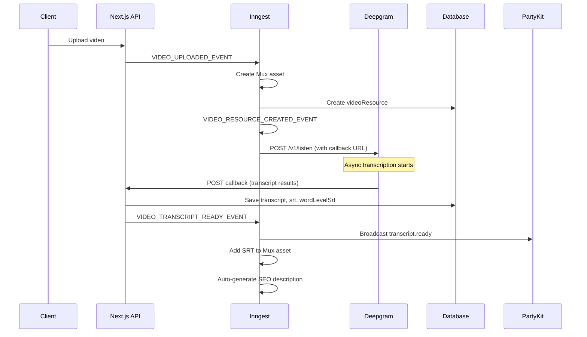

# Deepgram Transcript Webhook Implementation Guide

This document provides a comprehensive overview of how the Deepgram transcript webhook system works in Course Builder, including how webhooks are received, processed, and how transcripts are used for SEO description generation.

## Table of Contents

1. [Architecture Overview](#architecture-overview)
2. [Flow Diagram](#flow-diagram)
3. [Core Components](#core-components)
4. [Step-by-Step Implementation](#step-by-step-implementation)
5. [Data Schemas](#data-schemas)
6. [Event System](#event-system)
7. [SEO Description Generation](#seo-description-generation)
8. [Environment Variables](#environment-variables)
9. [Implementation Checklist](#implementation-checklist)

---

## Architecture Overview

The Deepgram transcript system uses an event-driven architecture powered by Inngest for workflow orchestration. The flow is:

1. **Video Upload** → Triggers `VIDEO_UPLOADED_EVENT`
2. **Video Resource Created** → Triggers `VIDEO_RESOURCE_CREATED_EVENT`
3. **Order Transcript** → Calls Deepgram API with callback URL
4. **Deepgram Callback** → Webhook receives transcription results
5. **Save & Broadcast** → Transcript saved to DB, `VIDEO_TRANSCRIPT_READY_EVENT` emitted
6. **Post-Processing** → SRT added to Mux, SEO description auto-generated

```
┌─────────────┐     ┌─────────────┐     ┌─────────────┐
│   Upload    │────▶│   Mux       │────▶│  Deepgram   │
│   Video     │     │   Process   │     │  Transcribe │
└─────────────┘     └─────────────┘     └──────┬──────┘
                                               │
                    ┌──────────────────────────┘
                    ▼
┌─────────────┐     ┌─────────────┐     ┌─────────────┐
│  Webhook    │────▶│   Save      │────▶│   SEO &     │
│  Callback   │     │   Transcript│     │   SRT       │
└─────────────┘     └─────────────┘     └─────────────┘
```

---

## Flow Diagram



---

## Core Components

### 1. Deepgram Provider (`packages/core/src/providers/deepgram.ts`)

The Deepgram provider handles:
- Initiating transcription requests
- Processing callback data into usable formats

```typescript
export default function Deepgram(options: TranscriptionUserConfig): TranscriptionConfig {
  return {
    id: 'deepgram' as const,
    name: 'Deepgram',
    type: 'transcription',
    callbackUrl: options.callbackUrl,
    apiKey: options.apiKey,

    // Initiate transcription with Deepgram API
    initiateTranscription: async (transcriptOptions) => {
      const deepgramUrl = `https://api.deepgram.com/v1/listen`
      const deepgramParams = new URLSearchParams({
        model: 'whisper-large',
        punctuate: 'true',
        paragraphs: 'true',
        utterances: 'true',
        utt_split: '0.5',
        callback: getCallbackUrl({
          baseUrl: options.callbackUrl,
          params: { videoResourceId: transcriptOptions.resourceId },
        }),
      })

      const response = await fetch(`${deepgramUrl}?${deepgramParams}`, {
        method: 'POST',
        headers: {
          'Content-Type': 'application/json',
          Authorization: `Token ${options.apiKey}`,
        },
        body: JSON.stringify({ url: transcriptOptions.mediaUrl }),
      })

      return await response.json()
    },

    // Process callback data into transcript formats
    handleCallback: (callbackData: DeepgramResults) => {
      const srt = srtFromTranscriptResult(callbackData)
      const wordLevelSrt = wordLevelSrtFromTranscriptResult(callbackData)
      const transcript = transcriptAsParagraphsWithTimestamps(callbackData)
      return { srt, transcript, wordLevelSrt }
    },
  }
}
```

### 2. Transcript Provider Configuration (per app)

Each app configures the transcript provider with its callback URL:

**File:** `src/coursebuilder/transcript-provider.ts`

```typescript
import { env } from '@/env.mjs'
import DeepgramProvider from '@coursebuilder/core/providers/deepgram'

export const transcriptProvider = DeepgramProvider({
  apiKey: env.DEEPGRAM_API_KEY,
  callbackUrl: `${env.COURSEBUILDER_URL}/api/coursebuilder/webhook/deepgram`,
})
```

### 3. Webhook Handler (`packages/core/src/lib/actions/index.ts`)

The webhook action handles incoming Deepgram callbacks:

```typescript
export async function webhook(
  request: RequestInternal,
  cookies: Cookie[],
  options: InternalOptions<'transcription' | 'payment'>,
): Promise<ResponseInternal> {
  if (options.provider.type === 'transcription') {
    const { results } = request.body
    const videoResourceId = options.url.searchParams.get('videoResourceId')

    // Get video resource
    const videoResource = await options.adapter?.getContentResource(videoResourceId)

    // Store raw Deepgram results
    const rawTranscriptId = `raw-transcript-${videoResourceId}`
    await options.adapter?.createContentResource({
      id: rawTranscriptId,
      type: 'raw-transcript',
      fields: { deepgramResults: results },
      createdById: videoResource.createdById,
    })
    await options.adapter?.addResourceToResource({
      childResourceId: rawTranscriptId,
      parentResourceId: videoResourceId,
    })

    // Generate transcript formats
    const srt = srtFromTranscriptResult(results)
    const wordLevelSrt = wordLevelSrtFromTranscriptResult(results)
    const transcript = transcriptAsParagraphsWithTimestamps(results)

    // Update video resource with transcripts
    await options.adapter?.updateContentResourceFields({
      id: videoResourceId,
      fields: { transcript, srt, wordLevelSrt },
    })

    // Emit events for downstream processing
    await options.inngest.send({
      name: VIDEO_TRANSCRIPT_READY_EVENT,
      data: { videoResourceId },
    })

    await options.inngest.send({
      name: VIDEO_SRT_READY_EVENT,
      data: { videoResourceId },
    })

    return { status: 200, body: null, headers: { 'Content-Type': 'application/json' }, cookies }
  }
}
```

---

## Step-by-Step Implementation

### Step 1: Order Transcript

**File:** `packages/core/src/inngest/video-processing/functions/order-transcript.ts`

Triggered by `VIDEO_RESOURCE_CREATED_EVENT`:

```typescript
export const orderTranscriptHandler: CoreInngestHandler = async ({
  event,
  step,
  db,
  transcriptProvider,
}) => {
  const videoResource = await step.run('Load Video Resource', async () => {
    return db.getVideoResource(event.data.videoResourceId)
  })

  if (!videoResource) {
    throw new NonRetriableError('Video Resource not found')
  }

  const deepgram = await step.run('Order Transcript [Deepgram]', async () => {
    return await transcriptProvider.initiateTranscription({
      mediaUrl: event.data.originalMediaUrl,
      resourceId: event.data.videoResourceId,
    })
  })

  return { deepgram, videoResource }
}
```

### Step 2: Handle Webhook Callback

The webhook endpoint is at `/api/coursebuilder/webhook/deepgram?videoResourceId=xxx`

The callback URL includes the `videoResourceId` as a query parameter so the webhook handler knows which video resource to update.

### Step 3: Transcript Ready Handler

**File:** `packages/core/src/inngest/video-processing/functions/transcript-ready.ts`

Broadcasts the transcript via PartyKit for real-time updates:

```typescript
export const transcriptReadyHandler: CoreInngestHandler = async ({
  event,
  step,
  partyProvider,
  db,
}) => {
  const videoResourceId = event.data.videoResourceId

  const videoResource = await step.run('get video resource', async () => {
    return db.getVideoResource(videoResourceId)
  })

  await step.run('send the transcript to the party', async () => {
    return await partyProvider.broadcastMessage({
      body: {
        body: videoResource?.transcript,
        requestId: videoResourceId,
        name: 'transcript.ready',
      },
      roomId: videoResourceId,
    })
  })

  return event.data.results
}
```

### Step 4: Add SRT to Mux Asset

**File:** `packages/core/src/inngest/video-processing/functions/add-srt-to-mux-asset.ts`

Triggered by `VIDEO_SRT_READY_EVENT`:

```typescript
export const addSrtToMuxAssetHandler: CoreInngestHandler = async ({
  event,
  step,
  db,
  siteRootUrl,
}) => {
  const muxAssetId = await step.run('get mux asset id', async () => {
    const videoResource = await db.getVideoResource(event.data.videoResourceId)
    return videoResource?.muxAssetId ?? null
  })

  if (muxAssetId) {
    const muxAsset = await step.run('get the mux asset', async () => {
      return getMuxAsset(muxAssetId)
    })

    if (muxAsset?.status === 'ready') {
      await step.run('delete existing srt track', async () => {
        return await deleteSrtTrackFromMuxAsset(muxAsset?.id)
      })

      await step.run('add srt track to mux asset', async () => {
        return addSrtTrackToMuxAsset({
          assetId: muxAsset?.id,
          srtUrl: `${siteRootUrl}/api/coursebuilder/srt/internal?videoResourceId=${event.data.videoResourceId}`,
        })
      })
    }
  }
}
```

---

## Data Schemas

### Deepgram Results Schema

```typescript
export const DeepgramResultsSchema = z.object({
  channels: z.array(
    z.object({
      alternatives: z.array(
        z.object({
          transcript: z.string(),
          paragraphs: z.object({
            paragraphs: z.array(ParagraphSchema),
          }).optional(),
          words: z.array(WordSchema),
        }),
      ),
    }),
  ),
})

export const ParagraphSchema = z.object({
  text: z.string(),
  sentences: z.array(
    z.object({
      end: z.number(),
      start: z.number(),
      text: z.string(),
    }),
  ),
})

export const WordSchema = z.object({
  word: z.string(),
  start: z.number(),
  end: z.number(),
  confidence: z.number(),
  punctuated_word: z.string(),
})
```

### Video Resource Fields (stored in DB)

```typescript
interface VideoResourceFields {
  state: 'processing' | 'ready' | 'errored'
  originalMediaUrl: string
  muxAssetId: string
  muxPlaybackId: string
  transcript?: string      // Paragraph format with timestamps
  srt?: string             // Standard SRT format
  wordLevelSrt?: string    // Word-level SRT format
}
```

### Transcript Formats

1. **Paragraph Format** (`transcript`):
   ```
   [00:00] First paragraph text here.

   [00:15] Second paragraph starts here.
   ```

2. **Standard SRT** (`srt`):
   ```
   1
   00:00:00,000 --> 00:00:05,500
   First subtitle line

   2
   00:00:05,600 --> 00:00:10,200
   Second subtitle line
   ```

3. **Word-Level SRT** (`wordLevelSrt`):
   ```
   1
   00:00:00,100 --> 00:00:00,300
   Hello

   2
   00:00:00,400 --> 00:00:00,600
   world
   ```

---

## Event System

### Events (in order of execution)

| Event | Trigger | Description |
|-------|---------|-------------|
| `VIDEO_UPLOADED_EVENT` | Client upload | Video file uploaded to S3 |
| `VIDEO_RESOURCE_CREATED_EVENT` | video-uploaded handler | Video resource created in DB |
| `VIDEO_TRANSCRIPT_READY_EVENT` | Webhook handler | Transcript received and saved |
| `VIDEO_SRT_READY_EVENT` | Webhook handler | SRT files ready for Mux |

### Event Definitions

**File:** `packages/core/src/inngest/video-processing/events/event-video-transcript-ready.ts`

```typescript
export const VIDEO_TRANSCRIPT_READY_EVENT = 'video/transcript-ready-event'

export type EventVideoTranscriptReady = {
  name: typeof VIDEO_TRANSCRIPT_READY_EVENT
  data: VideoTranscriptReadyEvent
}

export const VideoTranscriptReadyEventSchema = z.object({
  videoResourceId: z.string().nullable(),
})
```

---

## SEO Description Generation

When a transcript becomes ready, the system can automatically generate an SEO description for the parent resource (post/lesson).

**File:** `packages/core/src/inngest/video-processing/functions/auto-generate-post-seo-description.ts`

### Trigger

Triggered by `VIDEO_TRANSCRIPT_READY_EVENT`.

### Logic Flow

1. Find the parent resource (post/lesson) of the video
2. Check if description already exists (skip if so)
3. Get the resource creator user
4. Trigger SEO description generation via AI chat

```typescript
export const autoGeneratePostSeoDescriptionHandler: CoreInngestHandler = async ({
  event,
  step,
  db,
}) => {
  const videoResourceId = event.data.videoResourceId

  // Step 1: Find the parent resource of this video
  const resource = await step.run('find parent resource of video', async () => {
    return await db.getParentResourceOfVideoResource(videoResourceId)
  })

  if (!resource) {
    return { skipped: true, reason: 'video does not belong to a post or lesson' }
  }

  // Step 2: Check if description already exists
  const hasDescription = resource.fields?.description?.trim() !== ''

  if (hasDescription) {
    return { skipped: true, reason: 'resource already has description' }
  }

  // Step 3: Get the resource creator
  const user = await step.run('get resource creator', async () => {
    return await db.getUserById(resource.createdById)
  })

  // Step 4: Trigger SEO description generation
  const contentType = resource.type === 'lesson' ? 'lesson' : 'post'
  await step.sendEvent('trigger seo description generation', {
    name: RESOURCE_CHAT_REQUEST_EVENT,
    data: {
      resourceId: resource.id,
      messages: [
        {
          role: 'user',
          content: `Generate a SEO-friendly description for this ${contentType}. The description should be under 160 characters, include relevant keywords, and be compelling for search results.`,
        },
      ],
      selectedWorkflow: 'prompt-0541t',  // Specific prompt workflow ID
    },
    user: { id: user.id, email: user.email || '' },
  })

  return { success: true, resourceId: resource.id }
}
```

### Resource Chat System

The `RESOURCE_CHAT_REQUEST_EVENT` triggers the resource chat handler which:

1. Loads the resource with its transcript
2. Applies a Liquid template prompt with resource data
3. Streams AI-generated content
4. Broadcasts results via PartyKit

**File:** `packages/core/src/inngest/co-gardener/resource-chat.ts`

---

## Environment Variables

```bash
# Deepgram
DEEPGRAM_API_KEY=your_deepgram_api_key

# App URL (for callback)
COURSEBUILDER_URL=https://your-app.com
# or for development:
NEXT_PUBLIC_URL=http://localhost:3000

# Mux (for SRT track upload)
MUX_ACCESS_TOKEN_ID=your_mux_token_id
MUX_SECRET_KEY=your_mux_secret_key

# PartyKit (for real-time updates)
NEXT_PUBLIC_PARTY_KIT_URL=https://your-party.partykit.dev

# OpenAI (for SEO generation)
OPENAI_API_KEY=your_openai_api_key
```

---

## Implementation Checklist

To bring this implementation to another repo, you need:

### Core Files to Copy

- [ ] `packages/core/src/providers/deepgram.ts` - Deepgram provider with transcript processing
- [ ] `packages/core/src/inngest/video-processing/functions/order-transcript.ts` - Order transcript handler
- [ ] `packages/core/src/inngest/video-processing/functions/transcript-ready.ts` - Transcript ready handler
- [ ] `packages/core/src/inngest/video-processing/functions/add-srt-to-mux-asset.ts` - SRT upload to Mux
- [ ] `packages/core/src/inngest/video-processing/functions/auto-generate-post-seo-description.ts` - SEO generation
- [ ] `packages/core/src/inngest/video-processing/events/*.ts` - Event definitions
- [ ] `packages/core/src/lib/actions/index.ts` - Webhook handler (the `webhook` function)

### App-Level Setup

- [ ] Create `src/coursebuilder/transcript-provider.ts` with Deepgram config
- [ ] Register the transcript provider in your CourseBuilder config
- [ ] Set up Inngest middleware with all providers
- [ ] Register all video processing Inngest functions
- [ ] Ensure webhook endpoint is accessible at `/api/coursebuilder/webhook/deepgram`

### Database Adapter Methods Required

```typescript
interface RequiredAdapterMethods {
  getVideoResource(id: string): Promise<VideoResource | null>
  getContentResource(id: string): Promise<ContentResource | null>
  getParentResourceOfVideoResource(videoResourceId: string): Promise<ContentResource | null>
  createContentResource(resource: {...}): Promise<ContentResource>
  updateContentResourceFields(options: { id: string, fields: Record<string, any> }): Promise<ContentResource | null>
  addResourceToResource(options: { childResourceId: string, parentResourceId: string }): Promise<...>
  getUserById(userId: string): Promise<User | null>
}
```

### Inngest Functions to Register

```typescript
import { coreVideoProcessingFunctions } from '@coursebuilder/core/inngest/video-processing/functions'

// These are automatically exported:
// - transcriptReady
// - addSrtToMuxAsset
// - orderTranscript
// - removeCompletedVideo
// - videoProcessingError
// - videoReady
// - videoUploaded
// - autoGeneratePostSeoDescription
```

### Required External Services

1. **Deepgram** - For transcription
2. **Mux** - For video hosting and SRT tracks
3. **Inngest** - For event orchestration
4. **PartyKit** - For real-time WebSocket updates
5. **OpenAI** - For SEO description generation

---

## Key Implementation Notes

1. **Callback URL**: The Deepgram callback URL must include `videoResourceId` as a query parameter so the webhook handler knows which resource to update.

2. **Async Processing**: Deepgram transcription is asynchronous. The initial request returns immediately with a `request_id`, and results arrive via webhook later.

3. **Parallel Processing**: Video encoding (Mux) and transcription (Deepgram) run in parallel. Video can be playable before the transcript is ready.

4. **Raw Transcript Storage**: The raw Deepgram response is stored as a separate `raw-transcript` resource linked to the video resource, allowing for reprocessing if needed.

5. **SRT Cooldown**: The SRT-to-Mux function has a 20-second cooldown/retry mechanism in case the Mux asset isn't ready yet.

6. **SEO Generation Skip**: SEO description generation is skipped if the resource already has a description, preventing overwriting manual edits.
