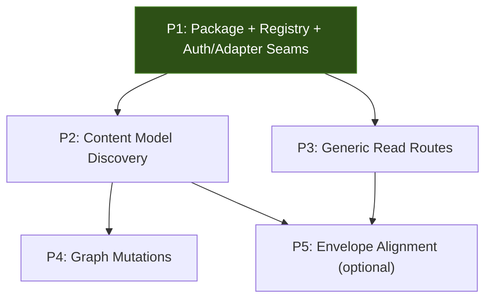

# Implementation Plan: Content Resource API Surface

**Date:** 2026-03-06
**Implements:** ADR-0001 (Hybrid Content Resource API)
**Scope:** API only — single shared `@coursebuilder/content-api` package, content model discovery, generic read routes, graph mutations, envelope alignment. CLI work (ADR-0002) is a separate planning session.

---

## Current State

```
packages/
  adapter-drizzle/     Drizzle schemas (ContentResource, CRR, CRV, CRT, CRP)
  core/                Zod schemas (ContentResourceSchema), CourseBuilderAdapter

apps/
  ai-hero/             AI_ table prefix, typed routes: posts, lessons, surveys, shortlinks
                       tRPC routers: contentResources, videoResources, solutions, events
  code-with-antonio/   CWA_ table prefix, typed routes: posts, lessons, shortlinks
```

**What exists:**
- DB schema is shared via `adapter-drizzle` — apps provide a `mysqlTable` creator with their prefix (`AI_`, `CWA_`)
- `ContentResourceSchema` (Zod) in `packages/core` — generic `fields: Record<string, any>`
- `ResourceStateSchema` (draft/published/archived/deleted) and `ResourceVisibilitySchema` (public/private/unlisted)
- `CourseBuilderAdapter` interface with `createContentResource`, `getContentResource`, `addResourceToResource`, `removeResourceFromResource`
- Typed write routes are per-app, hand-rolled Next.js route handlers (e.g. `apps/ai-hero/src/app/api/(content)/posts/route.ts`)
- Per-type Zod field schemas already exist in app code (e.g. `PostSchema` in `apps/ai-hero/src/lib/posts.ts`, `LessonSchema` in `lessons.ts`, `SolutionSchema` in `solution.ts`)
- tRPC routers for frontend use (`contentResources.getAll`, `contentResources.getList`, etc.)

**What doesn't exist:**
- `packages/content-api` — no shared API contract or route handlers
- Generic read/query REST routes (for CLI/external consumers)
- `/api/content-model` discovery endpoint
- `/api/content-resource-links` graph mutation routes
- Consistent response envelope across typed write routes

---

## Design Decisions

**Single package, clear seams.** Schemas and route handlers live together in `packages/content-api` with `src/schemas/` and `src/handlers/`. Handlers are framework-agnostic — they return `{ status, body, headers }` plain objects. App `route.ts` files stay thin and wrap them in `NextResponse`.

**tRPC stays for frontend, REST is for CLI/external.** The new generic REST endpoints and existing tRPC routers share the same adapter methods underneath. No migration of tRPC — it keeps serving the Studio UI.

**Reuse existing field schemas.** App-level schemas (`PostSchema`, `LessonSchema`, etc.) already exist. The content-model registry imports and wraps them — no duplication.

**App-owned auth, shared handler core.** `packages/content-api` must not import app-local auth types like `AppAbility`. Apps inject small authorization callbacks or a policy object into handlers.

**Ship discovery before reads.** `GET /api/content-model` is the cheapest proof that registry + schema serialization + auth injection work across apps. Generic reads come after that.

**Auto-versioning is opt-in.** Not blanket middleware. Routes that want version snapshots explicitly call `createVersionSnapshot()` before writes. Measure DB cost before expanding.

---

## Dependency Graph



P2 and P3 can run in parallel after P1. P4 depends on P2 because graph validation uses the same app registry surfaced by `content-model`. P5 is optional — deferred until the CLI needs it.

---

## Phase 1: Shared Content API Package

**Goal:** Single package with API types, Zod schemas, registry primitives, explicit auth/adapter seams, and framework-agnostic route handlers.

**Create:** `packages/content-api/`

### Tasks

- [ ] **1.1** Scaffold package:
  ```
  packages/content-api/
    package.json
    tsconfig.json
    src/
      index.ts
      auth/
        policy.ts
      schemas/
        content-model.ts
        content-resource-read.ts
        content-resource-graph.ts
        edge-matrix.ts
        envelope.ts
      handlers/
        list-resources.ts
        get-resource.ts
        get-children.ts
        get-parents.ts
        get-content-model.ts
        create-link.ts
        delete-link.ts
  ```

- [ ] **1.2** `schemas/content-model.ts` — capability and schema introspection types:
  ```ts
  const ResourceOperationSchema = z.enum(['create', 'read', 'update', 'delete'])

  type ResourceTypeDefinition = {
    type: string
    label: string
    operations: ResourceOperation[]
    fieldsSchema: z.ZodType<unknown>
    states: ResourceState[]
  }

  type ContentModel = {
    resourceTypes: ResourceTypeDefinition[]
    edges: EdgeRule[]
    constraints: ContentModelConstraints
  }

  const ContentModelResponseSchema = z.object({ ... })

  // Registry builder — apps call this with their existing schemas
  function createSchemaRegistry(): SchemaRegistry
  ```
  Keep `unknown` at the boundary and return validated typed data from registry helpers. Do not expose `any` in the package surface.

- [ ] **1.3** `schemas/edge-matrix.ts` — allowed parent-child relationships:
  ```ts
  type EdgeRule = {
    parentType: string
    childType: string
    maxChildren?: number
    required?: boolean
  }

  // Default edge rules derived from production data:
  // videoResource -> raw-transcript (501 links)
  // lesson -> videoResource (224)
  // lesson -> solution (100)
  // section -> lesson (224)
  // workshop -> section
  // solution -> videoResource (100)
  ```

- [ ] **1.4** `schemas/content-resource-read.ts` — read model DTOs and query params:
  ```ts
  const ContentResourceQuerySchema = z.object({
    type: z.string().optional(),
    state: ResourceStateSchema.optional(),
    visibility: ResourceVisibilitySchema.optional(),
    organizationId: z.string().optional(),
    search: z.string().optional(),
    page: z.coerce.number().default(1),
    limit: z.coerce.number().default(25),
    sort: z.enum(['createdAt', 'updatedAt', 'title']).default('updatedAt'),
    order: z.enum(['asc', 'desc']).default('desc'),
  })

  const ContentResourceReadSchema = ContentResourceSchema.extend({
    childCount: z.number().optional(),
  })

  const ContentResourceListResponseSchema = z.object({
    data: z.array(ContentResourceReadSchema),
    pagination: PaginationSchema,
  })
  ```

- [ ] **1.5** `schemas/content-resource-graph.ts` — link mutation schemas:
  ```ts
  const CreateLinkSchema = z.object({
    parentId: z.string(),
    childId: z.string(),
    position: z.number().default(0),
    metadata: z.record(z.string(), z.unknown()).default({}),
  })

  const DeleteLinkSchema = z.object({
    parentId: z.string(),
    childId: z.string(),
  })
  ```

- [ ] **1.6** `schemas/envelope.ts` — standard response envelope:
  ```ts
  type ApiResponse<T> = {
    ok: true
    data: T
    meta?: { version?: number }
  } | {
    ok: false
    error: { message: string; code: string; details?: unknown }
  }
  ```

- [ ] **1.7** `handlers/*` — framework-agnostic route handlers:
  Each handler signature:
  ```ts
  type HandlerResult = { status: number; body: unknown; headers?: Record<string, string> }
  type AuthorizationPolicy = {
    canReadResource(input: { resource: ContentResource; user?: User }): boolean | Promise<boolean>
    canManageLink(input: {
      parent: ContentResource
      child: ContentResource
      user?: User
    }): boolean | Promise<boolean>
  }

  type HandlerContext = {
    adapter: CourseBuilderAdapter
    authorize: AuthorizationPolicy
    registry?: SchemaRegistry
    user?: User
  }

  // Example:
  function listResources(params: ContentResourceQuery, ctx: HandlerContext): Promise<HandlerResult>
  ```
  App route.ts wraps:
  ```ts
  export async function GET(request: NextRequest) {
    const result = await listResources(parseParams(request), getContext(request))
    return NextResponse.json(result.body, { status: result.status })
  }
  ```

- [ ] **1.8** Extend `CourseBuilderAdapter` in `packages/core/src/adapters.ts`:
  ```ts
  queryContentResources(params: ContentResourceQuery): Promise<ContentResourceListResponse>
  getResourceChildren(id: string): Promise<ContentResource[]>
  getResourceParents(id: string): Promise<ContentResource[]>
  addResourceToResource(options: {
    childResourceId: string
    parentResourceId: string
    position?: number
    metadata?: Record<string, unknown>
  }): Promise<ContentResourceResource | null>
  ```
  Decide and document the delete return type now. Prefer a stable success envelope over returning a parent resource.

- [ ] **1.9** Wire `package.json` exports, add to workspace, run `pnpm manypkg fix`

- [ ] **1.10** Add dependency to `packages/core`, `apps/ai-hero`, `apps/code-with-antonio`

- [ ] **1.11** Add package tests:
  - Registry serialization tests
  - Handler auth-policy tests with fake adapters
  - Envelope schema tests

### Verify

```bash
pnpm build --filter="@coursebuilder/content-api"
pnpm typecheck --filter="@coursebuilder/content-api"
cd packages/content-api && pnpm test
```

---

## Phase 2: Content Model Discovery

**Goal:** `GET /api/content-model` returns the capability matrix for each app and proves the registry/auth seam works.

**Depends on:** P1

### Tasks

- [ ] **2.1** Create app-level schema registry files that import existing schemas:
  ```
  apps/ai-hero/src/lib/content-model/registry.ts
  apps/code-with-antonio/src/lib/content-model/registry.ts
  ```
  ```ts
  import { createSchemaRegistry, ResourceOperationSchema } from '@coursebuilder/content-api'
  import { PostSchema } from '@/lib/posts'
  import { LessonSchema } from '@/lib/lessons'
  import { SolutionSchema } from '@/lib/solution'

  export const registry = createSchemaRegistry()
    .register('post', PostSchema.shape.fields, ResourceOperationSchema.array().parse(['create', 'read', 'update', 'delete']))
    .register('lesson', LessonSchema.shape.fields, ResourceOperationSchema.array().parse(['read', 'update']))
    .register('solution', SolutionSchema.shape.fields, ResourceOperationSchema.array().parse(['read', 'create', 'update', 'delete']))
    .withEdges([
      { parentType: 'lesson', childType: 'videoResource' },
      { parentType: 'lesson', childType: 'solution' },
      { parentType: 'section', childType: 'lesson' },
      { parentType: 'workshop', childType: 'section' },
      { parentType: 'solution', childType: 'videoResource' },
      { parentType: 'videoResource', childType: 'raw-transcript' },
    ])
  ```

- [ ] **2.2** Fill in any missing per-type field schemas:
  - Check which types lack Zod schemas in each app
  - Only create schemas for types that do not exist yet
  - AI Hero types to check: `survey`, `shortlink`, `section`, `workshop`, `videoResource`, `raw-transcript`
  - CWA types to check: `event`, `event-series`

- [ ] **2.3** Implement `get-content-model` handler in `packages/content-api`:
  - Takes registry, serializes to JSON using `zod-to-json-schema`
  - Uses injected auth/policy context if the app wants discovery filtered by caller
  - Returns `ContentModelResponseSchema`

- [ ] **2.4** Mount `GET /api/content-model` in both apps

- [ ] **2.5** Add `zod-to-json-schema` dependency

- [ ] **2.6** Add tests:
  - Registry-to-JSON-schema snapshot tests in `packages/content-api`
  - App registry coverage tests to catch stale or missing registered types

### Verify

```bash
cd packages/content-api && pnpm test
curl $BASE/api/content-model | jq '.resourceTypes[].type'
# AI Hero: ["post", "lesson", "solution", "survey", "shortlink", ...]
# CWA: ["post", "lesson", "solution", "event", "event-series", ...]

curl $BASE/api/content-model | jq '.edges'
# -> array of { parentType, childType } rules
```

---

## Phase 3: Generic Read API Routes

**Goal:** Mount the shared read handlers in both apps.

**Depends on:** P1

### Tasks

- [ ] **3.1** Implement adapter methods in `packages/adapter-drizzle/`:
  - `queryContentResources`: filter by type/state/visibility/organizationId, offset pagination, sort
  - Start with type + state filters only. Defer full-text search on `fields` JSON.
  - `getResourceChildren`: join through `ContentResourceResource` where `resourceOfId = id`, order by `position`
  - `getResourceParents`: join through `ContentResourceResource` where `resourceId = id`

- [ ] **3.2** Add adapter tests in `packages/adapter-drizzle`:
  - query filters
  - pagination
  - child ordering by `position`
  - parent lookup

- [ ] **3.3** Mount routes in AI Hero:
  ```
  apps/ai-hero/src/app/api/content-resources/route.ts              -> list
  apps/ai-hero/src/app/api/content-resources/[id]/route.ts         -> get
  apps/ai-hero/src/app/api/content-resources/[id]/children/route.ts
  apps/ai-hero/src/app/api/content-resources/[id]/parents/route.ts
  ```
  Each route file is thin: parse request, build auth policy, call handler, wrap in `NextResponse`.

- [ ] **3.4** Mount routes in Code With Antonio (same structure)

- [ ] **3.5** Add app route smoke tests where cheap; keep heavy verification for package/adapter tests

### Verify

```bash
cd packages/adapter-drizzle && pnpm test
curl -H "Authorization: Bearer $TOKEN" $BASE/api/content-resources?type=post&limit=5
# -> 200, { ok: true, data: [...], pagination: { page: 1, limit: 5, total: N } }

curl -H "Authorization: Bearer $TOKEN" $BASE/api/content-resources/$ID
# -> 200, { ok: true, data: { id, type, fields, ... } }

curl -H "Authorization: Bearer $TOKEN" $BASE/api/content-resources/$ID/children
# -> 200, { ok: true, data: [...] } ordered by position
```

---

## Phase 4: Graph Mutations

**Goal:** Shared endpoints for creating/deleting parent-child resource links with edge validation.

**Depends on:** P2 and P3

### Tasks

- [ ] **4.1** Update `packages/adapter-drizzle` graph writes to match the new adapter contract:
  - `addResourceToResource` accepts optional `position` and `metadata`
  - Document whether omitted `position` means append
  - Make the return shape stable and aligned with the response envelope

- [ ] **4.2** Implement `create-link` handler in `packages/content-api`:
  - Validate payload against `CreateLinkSchema`
  - Load edge rules from schema registry
  - Load parent and child resources before auth + edge validation
  - Check parent type -> child type is an allowed edge
  - Delegate to the updated `addResourceToResource` adapter method
  - Return created link in envelope

- [ ] **4.3** Implement `delete-link` handler:
  - Validate against `DeleteLinkSchema`
  - Load parent and child resources for auth + validation
  - Delegate to `removeResourceFromResource`
  - Return success envelope

- [ ] **4.4** Mount in both apps:
  ```
  apps/ai-hero/src/app/api/content-resource-links/route.ts
  apps/code-with-antonio/src/app/api/content-resource-links/route.ts
  ```

- [ ] **4.5** Add tests:
  - valid edge succeeds
  - invalid edge fails with `INVALID_EDGE`
  - unauthorized link mutation fails
  - position/metadata are persisted when supplied

### Verify

```bash
cd packages/adapter-drizzle && pnpm test

# Create valid link
curl -X POST -H "Authorization: Bearer $TOKEN" \
  $BASE/api/content-resource-links \
  -H "Content-Type: application/json" \
  -d '{"parentId":"REAL_LESSON_ID","childId":"REAL_VIDEO_ID","position":0}'
# -> 201, { ok: true, data: { ... } }

# Reject invalid edge
curl -X POST -H "Authorization: Bearer $TOKEN" \
  $BASE/api/content-resource-links \
  -H "Content-Type: application/json" \
  -d '{"parentId":"REAL_TRANSCRIPT_ID","childId":"REAL_WORKSHOP_ID"}'
# -> 422, { ok: false, error: { code: "INVALID_EDGE", message: "..." } }

# Delete link
curl -X DELETE -H "Authorization: Bearer $TOKEN" \
  $BASE/api/content-resource-links \
  -H "Content-Type: application/json" \
  -d '{"parentId":"REAL_LESSON_ID","childId":"REAL_VIDEO_ID"}'
# -> 200, { ok: true }
```

---

## Phase 5: Align Typed Write Envelopes (Optional / Deferred)

**Goal:** Existing typed write endpoints adopt the same response envelope.

**Depends on:** P2, P3. **Deferred** until the CLI needs consistent write responses. The real value of this plan lands in P1-P4. Migrating existing working routes carries risk for marginal gain right now.

**When to do it:** When CLI ADR-0002 work starts and needs typed write routes to return the `{ ok, data, meta }` envelope.

### Tasks (for when the time comes)

- [ ] **5.1** Create `withEnvelope` response wrapper utility using the envelope schema from P1

- [ ] **5.2** Add opt-in `createVersionSnapshot(resourceId, adapter)` helper:
  - Creates a `ContentResourceVersion` record with current `fields` state
  - Routes call it explicitly before writes — not blanket middleware
  - Measure DB write cost on first route before expanding

- [ ] **5.3** Migrate AI Hero typed write routes to new envelope:
  - `apps/ai-hero/src/app/api/(content)/posts/route.ts`
  - `apps/ai-hero/src/app/api/(content)/lessons/route.ts`
  - `apps/ai-hero/src/app/api/(content)/lessons/[lessonId]/solution/route.ts`
  - `apps/ai-hero/src/app/api/(content)/surveys/route.ts`
  - `apps/ai-hero/src/app/api/shortlinks/route.ts`

- [ ] **5.4** Migrate CWA typed write routes (same list minus surveys)

- [ ] **5.5** Add observability events:
  - `content_resource.query`, `content_resource_link.create`, `content_resource_link.delete`
  - Per-type: `post.create`, `post.update`, `lesson.update`, etc.

### Verify

- Existing integration tests still pass
- Response envelope is consistent:
  ```json
  { "ok": true, "data": { ... }, "meta": { "version": 3 } }
  ```

---

## Testing Strategy

Default to **package/app-local automated tests first**, then one end-to-end smoke pass against a local dev app exposed via ngrok.

### Automated test layers

1. `packages/content-api`
   - Registry serialization
   - Envelope schema behavior
   - Handler authorization with fake adapters/policies

2. `packages/adapter-drizzle`
   - Query filters
   - Pagination
   - Parent/child ordering
   - Link writes with `position` and `metadata`

3. App route smoke tests
   - Thin wrapper coverage only
   - Request parsing
   - Handler wiring
   - `NextResponse` mapping

### External smoke environment

```
BASE=https://vojta.ngrok.app
```

### Obtaining a Bearer Token via Device OAuth Flow

The apps expose device OAuth endpoints at:
- `POST /oauth/device/code` — creates a device verification, returns `device_code`, `user_code`, `verification_uri_complete`
- `POST /oauth/token` — polls with `device_code` form body until user approves, returns `access_token`

For automated testing, use Playwright to complete the approval step:

```
┌─────────────┐     POST /oauth/device/code     ┌──────────┐
│  Test runner │ ──────────────────────────────── │  App     │
│  (curl/node) │ <── { device_code, user_code,   │  (ngrok) │
│              │      verification_uri_complete } │          │
└──────┬───────┘                                  └──────────┘
       │
       │  Launch Playwright
       ▼
┌─────────────┐     Navigate to verification_uri_complete
│  Playwright  │ ────────────────────────────────────────────┐
│  browser     │     (already logged in via stored state,    │
│              │      or log in first)                       │
│              │     Click "Approve" on /activate page       │
└──────┬───────┘ <───────────────────────────────────────────┘
       │
       │  Return to test runner
       ▼
┌─────────────┐     POST /oauth/token { device_code }
│  Test runner │ ──────────────────────────────────────────┐
│              │ <── { access_token, token_type: "bearer" } │
└──────────────┘                                           │
                                                           │
  export TOKEN=$access_token                               │
  All subsequent curl calls use:                           │
    -H "Authorization: Bearer $TOKEN"                      │
```

**Concrete steps:**

1. `POST $BASE/oauth/device/code` — get `device_code` + `verification_uri_complete`
2. Playwright opens `verification_uri_complete` (e.g. `$BASE/activate?user_code=three-silly-words`)
   - If no session: log in via NextAuth first
   - If session exists (stored Playwright auth state): lands directly on activation page
3. Playwright clicks the "Approve" / "Activate" button on `/activate`
4. Poll `POST $BASE/oauth/token` with `device_code` form body until it returns `access_token`
5. Store `TOKEN` for the rest of the test run

**Playwright auth state persistence:** Save browser state after first login with `context.storageState()` to `.playwright/auth-state.json` (gitignored). Subsequent runs skip the login step.

**Alternative for quick manual testing:** Use the existing CLI:
```bash
aihero auth login --base-url https://vojta.ngrok.app
# Opens browser, you approve, token stored
aihero auth whoami  # confirms it works
# Then grab the token from ~/.config/aihero/config.json
```

### Assertions per phase

| Phase | Test method | What to assert |
|-------|-----------|----------------|
| P1 | `pnpm build`, `pnpm typecheck`, `cd packages/content-api && pnpm test` | Package compiles, types export correctly, handlers work with injected auth policy |
| P2 | `cd packages/content-api && pnpm test`, curl `$BASE/api/content-model` | Registry serializes correctly, returns registered types and edge rules |
| P3 | `cd packages/adapter-drizzle && pnpm test`, curl `$BASE/api/content-resources*` | List returns paginated data, get returns single, children/parents return ordered arrays |
| P4 | `cd packages/adapter-drizzle && pnpm test`, curl POST/DELETE `$BASE/api/content-resource-links` | Valid edges succeed, invalid edges return 422, position/metadata persist |
| P5 | curl typed write routes, check response shape | Envelope matches `{ ok, data, meta }` (when implemented) |

---

## Summary

```
P1 Content API Package ──┬── P2 Content Model ───┬── P4 Graph Mutations
                          ├── P3 Read Routes ─────┤
                          └───────────────────────┴── P5 Envelope Alignment (deferred)
```

| Phase | Scope | Key deliverable |
|-------|-------|-----------------|
| P1 | New package: schemas + handlers + seams | `@coursebuilder/content-api` |
| P2 | Import existing schemas into registry | `GET /api/content-model` in 2 apps |
| P3 | Adapter methods + mount routes | `GET /api/content-resources/*` in 2 apps |
| P4 | Edge-validated link mutations | `POST/DELETE /api/content-resource-links` |
| P5 | Migrate existing routes (deferred) | Consistent envelope + opt-in versioning |

---

## Risks and Mitigations

| Risk | Mitigation |
|------|-----------|
| `queryContentResources` adapter method is complex | Start with type + state filters only, defer search |
| Edge matrix diverges across apps | Each app defines its own edges in registry, shared validation logic |
| Content-model endpoint becomes stale | CI test that validates `/api/content-model` against registered types |
| Handler/app coupling creeps back in | Shared handlers accept injected auth policy callbacks; no `AppAbility` imports in package |
| Graph API contract drifts from adapter reality | Extend adapter contract up front for `position` and `metadata`, then test drizzle implementation |
| Missing field schemas for some types | P2 task 2.2 audits what's missing; only create what doesn't exist |

---

## Open Questions

1. **Search implementation** — Full-text search on `fields` JSON is expensive. Options: generated column index on common fields, external search (Typesense/Meilisearch), or defer to app-level. **Recommendation:** start with LIKE on `fields->>'$.title'`, upgrade later.

2. **Auth on generic endpoints** — Same CASL system, but shared handlers should not know app ability types. **Recommendation:** each app adapts CASL into a small injected policy object (`canReadResource`, `canManageLink`) passed to shared handlers.

3. **Pagination strategy** — Offset vs cursor. Offset is simpler and matches existing UI patterns. Cursor is better at scale. **Recommendation:** offset-based now, add cursor option in future.
