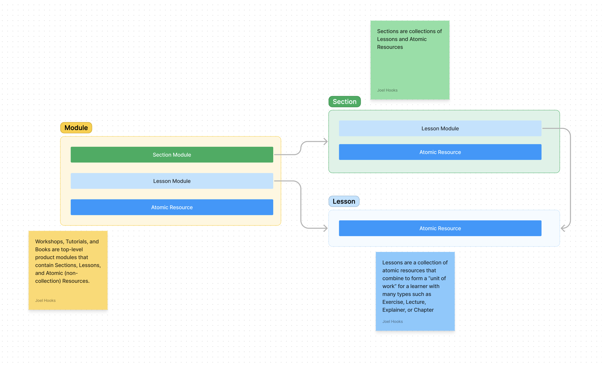

Course Builder functions as an intuitive content management system, seamlessly integrated with [Sanity](https://sanity.io). Sanity serves as a robust, headless CMS, acting as the foundational content database and underlying management system for Course Builder.

## Types of Content

At its core, Course Builder employs a thoughtfully designed information architecture (IA). This IA isn't just a fancy term; it's a culmination of over a decade of research, experimentation, and refinement.

:::note
Dive deeper into the Course Builder IA [here](https://badass.dev/information-architecture). Discover how years of experience have shaped our approach.
:::

Our IA organizes content into distinct types:

- **Collections**: Defined as a `collection`, this type represents a curated set of resources tailored for an optimal learning experience.
- **Resources**: The fundamental building block of Course Builder, a `resource` forms the basis of our content. Intriguingly, a `collection` itself is a type of `resource`.

### Product Modules Modules

Within Course Builder, `modules` such as Courses, Tutorials, and Workshops have designated types and functions.

- **Courses, Tutorials, and Workshops** are essentially collections of resources, primarily lessons, packaged in various formats. Despite similar data structures, they differ in terms of billing models within our product range.
- **Tutorial**: Free access content.
- **Workshop**: Paid content, offering more depth compared to tutorials.

We typically steer clear of the term "courses" due to its generic nature. The distinction between "tutorial" and "workshop" clearly communicates the value and depth of content to learners, production teams, and creators, aligning with [The Process 🌀](https://badass.dev/the-process).

### Sections

A `section` is a collection of `lessons` and `atomic resources` within a 
`module`. It's a logical grouping of lessons, typically organized by topic or theme.

Sections do not receive a navigable route/page, but are used to structure 
and organize content within a module.

### Lessons

A `lesson` is a specifically structured collection of resources. Its presentation hinges on the `type` of lesson and the organization of its constituent resources.

Common types of lessons include:

- `Tip`: Part of the `Tips` module, `Tip` lessons are organized internally and not directly visible to learners.
- `Exercise`: Integral to both `Tutorials` and `Workshops`. Exercises are more comprehensive than `Tips` or `Explainers`, comprising a problem video, a hands-on exercise, and a solution video.
- `Explainer`: Found in `Tutorials` and `Workshops`, `Explainer` lessons are similar in presentation to `Tips`, but serve as lectures within a specific module context.

This IA allows for the introduction of new lesson types tailored to specific products, offering versatility while maintaining a consistent structure.

:::note[Flexibility and Consistency]
Our IA strikes a balance between flexibility and consistency. It's designed to support the creative visions of expert creators, allowing them to convey material effectively, without compromising on uniformity and quality.
:::

### Atomic Resources

#### Videos

:::note
a video/audio resource is a collection because the transcript, media url, and 
srt are all part of a single atomic resource since the transcript and srt should be a very specific 1:1 relationship with a video/audio file

it's important in the sense that a lesson won't have a transcript and video resource. just the video resource that has the appropriate data for presenting a video which is media url, transcript(s), and srt(s) (plural here because we could move to multi-language)
:::

### Tips

### Articles

## Creating New Content

## Publishing Content

## Updating Content

## Removing Content
