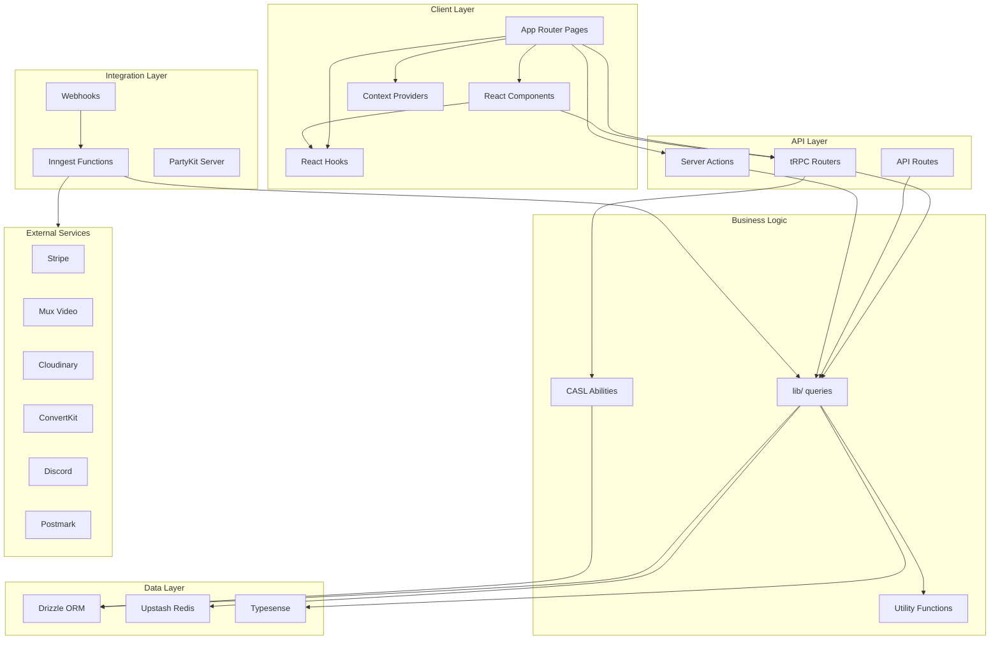

# Extraction Readiness Review: ai-hero

**Date**: 2026-01-07
**Reviewer**: Claude Code
**App**: `apps/ai-hero`

---

## 1. App Overview

### Purpose
AI Hero is a developer education platform for building AI-powered applications in TypeScript. It delivers cohort-based workshops, tutorials, and interactive content with real-time collaboration features.

### Stack Summary
| Layer | Technology |
|-------|------------|
| Framework | Next.js 16 (App Router, RSC, Server Actions) |
| Database | Drizzle ORM + MySQL/PlanetScale |
| API | tRPC 11 for type-safe RPCs |
| Auth | NextAuth.js 5 (beta) + CASL abilities |
| Real-time | PartyKit + Yjs for collaboration |
| Events | Inngest for background workflows |
| Media | Mux (video), Deepgram (transcription), Cloudinary (images) |
| Payments | Stripe |
| Search | Typesense |
| Email | Postmark, Resend, ConvertKit |
| Monitoring | Sentry, Axiom |

### Package Dependencies (from @coursebuilder/*)
```
@coursebuilder/adapter-drizzle   - Database adapter
@coursebuilder/commerce-next     - Commerce components
@coursebuilder/core              - Core types/functions
@coursebuilder/email-templates   - Email components
@coursebuilder/mdx-mermaid       - MDX diagrams
@coursebuilder/next              - Next.js bindings (minimal)
@coursebuilder/nodash            - Utility functions
@coursebuilder/survey            - Survey components
@coursebuilder/ui                - shadcn/ui components
@coursebuilder/utils-*           - 14 utility packages
```

### Directory Structure
```
apps/ai-hero/src/
├── ability/         # CASL authorization (3 files)
├── app/             # Next.js App Router (27 route groups)
├── components/      # React components (35 files/dirs)
├── config.ts        # App configuration
├── convertkit/      # ConvertKit integration
├── coursebuilder/   # Framework integration
├── db/              # Drizzle schema + queries (11 files)
├── emails/          # React Email templates (12 files)
├── env.mjs          # Environment schema (8KB)
├── flags/           # Feature flags
├── hooks/           # React hooks (12 files)
├── inngest/         # Event workflows (24 functions)
├── lib/             # Business logic (72 files)
├── providers/       # React providers
├── server/          # Server utilities (6 files)
├── trpc/            # tRPC routers (16 routers)
├── utils/           # Utility functions (35 files)
└── video-uploader/  # Video upload components
```

---

## 2. Architecture Map



### Key Data Flows

1. **Content Delivery**: Pages → lib/*-query.ts → DB → RSC render
2. **Commerce**: Pages → TRPC pricing → Stripe → Inngest workflows
3. **Real-time**: PartyKit → Yjs → Collaborative editing
4. **Email**: Inngest → sendAnEmail() → Postmark/Resend

---

## 3. Extraction Patterns

### Pattern 1: Server Utilities
**Files**: `server/with-skill.ts`, `server/redis-client.ts`, `server/logger.ts`
**Target**: `@coursebuilder/next/server`
**Strategy**: Direct copy with config injection

```typescript
// Current (apps/ai-hero/src/server/redis-client.ts)
import { Redis } from '@upstash/redis'
export const redis = Redis.fromEnv()

// After extraction (apps/ai-hero/src/server/redis-client.ts)
export { redis } from '@coursebuilder/next/server'
```

**Blockers**: `logger.ts` has app-specific Axiom orgId
**Effort**: LOW

---

### Pattern 2: React Providers
**Files**: `components/theme-provider.tsx`, `components/amplitude-provider.tsx`, `hooks/use-mux-player.tsx`
**Target**: `@coursebuilder/next/providers`
**Strategy**: Extract with config injection, apps re-export

```typescript
// Package (packages/next/src/providers/amplitude-provider.tsx)
export function AmplitudeProvider({ children, config }: { children: ReactNode; config: AmplitudeConfig }) {
  // Implementation
}

// App (apps/ai-hero/src/components/amplitude-provider.tsx)
import { AmplitudeProvider as Base } from '@coursebuilder/next/providers'
import { env } from '@/env.mjs'

export function AmplitudeProvider({ children }) {
  return <Base config={{ apiKey: env.NEXT_PUBLIC_AMPLITUDE_API_KEY }}>{children}</Base>
}
```

**Blockers**: None
**Effort**: LOW

---

### Pattern 3: React Hooks
**Files**: `hooks/use-is-mobile.ts`, `hooks/use-mutation-observer.ts`, `hooks/use-socket.ts`, `hooks/use-active-heading.tsx`, `hooks/use-scroll-to-active.ts`, `hooks/use-mux-player-prefs.ts`
**Target**: `@coursebuilder/next/hooks`
**Strategy**: Direct extraction (no `@/` dependencies)

```typescript
// After extraction
export { useIsMobile } from '@coursebuilder/next/hooks'
export { useSocket } from '@coursebuilder/next/hooks'
```

**Blockers**: `use-socket.ts` needs env injection for PartyKit URL
**Effort**: LOW

---

### Pattern 4: Utility Re-exports
**Files**: `utils/cn.ts`, `utils/guid.ts`, `utils/discord.ts`, `utils/cookies.ts`, etc.
**Target**: Already using `@coursebuilder/utils-*`
**Strategy**: Convert to re-exports

```typescript
// Current (apps/ai-hero/src/utils/cn.ts)
import { clsx, type ClassValue } from 'clsx'
import { twMerge } from 'tailwind-merge'
export function cn(...inputs: ClassValue[]) {
  return twMerge(clsx(inputs))
}

// After (apps/ai-hero/src/utils/cn.ts)
export { cn } from '@coursebuilder/utils-ui'
```

**Blockers**: None (already done for most)
**Effort**: MINIMAL

---

### Pattern 5: TRPC Routers (Factory Pattern)
**Files**: `trpc/api/routers/*.ts` (16 routers)
**Target**: `@coursebuilder/next/trpc` (future)
**Strategy**: Track canonical versions, extract when deps move

```typescript
// Future extraction pattern
export function createProgressRouter(deps: { db: Database; ability: AppAbility }) {
  return router({
    get: publicProcedure.input(z.object({ resourceId: z.string() })).query(async ({ input }) => {
      // Implementation using deps
    }),
  })
}
```

**Blockers**: Heavy `@/` dependencies (`@/db`, `@/ability`, `@/server/auth`)
**Effort**: HIGH (defer)

---

### Pattern 6: Inngest Utilities
**Files**: `inngest/functions/email-send-broadcast.ts`, `lib/personal-organization-service.ts`
**Target**: `@coursebuilder/utils-email`, `@coursebuilder/adapter-drizzle`
**Strategy**: Extract utility functions, not entire inngest handlers

```typescript
// Extract sendAnEmail() to @coursebuilder/utils-email
export async function sendAnEmail<T>(options: SendEmailOptions<T>) {
  const resend = new Resend(options.resendApiKey) // Config injected
  return resend.emails.send({
    from: options.From,
    to: [options.To],
    subject: options.Subject,
    react: options.Component(options.componentProps),
  })
}
```

**Blockers**: Inngest functions stay in apps (app-specific client/events)
**Effort**: MEDIUM

---

### Pattern 7: Ability Rules
**Files**: `ability/index.ts`, `ability/purchase-validators.ts`
**Target**: `@coursebuilder/core` or `@coursebuilder/next/ability`
**Strategy**: Extract base rules, allow app extensions

```typescript
// Package: base rules
export const baseAbilityRules = defineAbility((can, cannot) => {
  // Common rules
})

// App: extend with app-specific
export const appAbility = baseAbilityRules.extend((can, cannot) => {
  // ai-hero specific rules
})
```

**Blockers**: Rules differ per app (ai-hero has cohort/workshop rules)
**Effort**: MEDIUM

---

### Pattern 8: Query Functions
**Files**: `lib/*-query.ts` (26 files)
**Target**: `@coursebuilder/adapter-drizzle`
**Strategy**: Extract generic queries, keep app-specific

| Query File | Lines | Extractable |
|------------|-------|-------------|
| `posts-query.ts` | 746 | Partial - generic CRUD |
| `lessons-query.ts` | 542 | Partial - generic CRUD |
| `cohorts-query.ts` | 409 | App-specific |
| `products-query.ts` | 176 | Partial |
| `users.ts` | 38 | Fully extractable |

**Blockers**: Schema-coupled, need adapter pattern
**Effort**: HIGH (defer to adapter-drizzle work)

---

### Pattern 9: API Routes
**Files**: `app/api/**/*.ts` (28 routes)
**Target**: Most stay in apps
**Strategy**: Extract utility handlers, keep app routes

| Route | Extractable |
|-------|-------------|
| `api/auth/[...nextauth]` | No - app config |
| `api/trpc/[trpc]` | No - app router |
| `api/inngest` | No - app client |
| `api/mux/webhook` | Maybe - with config |
| `api/uploadthing` | No - app config |

**Blockers**: Routes are glue code with app-specific config
**Effort**: LOW value

---

### Pattern 10: Email Templates
**Files**: `emails/*.tsx` (12 templates)
**Target**: `@coursebuilder/email-templates`
**Strategy**: Generic templates to package, branded to app

| Template | Type |
|----------|------|
| `basic-email.tsx` | Generic - extract |
| `welcome-email.tsx` | Branded - keep |
| `welcome-cohort-email.tsx` | App-specific - keep |
| `workshop-access-email.tsx` | Generic structure - extract |

**Blockers**: Branding, app-specific content
**Effort**: MEDIUM

---

### Pattern 11: Components (Domain-Specific)
**Files**: `components/codehike/*`, `components/certificates/*`, `components/navigation/*`
**Target**: `@coursebuilder/ui` (selective)
**Strategy**: Extract truly generic, keep domain-specific

| Component Dir | Files | Extractable |
|---------------|-------|-------------|
| `codehike/` | 15 | Yes - generic |
| `certificates/` | 7 | Partial - layout generic, design branded |
| `navigation/` | 12 | No - app-specific |
| `pricing/` | 5 | Via `@coursebuilder/commerce-next` |
| `feedback-widget/` | 5 | Yes - generic |
| `list-editor/` | 12 | Yes - generic |
| `resources-crud/` | 8 | Yes - generic |
| `team-inquiry/` | 5 | Yes - generic |

**Blockers**: Styling differences, component API variations
**Effort**: HIGH

---

### Pattern 12: Config Files
**Files**: `env.mjs`, `config.ts`, `drizzle.config.ts`, `next.config.mjs`
**Target**: Stays in apps
**Strategy**: Document patterns, don't extract

**Reason**: Config is inherently app-specific. Extract patterns as templates, not code.

---

## 4. Extraction Matrix

| Category | Files | LOC | Target Package | Priority | Effort | Blockers |
|----------|-------|-----|----------------|----------|--------|----------|
| Server Utils | 3 | 80 | `@coursebuilder/next/server` | P1 | Low | logger app-specific |
| Providers | 3 | 200 | `@coursebuilder/next/providers` | P1 | Low | None |
| Hooks | 6 | 300 | `@coursebuilder/next/hooks` | P1 | Low | env injection |
| Utils | 15 | 400 | `@coursebuilder/utils-*` | P2 | Minimal | Already done |
| TRPC Routers | 16 | 1200 | `@coursebuilder/next/trpc` | P4 | High | `@/` deps |
| Inngest Utils | 2 | 100 | `@coursebuilder/utils-email` | P2 | Medium | None |
| Ability | 3 | 450 | `@coursebuilder/core` | P3 | Medium | App rules |
| Queries | 26 | 3000 | `@coursebuilder/adapter-drizzle` | P4 | High | Schema coupling |
| Components | 35 | 2500 | `@coursebuilder/ui` | P3 | High | Styling |
| Email Templates | 4 | 400 | `@coursebuilder/email-templates` | P3 | Medium | Branding |
| API Routes | 28 | 800 | None | - | - | App-specific |
| Config | 4 | 300 | None | - | - | App-specific |

---

## 5. Recommended Extraction Order

### Phase 1: Quick Wins (1-2 days)
1. **Server Utilities** → `@coursebuilder/next/server`
   - `with-skill.ts` (100% identical across apps)
   - `redis-client.ts` (100% identical)
   - Skip `logger.ts` initially (app-specific orgId)

2. **Providers** → `@coursebuilder/next/providers`
   - `ThemeProvider` (100% identical)
   - `AmplitudeProvider` (use epicdev-ai version - correct deps)
   - `MuxPlayerProvider` (from use-mux-player.tsx)

3. **Hooks** → `@coursebuilder/next/hooks`
   - `use-is-mobile.ts`
   - `use-mutation-observer.ts`
   - `use-active-heading.tsx`
   - `use-scroll-to-active.ts`
   - `use-mux-player-prefs.ts`
   - `use-socket.ts` (use epicdev-ai version - correct `??`)

### Phase 2: Utilities (2-3 days)
4. **Inngest Utilities** → `@coursebuilder/utils-email`
   - `sendAnEmail()` function extraction

5. **Personal Org Service** → `@coursebuilder/adapter-drizzle`
   - `ensurePersonalOrganizationWithLearnerRole()`
   - `getPersonalOrganization()`

6. **Remaining Utils** → verify all use `@coursebuilder/utils-*`
   - Audit `utils/` dir for local implementations
   - Convert to re-exports where possible

### Phase 3: Components (1 week)
7. **Generic Components** → `@coursebuilder/ui`
   - `feedback-widget/`
   - `team-inquiry/`
   - `list-editor/`
   - `resources-crud/`

8. **CodeHike** → `@coursebuilder/ui/code`
   - All CodeHike components (already fairly generic)

9. **Email Templates** → `@coursebuilder/email-templates`
   - Generic layouts only

### Phase 4: Deferred (Future)
10. **TRPC Routers** - Wait for `@/` dependencies to move
11. **Query Functions** - Part of adapter-drizzle work
12. **Ability Rules** - Need base rules pattern first

---

## 6. Don't Extract This

### App-Specific Config
| File | Reason |
|------|--------|
| `env.mjs` | App-specific env vars, validation |
| `config.ts` | App branding, URLs |
| `next.config.mjs` | App-specific plugins, redirects |
| `drizzle.config.ts` | Database connection config |
| `sentry.*.config.ts` | App-specific DSN, sampling |
| `partykit.json` | App-specific PartyKit config |

### App-Specific Business Logic
| Dir/File | Reason |
|----------|--------|
| `lib/cohorts-query.ts` | AI Hero cohort model |
| `lib/surveys-query.ts` | AI Hero survey system |
| `lib/typesense-query.ts` | App-specific search schema |
| `convertkit/` | App-specific ConvertKit forms |
| `flags/` | App-specific feature flags |

### Branded Content
| Dir/File | Reason |
|----------|--------|
| `emails/welcome-email.tsx` | Brand-specific copy/design |
| `emails/welcome-cohort-email.tsx` | Cohort-specific |
| `components/brand/` | Logo, colors, etc. |
| `components/navigation/` | App-specific nav structure |

### Tightly Coupled
| Dir/File | Reason |
|----------|--------|
| `trpc/api/routers/*.ts` | Uses `@/db`, `@/ability`, `@/server/auth` |
| `inngest/functions/*.ts` | Uses `@/inngest/inngest.server`, `@/inngest/events` |
| `ability/index.ts` | App-specific CASL rules |
| `app/**/*.tsx` | App routes are inherently app-specific |

### Low Value Extraction
| File | Reason |
|------|--------|
| `server/shortlinks.ts` | 13 lines, simple redirect |
| `server/ability-for-request.ts` | 37 lines, uses `@/ability` |
| `instrumentation.ts` | 6 lines, Sentry bootstrap |

---

## Summary

**Total Extractable**: ~5,000 LOC across 45 files
**Immediate Priority**: Server utils, providers, hooks (~580 LOC, 12 files)
**High Effort/Defer**: TRPC routers, queries, ability rules

**Key Principle**: Extract utilities and generic UI. Keep business logic, config, and branded content in apps.

**Success Metric**: After Phase 1-2, apps should:
- Import providers from `@coursebuilder/next/providers`
- Import hooks from `@coursebuilder/next/hooks`
- Import server utils from `@coursebuilder/next/server`
- Re-export locally for backward compatibility
