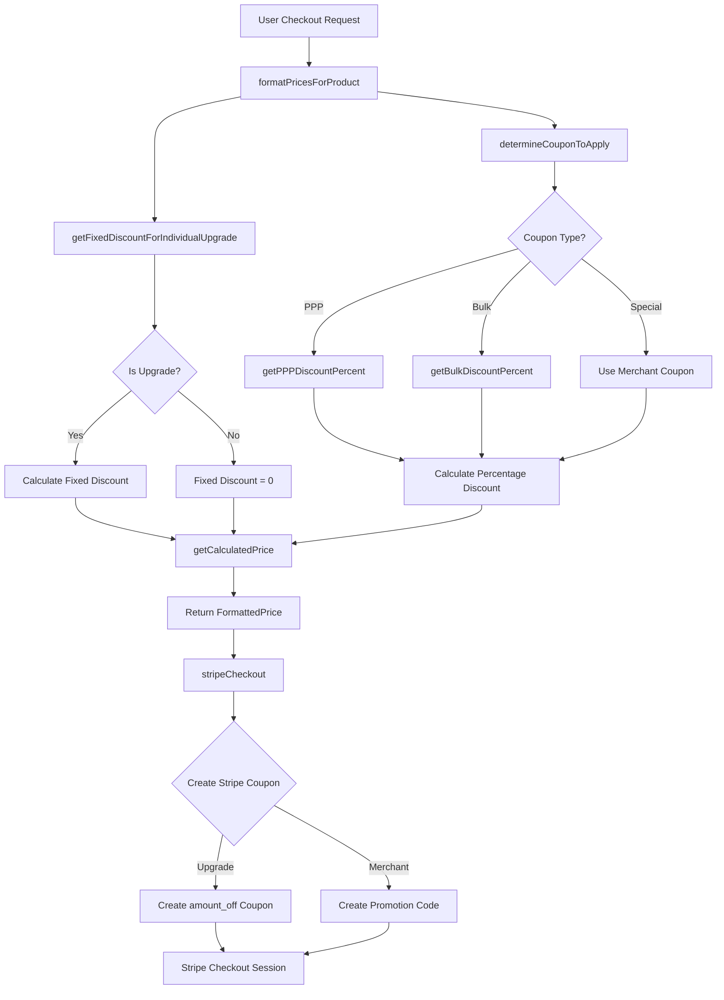
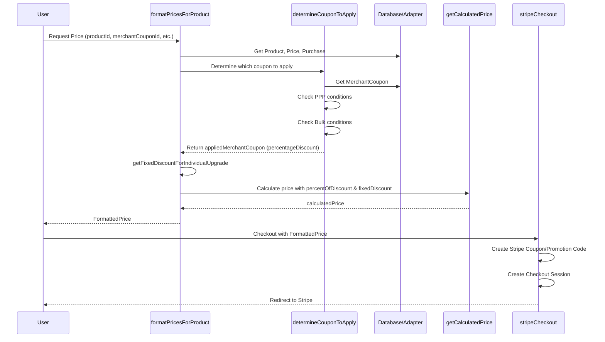
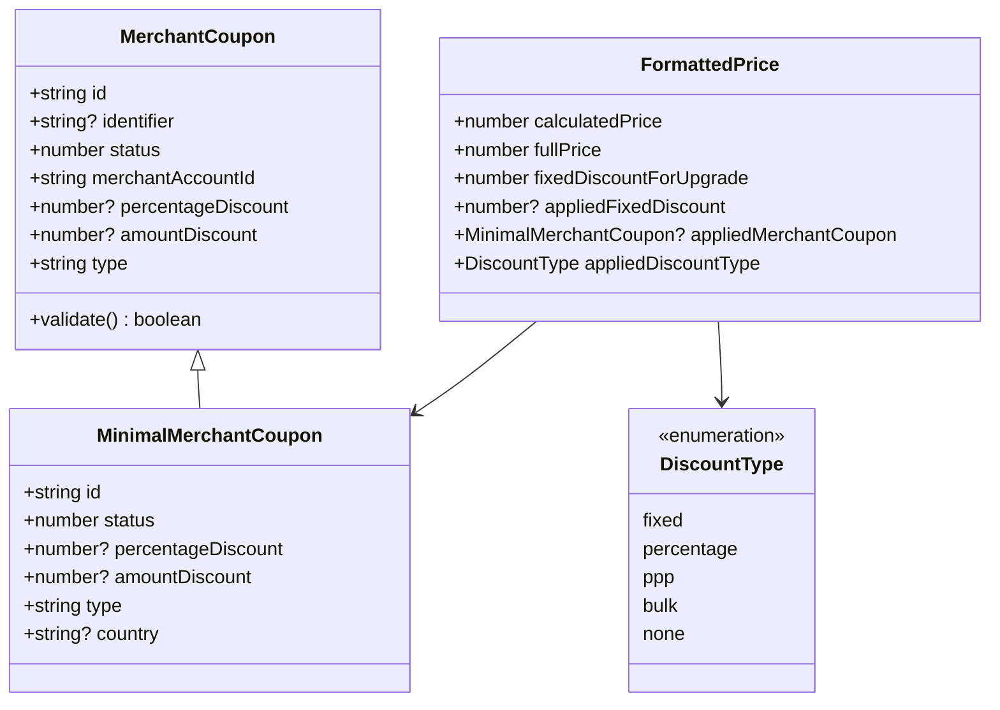
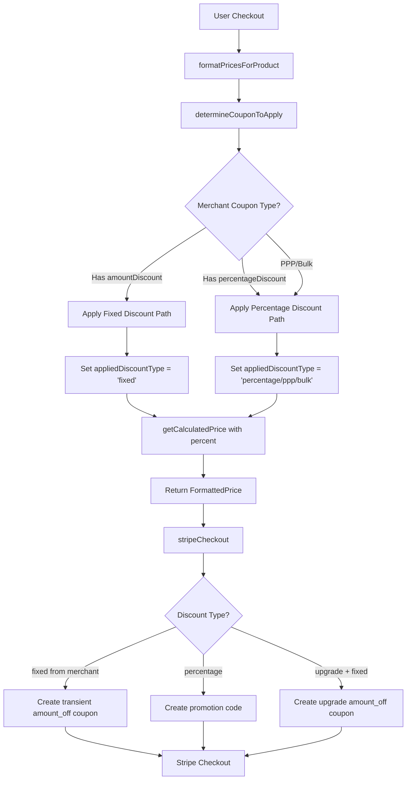
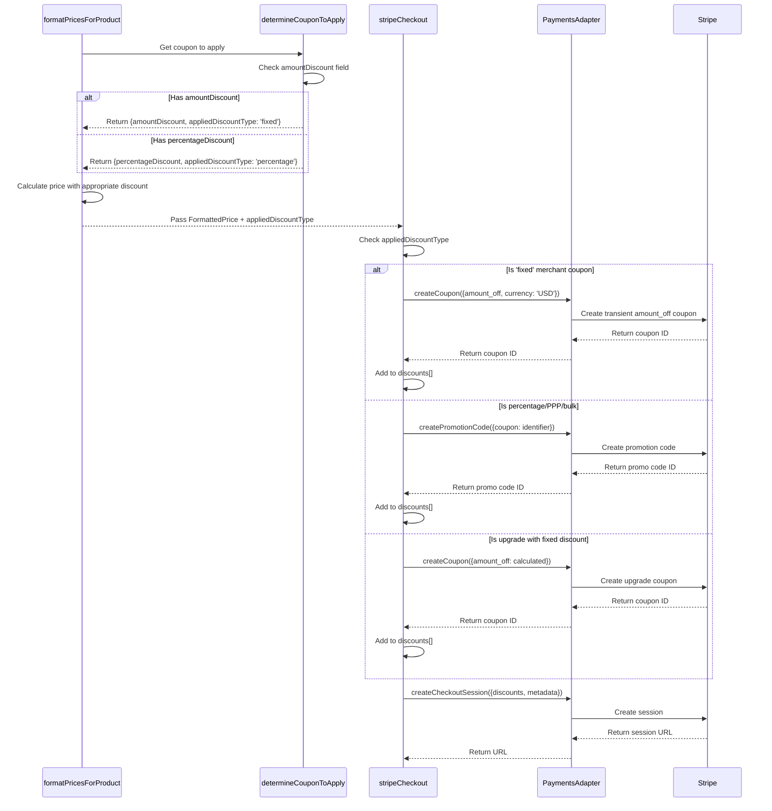

# Flat Discount Coupons - System Architecture Documentation

## Overview

This document provides a comprehensive overview of the pricing and coupon system that will be modified to support flat-rate (fixed amount) discount coupons alongside the existing percentage-based discounts.

## Current System Architecture

### High-Level Data Flow



### Current Coupon Flow



## Key System Components

### 1. Data Models & Schemas

#### Current MerchantCoupon Schema
**Location:** `packages/core/src/schemas/merchant-coupon-schema.ts`

```typescript
{
  id: string
  identifier: string | null | undefined  // Stripe coupon ID
  status: number
  merchantAccountId: string
  percentageDiscount: number  // 0.0 to 1.0 (e.g., 0.25 = 25%)
  type: string  // 'ppp' | 'bulk' | 'special'
}
```

**Key Issue:** No field for fixed amount discounts (amount_off)

#### FormattedPrice Type
**Location:** `packages/core/src/types.ts`

```typescript
{
  id: string
  quantity: number
  unitPrice: number
  fullPrice: number
  fixedDiscountForUpgrade: number  // Only for upgrades
  calculatedPrice: number
  availableCoupons: MinimalMerchantCoupon[]
  appliedMerchantCoupon?: MinimalMerchantCoupon
  bulk: boolean
  // ... upgrade fields
}
```

**Key Issue:** Fixed discounts only supported for upgrades, not merchant coupons

### 2. Core Pricing Functions

#### determineCouponToApply()
**Location:** `packages/core/src/lib/pricing/determine-coupon-to-apply.ts:39`

**Purpose:** Determines which coupon (PPP, Bulk, or Special) to apply based on priority

**Current Logic:**
1. Check if merchant coupon is 'special' type
2. Check PPP eligibility (country-based, single quantity, no prior full-price purchases)
3. Check Bulk eligibility (quantity > 1 or existing bulk purchase)
4. Return coupon with **percentageDiscount only**

**Returns:**
```typescript
{
  appliedMerchantCoupon?: MinimalMerchantCoupon  // has percentageDiscount
  appliedCouponType: 'ppp' | 'bulk' | 'special' | 'none'
  availableCoupons: MinimalMerchantCoupon[]
  bulk: boolean
}
```

#### getCalculatedPrice()
**Location:** `packages/core/src/lib/pricing/get-calculated-price.ts:17`

**Current Implementation:**
```typescript
function getCalculatedPrice({
  unitPrice,
  percentOfDiscount = 0,
  quantity = 1,
  fixedDiscount = 0,
}) {
  const fullPrice = unitPrice * quantity
  const discountMultiplier = 1 - percentOfDiscount
  const calculatedPrice = (
    (fullPrice - fixedDiscount) * discountMultiplier
  ).toFixed(2)

  return Number(calculatedPrice)
}
```

**Order of operations:**
1. Calculate fullPrice = unitPrice × quantity
2. Subtract fixedDiscount (upgrade only)
3. Apply percentage discount multiplier
4. Return final price

#### formatPricesForProduct()
**Location:** `packages/core/src/lib/pricing/format-prices-for-product.ts:128`

**Current Flow:**
1. Get product, price, and purchase data
2. Call `determineCouponToApply()` → get percentageDiscount
3. Calculate `fixedDiscountForUpgrade` (upgrade scenarios only)
4. Calculate fullPrice: `unitPrice * quantity - fixedDiscountForUpgrade`
5. Call `getCalculatedPrice()` with percentOfDiscount
6. Return FormattedPrice

**Key Lines:**
```typescript
// Line 204: Extract percentage discount from merchant coupon
const percentOfDiscount = appliedMerchantCoupon?.percentageDiscount

// Line 202: Full price calculation
const fullPrice: number = unitPrice * quantity - fixedDiscountForUpgrade

// Line 221: Price calculation
calculatedPrice: getCalculatedPrice({
  unitPrice,
  percentOfDiscount,
  fixedDiscount: fixedDiscountForUpgrade,
  quantity,
})
```

### 3. Stripe Integration

#### stripeCheckout()
**Location:** `packages/core/src/lib/pricing/stripe-checkout.ts:192`

**Current Discount Handling:**

**Scenario 1: Upgrades** (Lines 323-376)
```typescript
if (isUpgrade && upgradeFromPurchase && loadedProduct && customerId) {
  const fixedDiscountForIndividualUpgrade = await getFixedDiscountForIndividualUpgrade(...)

  if (fixedDiscountForIndividualUpgrade > 0) {
    const amount_off_in_cents = (fullPrice - calculatedPrice) * 100
    const couponId = await config.paymentsAdapter.createCoupon({
      amount_off: amount_off_in_cents,  // ← Creates fixed-amount coupon
      name: couponName,
      max_redemptions: 1,
      redeem_by: TWELVE_FOUR_HOURS_FROM_NOW,
      currency: 'USD',
      applies_to: { products: [merchantProductIdentifier] },
    })
    discounts.push({ coupon: couponId })
  }
}
```

**Scenario 2: Merchant Coupons** (Lines 377-395)
```typescript
else if (merchantCoupon && merchantCoupon.identifier) {
  // Assumes pre-existing Stripe coupon with percentage_off
  const promotionCodeId = await config.paymentsAdapter.createPromotionCode({
    coupon: merchantCoupon.identifier,  // ← Uses existing Stripe coupon ID
    max_redemptions: 1,
    expires_at: TWELVE_FOUR_HOURS_FROM_NOW,
  })
  discounts.push({ promotion_code: promotionCodeId })
}
```

**Key Issue:** Merchant coupons currently only support percentage-based Stripe coupons via promotion codes

#### PaymentsAdapter Interface
**Location:** `packages/core/src/types.ts:131`

```typescript
interface PaymentsAdapter {
  getCouponPercentOff(identifier: string): Promise<number>

  createCoupon(params: Stripe.CouponCreateParams): Promise<string>
  // Stripe.CouponCreateParams supports:
  // - percent_off: number
  // - amount_off: number (in cents)
  // - currency: string (required with amount_off)

  createPromotionCode(params: Stripe.PromotionCodeCreateParams): Promise<string>
  createCheckoutSession(params: Stripe.Checkout.SessionCreateParams): Promise<string | null>
  // ... other methods
}
```

**Implementation:** `packages/core/src/providers/stripe.ts:95`

## Current Limitations

### 1. Schema Constraints
- ✅ `MerchantCoupon.percentageDiscount` exists
- ❌ No `MerchantCoupon.amountDiscount` field
- ❌ No validation preventing both discount types

### 2. Business Logic Constraints
- ✅ Fixed discounts work for **upgrades only** via `getFixedDiscountForIndividualUpgrade`
- ❌ Merchant coupons limited to **percentage-based** discounts
- ❌ No mechanism to choose between fixed vs percentage for merchant coupons

### 3. Stripe Integration Constraints
- ✅ Adapter supports creating `amount_off` coupons (upgrade flow proves this)
- ✅ Adapter can retrieve `percent_off` from existing coupons via `getCouponPercentOff`
- ❌ No adapter method to retrieve `amount_off` from existing coupons
- ❌ Merchant coupon flow assumes pre-existing Stripe coupon with percentage

### 4. Calculation Order Issues
- Current: `(fullPrice - fixedDiscount) * (1 - percentDiscount)`
- Fixed discount applied **before** percentage
- Need to prevent double-discounting when merchant coupon is fixed-amount

## Proposed Architecture Changes

### 1. Enhanced Data Model



**Schema Updates:**
```typescript
// merchant-coupon-schema.ts
export const merchantCouponSchema = z.object({
  id: z.string().max(191),
  identifier: z.string().max(191).optional().nullable(),
  status: z.number().int().default(0),
  merchantAccountId: z.string().max(191),
  percentageDiscount: z.coerce.number().optional().refine(...),
  amountDiscount: z.number().int().optional(),  // NEW: in cents
  type: z.string().max(191),
}).refine(
  (data) => {
    // Validation: Cannot have both percentageDiscount and amountDiscount
    const hasPercent = data.percentageDiscount !== undefined && data.percentageDiscount > 0
    const hasAmount = data.amountDiscount !== undefined && data.amountDiscount > 0
    return !(hasPercent && hasAmount)
  },
  { message: "Cannot have both percentage and amount discount" }
)
```

### 2. Enhanced Pricing Flow



### 3. Updated Stripe Checkout Logic



## Implementation Plan Summary

### Phase 1: Data Layer
1. **Schema Updates**
   - Add `amountDiscount` field to `merchantCouponSchema`
   - Add validation to prevent both discount types
   - Update `MinimalMerchantCoupon` type

2. **Database Migration**
   - Add `amountDiscount` column (nullable int)
   - Add check constraint for mutual exclusivity

3. **Adapter Updates**
   - Add `getCouponAmountOff(identifier: string): Promise<number>` to PaymentsAdapter
   - Implement in StripePaymentAdapter

### Phase 2: Business Logic
1. **determineCouponToApply()**
   - Check for `amountDiscount` on merchant coupons
   - Add `appliedDiscountType` to return value
   - Document precedence: amountDiscount > percentageDiscount > PPP > bulk

2. **formatPricesForProduct()**
   - Extract `appliedFixedDiscount` from merchant coupon
   - Pass to `getCalculatedPrice`
   - Add to return payload
   - Handle conflict when upgrade + merchant fixed discount

3. **getCalculatedPrice()**
   - Add optional `merchantFixedDiscount` parameter
   - Update calculation logic to handle merchant fixed discounts
   - Ensure non-negative prices

### Phase 3: Stripe Integration
1. **stripeCheckout()**
   - Check `appliedDiscountType`
   - For fixed merchant coupons: create transient amount_off coupon
   - Update metadata to include discount type and amount
   - Add guard to prevent stacking upgrade + merchant fixed discounts
   - Add logging for coupon decisions

2. **Metadata Updates**
   - Add `discountType: 'fixed' | 'percentage' | 'ppp' | 'bulk'`
   - Add `discountAmount: number` (cents or percentage)

### Phase 4: Observability
1. Replace `console.log` with proper logging
2. Add telemetry for discount type decisions
3. Document in package README

### Phase 5: Testing
1. Unit tests for new discount type handling
2. Integration tests for Stripe checkout with fixed discounts
3. Test PPP + fixed discount interactions
4. Test upgrade + fixed discount conflicts
5. Test bulk + fixed discount scenarios

## Key Files Reference

### Core Pricing
- `packages/core/src/lib/pricing/format-prices-for-product.ts` - Main pricing orchestrator
- `packages/core/src/lib/pricing/determine-coupon-to-apply.ts` - Coupon selection logic
- `packages/core/src/lib/pricing/get-calculated-price.ts` - Price calculation
- `packages/core/src/lib/pricing/stripe-checkout.ts` - Stripe integration

### Schemas & Types
- `packages/core/src/schemas/merchant-coupon-schema.ts` - MerchantCoupon schema
- `packages/core/src/types.ts` - Type definitions (FormattedPrice, PaymentsAdapter, etc.)

### Adapters
- `packages/core/src/providers/stripe.ts` - Stripe payment adapter implementation
- `packages/core/src/adapters.ts` - CourseBuilderAdapter interface

### Supporting Files
- `packages/core/src/lib/pricing/parity-coupon.ts` - PPP discount calculation
- `packages/core/src/lib/pricing/bulk-coupon.ts` - Bulk discount calculation

## Risk Mitigation

### Revenue Impact Risks
1. **Double Discounting Prevention**
   - Validate merchant coupons have only one discount type
   - Add explicit guards in `stripeCheckout` to prevent stacking
   - Log all discount decisions for audit trail

2. **Negative Price Protection**
   - Clamp calculated prices to minimum $0
   - Add validation in `getCalculatedPrice`
   - Alert/log when clamping occurs

3. **Coupon Metadata Integrity**
   - Store complete discount information in checkout metadata
   - Validate amounts match between CourseBuilder and Stripe
   - Add reconciliation checks in webhook processing

### Backward Compatibility
1. **Existing Percentage Coupons**
   - Continue to work via existing flow
   - No changes to PPP/Bulk logic
   - Upgrade flow unchanged

2. **Database Schema**
   - `amountDiscount` is nullable (backward compatible)
   - Existing coupons have `percentageDiscount` only

3. **API Compatibility**
   - FormattedPrice type extended (not modified)
   - New fields are optional

## Testing Strategy

### Unit Tests
- `determineCouponToApply`: fixed vs percentage precedence
- `getCalculatedPrice`: fixed + percentage combinations
- `formatPricesForProduct`: all discount scenarios
- Schema validation: mutual exclusivity

### Integration Tests
- Stripe checkout with fixed merchant coupon
- Stripe checkout with upgrade + fixed merchant coupon
- PPP + fixed discount interaction
- Bulk + fixed discount (should prefer better discount)

### Edge Cases
- Fixed discount > product price (clamp to 0)
- Both amountDiscount and percentageDiscount set (validation error)
- Fixed discount + upgrade conflict (precedence rules)
- Currency mismatch (USD assumption)

## Success Criteria

✅ Fixed-amount merchant coupons create valid Stripe checkout sessions
✅ Percentage-based coupons continue to work unchanged
✅ No revenue leaks from double-discounting
✅ All edge cases produce non-negative prices
✅ Logging provides audit trail for discount decisions
✅ Tests cover all discount type combinations
✅ Documentation updated for new coupon types
✅ Type safety maintained throughout
