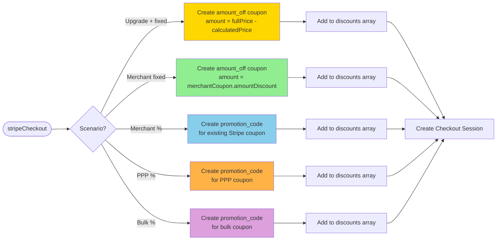
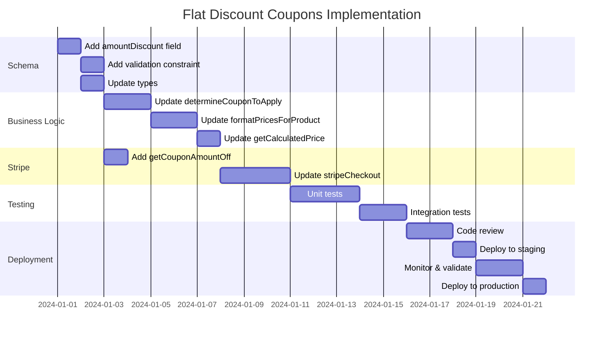

# Flat Discount Coupons - Decision Flow & Reference

## Discount Type Decision Tree

```mermaid
graph TD
    Start([Checkout Request]) --> GetCoupon[Get Merchant Coupon]
    GetCoupon --> HasCoupon{Has Merchant<br/>Coupon?}

    HasCoupon -->|No| CheckPPP[Check PPP Eligibility]
    HasCoupon -->|Yes| CheckType{Coupon Has<br/>amountDiscount?}

    CheckType -->|Yes| FixedPath[FIXED DISCOUNT PATH]
    CheckType -->|No| HasPercent{Has<br/>percentageDiscount?}

    HasPercent -->|Yes| PercentPath[PERCENTAGE PATH]
    HasPercent -->|No| CheckPPP

    CheckPPP --> IsPPPEligible{PPP Eligible?<br/>country, quantity=1,<br/>no full-price purchases}

    IsPPPEligible -->|Yes| PPPPath[PPP PATH]
    IsPPPEligible -->|No| CheckBulk[Check Bulk Eligibility]

    CheckBulk --> IsBulk{quantity > 1 OR<br/>existing bulk purchase?}

    IsBulk -->|Yes| BulkPath[BULK PATH]
    IsBulk -->|No| NoDiscount[NO DISCOUNT]

    %% Fixed Path Details
    FixedPath --> IsUpgrade1{Is Upgrade?}
    IsUpgrade1 -->|Yes| ConflictCheck{Fixed Upgrade<br/>Discount > 0?}
    IsUpgrade1 -->|No| ApplyFixed[Apply Fixed Amount<br/>from merchantCoupon.amountDiscount]

    ConflictCheck -->|Yes| TakeBetter[Take Better Discount<br/>max(upgrade, merchant)]
    ConflictCheck -->|No| ApplyFixed

    TakeBetter --> CreateFixedCoupon[Create Transient<br/>amount_off Coupon]
    ApplyFixed --> CreateFixedCoupon

    CreateFixedCoupon --> StripeCheckout1[Stripe Checkout]

    %% Percentage Path Details
    PercentPath --> IsUpgrade2{Is Upgrade?}
    IsUpgrade2 -->|Yes| CalcUpgrade[Calculate Upgrade Discount<br/>+ Apply Percentage]
    IsUpgrade2 -->|No| UsePromoCode[Use Promotion Code<br/>with existing Stripe coupon]

    CalcUpgrade --> CreateAmountOff[Create amount_off Coupon<br/>for combined discount]
    CreateAmountOff --> StripeCheckout2[Stripe Checkout]
    UsePromoCode --> StripeCheckout2

    %% PPP Path
    PPPPath --> GetPPPPercent[Get PPP Discount %<br/>based on country]
    GetPPPPercent --> PPPUpgrade{Is Upgrade?}
    PPPUpgrade -->|Yes| PPPUpgradeCalc[Combine PPP %<br/>with upgrade discount]
    PPPUpgrade -->|No| PPPPromo[Create Promotion Code<br/>for PPP coupon]

    PPPUpgradeCalc --> StripeCheckout3[Stripe Checkout]
    PPPPromo --> StripeCheckout3

    %% Bulk Path
    BulkPath --> GetBulkPercent[Get Bulk Discount %<br/>based on quantity]
    GetBulkPercent --> BulkPromo[Create Promotion Code<br/>for bulk coupon]
    BulkPromo --> StripeCheckout4[Stripe Checkout]

    %% No Discount Path
    NoDiscount --> CheckUpgradeOnly{Is Upgrade?}
    CheckUpgradeOnly -->|Yes| UpgradeOnly[Apply Upgrade Discount Only]
    CheckUpgradeOnly -->|No| FullPrice[Full Price]
    UpgradeOnly --> StripeCheckout5[Stripe Checkout]
    FullPrice --> StripeCheckout5

    style FixedPath fill:#e1f5e1
    style PercentPath fill:#e3f2fd
    style PPPPath fill:#fff3e0
    style BulkPath fill:#f3e5f5
    style NoDiscount fill:#ffebee
```

## Discount Type Priority Matrix

| Scenario | Priority 1 | Priority 2 | Priority 3 | Priority 4 | Result |
|----------|-----------|-----------|-----------|-----------|--------|
| Merchant coupon with `amountDiscount` | ✅ Fixed Amount | - | - | - | **Fixed discount applied** |
| Merchant coupon with `percentageDiscount` | ✅ Percentage | - | - | - | **Percentage applied** |
| PPP eligible + no merchant coupon | ✅ PPP % | - | - | - | **PPP applied** |
| Bulk (qty>1) + no merchant coupon | ✅ Bulk % | - | - | - | **Bulk applied** |
| PPP eligible + merchant percentage | Compare | ✅ Better discount wins | - | - | **Better of PPP vs merchant** |
| Bulk + merchant percentage | Compare | ✅ Better discount wins | - | - | **Better of bulk vs merchant** |
| Fixed merchant + upgrade | ✅ Max(fixed, upgrade) | - | - | - | **Better discount wins** |
| Percentage merchant + upgrade | ✅ Combine both | - | - | - | **Combined discount** |
| No coupons + upgrade | ✅ Upgrade discount | - | - | - | **Upgrade applied** |
| No coupons + no upgrade | ❌ No discount | - | - | - | **Full price** |

## Stripe Coupon Creation Decision



## Price Calculation Formula

### Current Formula
```
fullPrice = (unitPrice × quantity) - fixedDiscountForUpgrade
calculatedPrice = (fullPrice - 0) × (1 - percentOfDiscount)
```

### Updated Formula (with merchant fixed discount)
```
fullPrice = (unitPrice × quantity) - fixedDiscountForUpgrade

If discountType === 'fixed':
  effectiveFixedDiscount = max(fixedDiscountForUpgrade, appliedFixedDiscount)
  calculatedPrice = fullPrice - effectiveFixedDiscount

Else if discountType in ['percentage', 'ppp', 'bulk']:
  calculatedPrice = fullPrice × (1 - percentOfDiscount)

Else:
  calculatedPrice = fullPrice

// Always ensure non-negative
calculatedPrice = max(0, calculatedPrice)
```

## Comparison Table: Current vs Proposed

| Aspect | Current System | Proposed System |
|--------|---------------|-----------------|
| **Merchant Coupon Types** | Percentage only | Percentage + Fixed Amount |
| **Fixed Discount Support** | Upgrades only | Upgrades + Merchant coupons |
| **Schema Fields** | `percentageDiscount` | `percentageDiscount` + `amountDiscount` |
| **Stripe Coupon Creation** | • Promotion codes for merchant<br/>• amount_off for upgrades | • Promotion codes for % merchant<br/>• amount_off for fixed merchant<br/>• amount_off for upgrades |
| **Discount Type Tracking** | Implicit (via type field) | Explicit (`appliedDiscountType` enum) |
| **Validation** | None | Mutual exclusivity check |
| **Price Calculation** | `(fullPrice - upgrade) × (1 - %)` | Conditional based on discount type |
| **Conflict Resolution** | N/A | Max of conflicting fixed discounts |
| **Metadata** | Basic coupon info | Includes `discountType` and `discountAmount` |

## Common Scenarios & Examples

### Scenario 1: Simple Fixed-Amount Coupon
```
Product Price: $100
Merchant Coupon: $20 off (amountDiscount = 2000 cents)
Quantity: 1

Flow:
1. determineCouponToApply → returns amountDiscount=2000, discountType='fixed'
2. formatPricesForProduct → appliedFixedDiscount = $20
3. calculatedPrice = $100 - $20 = $80
4. stripeCheckout → creates amount_off=2000 coupon
5. Stripe session → customer pays $80
```

### Scenario 2: Fixed Coupon + Upgrade Conflict
```
Product Price: $200
Upgrade Discount: $50 (from prior $50 purchase)
Merchant Coupon: $30 off (amountDiscount = 3000 cents)
Quantity: 1

Flow:
1. getFixedDiscountForIndividualUpgrade → returns $50
2. determineCouponToApply → returns amountDiscount=3000, discountType='fixed'
3. formatPricesForProduct:
   - fixedDiscountForUpgrade = $50
   - appliedFixedDiscount = $30
   - effectiveFixedDiscount = max($50, $30) = $50  // Better discount
4. calculatedPrice = $200 - $50 = $150
5. stripeCheckout → creates amount_off=5000 coupon
6. Stripe session → customer pays $150
```

### Scenario 3: PPP vs Fixed Coupon
```
Product Price: $100
Country: India (PPP = 60% off)
Merchant Coupon: $25 off (amountDiscount = 2500 cents)
Quantity: 1

Decision:
- PPP would give: $100 × 0.40 = $40 (customer pays $40)
- Fixed would give: $100 - $25 = $75 (customer pays $75)
- PPP is better → PPP wins

But if merchant coupon is $70 off:
- Fixed would give: $100 - $70 = $30 (customer pays $30)
- Fixed is better → Fixed wins

Note: This requires explicit comparison logic in determineCouponToApply
```

### Scenario 4: Bulk Purchase (No Fixed Discount)
```
Product Price: $100
Quantity: 5
No merchant coupon

Flow:
1. determineCouponToApply → detects quantity=5 → bulk discount 20%
2. calculatedPrice = ($100 × 5) × 0.80 = $400
3. No fixed discounts applied
4. Customer pays $400 total ($80 per seat)
```

### Scenario 5: Percentage Merchant Coupon (Unchanged)
```
Product Price: $100
Merchant Coupon: 25% off (percentageDiscount = 0.25)
Quantity: 1

Flow:
1. determineCouponToApply → returns percentageDiscount=0.25, discountType='percentage'
2. calculatedPrice = $100 × 0.75 = $75
3. stripeCheckout → creates promotion_code for existing Stripe coupon
4. Stripe session → customer pays $75

This flow is UNCHANGED from current system
```

## Edge Cases & Validation

### Edge Case 1: Fixed Discount > Product Price
```
Product Price: $50
Merchant Coupon: $75 off

Result: calculatedPrice = max(0, $50 - $75) = $0
Customer pays: $0 (free)
```

### Edge Case 2: Both Discount Types Set (Invalid)
```
Merchant Coupon:
  percentageDiscount: 0.25
  amountDiscount: 2000

Result: Schema validation fails
Error: "Coupon cannot have both percentageDiscount and amountDiscount"
```

### Edge Case 3: PPP + Fixed Merchant + Upgrade
```
Product Price: $200
Upgrade: $60
PPP: 50% off
Fixed Merchant: $40 off
Quantity: 1

Decision Tree:
1. PPP ineligible (has upgrade = prior purchase)
2. Fixed merchant available
3. effectiveFixedDiscount = max($60 upgrade, $40 merchant) = $60
4. calculatedPrice = $200 - $60 = $140
```

## Testing Scenarios Checklist

- [ ] **Fixed Amount Discounts**
  - [ ] Simple fixed-amount merchant coupon
  - [ ] Fixed amount > product price (clamps to 0)
  - [ ] Fixed amount < product price (normal flow)
  - [ ] Fixed amount in cents converts correctly to dollars

- [ ] **Conflict Resolution**
  - [ ] Fixed merchant + upgrade fixed (takes max)
  - [ ] Fixed merchant + percentage merchant (validation fails)
  - [ ] Fixed merchant + PPP (compare effectiveness)
  - [ ] Fixed merchant + bulk (fixed wins, no bulk on individual)

- [ ] **Backward Compatibility**
  - [ ] Percentage merchant coupons work unchanged
  - [ ] PPP flow unchanged
  - [ ] Bulk flow unchanged
  - [ ] Upgrade-only flow unchanged

- [ ] **Stripe Integration**
  - [ ] amount_off coupon created for fixed merchant
  - [ ] Promotion code created for percentage merchant
  - [ ] Transient coupons expire correctly (12 hours)
  - [ ] Metadata includes discount type and amount

- [ ] **Data Validation**
  - [ ] Cannot set both percentageDiscount and amountDiscount
  - [ ] amountDiscount must be integer (cents)
  - [ ] percentageDiscount must be 0.0-1.0
  - [ ] Prices never go negative

## Implementation Order



## Key Takeaways

1. **Fixed amount coupons are similar to upgrade discounts** - reuse existing amount_off coupon creation pattern

2. **Mutual exclusivity is critical** - A coupon MUST have either percentage OR amount, never both

3. **Conflict resolution uses "max discount"** - When upgrade and merchant both offer fixed discounts, take the better one

4. **Stripe supports both patterns** - Promotion codes for percentage, direct coupons for amount_off

5. **Backward compatibility is maintained** - All existing flows continue to work; this is purely additive

6. **Validation prevents revenue leaks** - Non-negative prices and mutual exclusivity checks protect against errors

7. **Metadata enables debugging** - Store discount type and amount in checkout session metadata for audit trail
